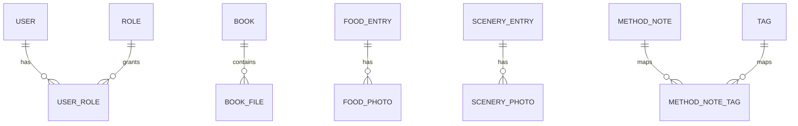

# Data Models

## Design Principle

Data tables should map cleanly to modules.

Do not put all page data into one giant generic table.

## Shared Tables

### User

| Field | Type | Notes |
| --- | --- | --- |
| id | bigint | primary key |
| username | varchar | login name |
| password_hash | varchar | stored securely |
| is_active | bool | account status |
| created_at | datetime | audit |

### Role

| Field | Type | Notes |
| --- | --- | --- |
| id | bigint | primary key |
| code | varchar | owner / editor / viewer |
| name | varchar | display name |

### UserRole

| Field | Type | Notes |
| --- | --- | --- |
| id | bigint | primary key |
| user_id | fk user | relation |
| role_id | fk role | relation |

## Books Module

### Book

| Field | Type | Notes |
| --- | --- | --- |
| id | bigint | primary key |
| title | varchar | book title |
| author | varchar | author |
| status | varchar | planned / reading / finished |
| rating | int | optional |
| notes | text | note |
| cover_image | file | optional |
| created_at | datetime | audit |
| updated_at | datetime | audit |

### BookFile

| Field | Type | Notes |
| --- | --- | --- |
| id | bigint | primary key |
| book_id | fk book | relation |
| file_name | varchar | original name |
| file_path | varchar | storage path |
| file_type | varchar | pdf / epub / txt / md |
| visibility | varchar | authenticated by default |
| uploaded_at | datetime | audit |

## Food Module

### FoodEntry

| Field | Type | Notes |
| --- | --- | --- |
| id | bigint | primary key |
| name | varchar | dish name |
| recipe_text | text | method |
| intro_text | text | why it matters |
| created_at | datetime | audit |
| updated_at | datetime | audit |

### FoodPhoto

| Field | Type | Notes |
| --- | --- | --- |
| id | bigint | primary key |
| food_id | fk food_entry | relation |
| image_path | varchar | storage path |
| caption | varchar | optional |

## Music Module

### MusicTrack

| Field | Type | Notes |
| --- | --- | --- |
| id | bigint | primary key |
| title | varchar | track name |
| artist | varchar | artist |
| album | varchar | optional |
| audio_path | varchar | file path |
| cover_image | varchar | optional |
| note | text | why liked |
| visibility | varchar | authenticated by default |
| created_at | datetime | audit |

## Scenery Module

### SceneryEntry

| Field | Type | Notes |
| --- | --- | --- |
| id | bigint | primary key |
| title | varchar | place title |
| address | varchar | text address |
| latitude | decimal | optional |
| longitude | decimal | optional |
| note | text | description |
| visited_at | date | optional |

### SceneryPhoto

| Field | Type | Notes |
| --- | --- | --- |
| id | bigint | primary key |
| scenery_id | fk scenery_entry | relation |
| image_path | varchar | storage path |
| caption | varchar | optional |

## Fitness Module

### WeightLog

| Field | Type | Notes |
| --- | --- | --- |
| id | bigint | primary key |
| log_date | date | unique per day preferred |
| weight_kg | decimal | body weight |
| note | text | optional |

### MealLog

| Field | Type | Notes |
| --- | --- | --- |
| id | bigint | primary key |
| log_date | date | day |
| meal_type | varchar | breakfast / lunch / dinner / snack |
| content | text | food description |
| calories | int | optional |

### ExerciseLog

| Field | Type | Notes |
| --- | --- | --- |
| id | bigint | primary key |
| log_date | date | day |
| activity | varchar | walking / lifting / etc |
| duration_min | int | optional |
| calories_burned | int | optional |

## Finance Module

### FinanceEntry

| Field | Type | Notes |
| --- | --- | --- |
| id | bigint | primary key |
| entry_date | date | day |
| direction | varchar | income / expense |
| category | varchar | rent / food / transport / etc |
| amount | decimal | money |
| note | text | optional |

## Schedule Module

### ScheduleEntry

| Field | Type | Notes |
| --- | --- | --- |
| id | bigint | primary key |
| plan_date | date | day |
| title | varchar | task |
| duration_min | int | estimate |
| category | varchar | study / body / life |
| status | varchar | planned / done / skipped |
| reflection | text | optional |

## Methods Module

### MethodNote

| Field | Type | Notes |
| --- | --- | --- |
| id | bigint | primary key |
| title | varchar | note title |
| slug | varchar | route slug |
| content_md | text | markdown content |
| created_at | datetime | audit |
| updated_at | datetime | audit |

### Tag

| Field | Type | Notes |
| --- | --- | --- |
| id | bigint | primary key |
| name | varchar | tag name |

### MethodNoteTag

| Field | Type | Notes |
| --- | --- | --- |
| id | bigint | primary key |
| method_note_id | fk method_note | relation |
| tag_id | fk tag | relation |

## Core Relationship Sketch

## Permission Notes

Recommended file access rules:

- BookFile: authenticated-only
- MusicTrack audio file: authenticated-only
- other public-facing text/image records: public-readable by default unless explicitly protected
