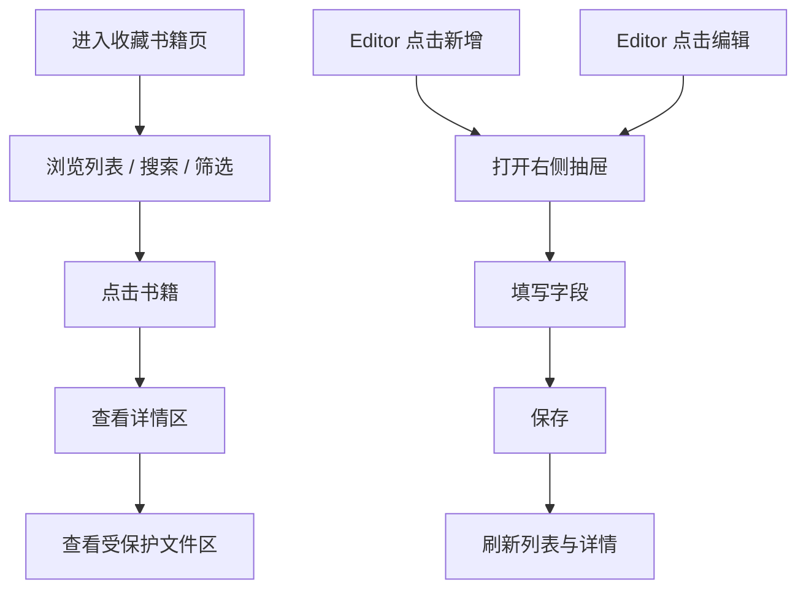
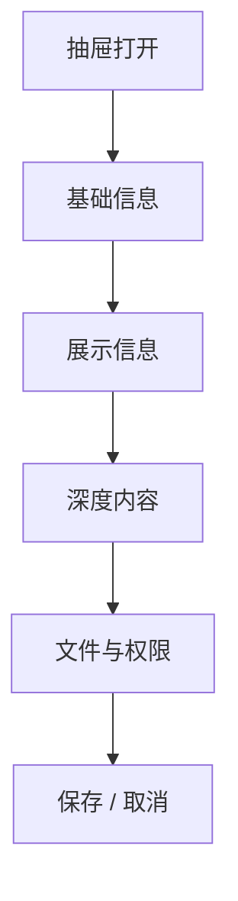
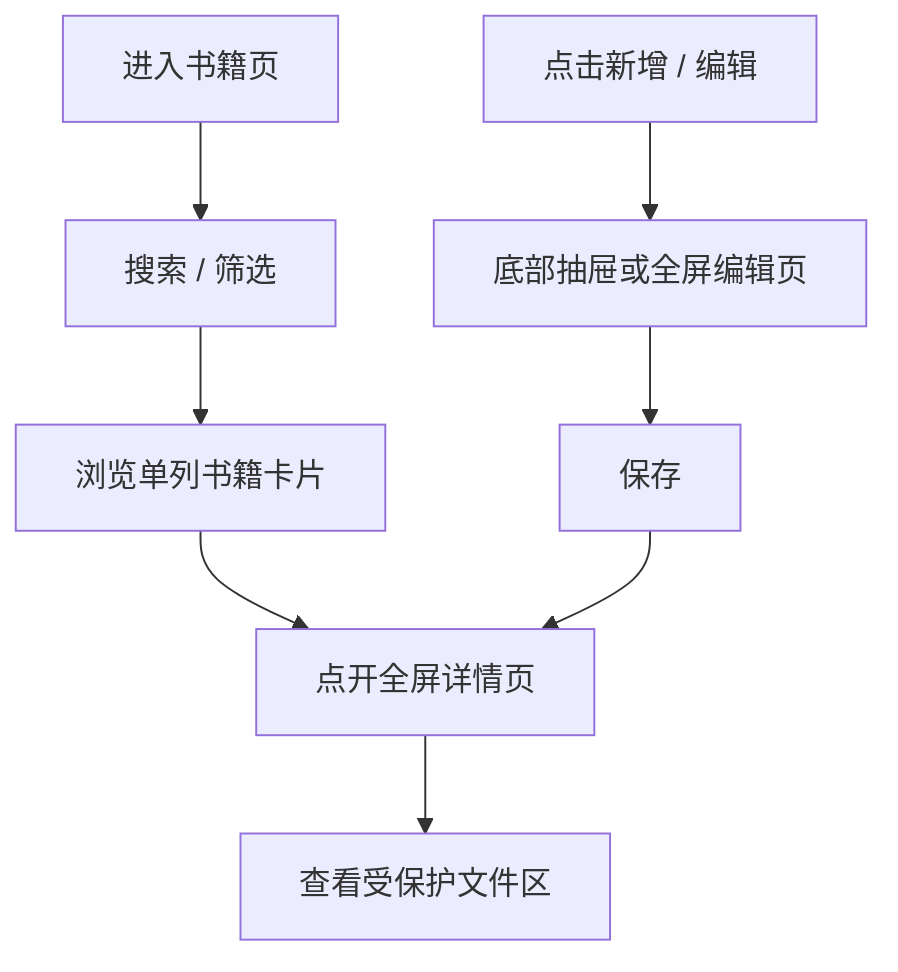

# 收藏书籍交互与手机端说明

## 目标

这个文档解决三个问题：

1. 新增/编辑书籍的抽屉怎么设计
2. 桌面端和手机端分别怎么使用
3. 游客、Viewer、Editor、Owner 的交互边界怎么落地

## 整体交互图



## 桌面端交互

### 页面主结构

桌面端建议采用三段式：

- 左：轻筛选
- 中：书架列表
- 右：详情与文件区

抽屉从最右侧再向内打开。

这样可以保证：

- 当前阅读上下文不丢
- 不需要跳转新页面
- 列表、详情、编辑形成自然层次

## 抽屉结构

### 抽屉标题

新增状态：

- `新增书籍`

编辑状态：

- `编辑书籍`

标题下面可加一行说明：

- 新增时：`录入一本对你重要的书`
- 编辑时：`调整信息，但不要打断页面阅读感`

### 抽屉分区

建议分为四段：

1. 基础信息
2. 展示信息
3. 深度内容
4. 文件与权限



### 1. 基础信息

- 书名
- 副标题
- 作者
- 译者
- 出版社
- 出版年份
- 语言
- ISBN

### 2. 展示信息

- 封面图上传
- 阅读状态
- 标签
- 主观评分
- 一句短评

### 3. 深度内容

- 为什么重要
- 长笔记
- 开始阅读时间
- 读完时间
- 重读次数

### 4. 文件与权限

- 资源文件上传
- 文件类型
- 是否允许在线阅读
- 是否允许下载
- 书籍可见性
- 文件可见性

## 抽屉表单建议

### 推荐布局

```text
+------------------------------------------------------+
| 新增书籍                                             |
| 录入一本对你重要的书                                 |
+------------------------------------------------------+
| 书名 *                                               |
| 作者 *                 阅读状态 *                     |
| 副标题                 评分                           |
| 译者                   标签                           |
| 出版社                 出版年份                       |
| 语言                   ISBN                           |
|------------------------------------------------------|
| 封面图                                               |
| 一句短评                                             |
|------------------------------------------------------|
| 为什么重要                                           |
| 长笔记                                               |
|------------------------------------------------------|
| 文件上传                                             |
| 在线阅读开关        下载开关                         |
| 书籍可见性          文件可见性                       |
|------------------------------------------------------|
| [取消]                                   [保存]      |
+------------------------------------------------------+
```

### 字段校验建议

至少要校验：

- `title` 必填
- `author` 必填
- `status` 必填
- 评分范围 `0~10` 或 `0~5`
- 文件上传后自动识别文件类型
- 结束时间不能早于开始时间

### 保存策略

建议：

- 支持草稿态
- 保存成功后停留在当前页面
- 保存后自动刷新详情区

不建议：

- 一保存就强制跳页
- 一保存就关闭全部上下文

## 权限下的交互差异

| 角色 | 可看列表 | 可看详情 | 可读文件 | 可下载文件 | 可新增/编辑 | 可改权限 |
| --- | --- | --- | --- | --- | --- | --- |
| 游客 | 是 | 是 | 否/看锁态 | 否 | 否 | 否 |
| Viewer | 是 | 是 | 是 | 是 | 否 | 否 |
| Editor | 是 | 是 | 是 | 是 | 是 | 部分 |
| Owner | 是 | 是 | 是 | 是 | 是 | 是 |

## 游客态设计

游客态不是“禁止访问页”，而是“可理解但有边界的书页”。

文件区展示应当包含：

- 文件存在
- 文件格式
- 登录后可继续阅读 / 下载

不要出现太强的警告感。

## 手机端交互

手机端要完全重排，不要照搬桌面三栏。

### 手机端主流程



### 手机端信息结构

1. 顶部标题与搜索
2. 横向筛选 chips
3. 单列书籍卡片
4. 点击进入全屏详情
5. 详情页底部再放阅读 / 下载 / 编辑动作

### 手机端原型

```text
+--------------------------------------+
| 收藏书籍                    搜索      |
+--------------------------------------+
| [全部] [在读] [读完] [PDF] [哲学]     |
+--------------------------------------+
| [封面] 书名                          |
| 作者 / 状态 / 标签                   |
| 一句短评                             |
+--------------------------------------+
| [封面] 书名                          |
| 作者 / 状态 / 标签                   |
| 一句短评                             |
+--------------------------------------+

点击后

+--------------------------------------+
| 返回                     编辑         |
+--------------------------------------+
| 封面                                  |
| 书名                                  |
| 作者 / 标签 / 状态                    |
| 为什么重要                            |
| 长笔记                                |
| 阅读时间线                            |
| 文件：PDF / 登录后可读                |
| [在线阅读] [下载]                     |
+--------------------------------------+
```

### 手机端编辑方式

更推荐：

- 底部上拉抽屉

如果字段很多，也可以用：

- 全屏编辑页

建议规则：

- 新增用全屏编辑页更稳
- 快速修改可用底部抽屉

## 最终交互结论

- 桌面端：三段式阅读结构 + 右侧抽屉编辑
- 手机端：单列列表 + 全屏详情 + 抽屉/全屏编辑
- 权限体验：边界明确，但不要生硬
- 保存行为：停留上下文，不强制跳走
