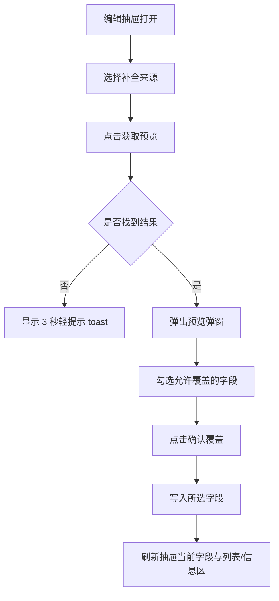

# 收藏书籍外部信息补全设计

## 目标

这个功能不是“自动乱改书籍信息”。

它应该是一个可控的、单本书级别的补全工具：

- 由你手动触发
- 先看预览，再确认覆盖
- 只覆盖你勾选的字段
- 搜不到时只给轻提示，不打断当前页面

本功能当前版本支持两个来源：

1. `微信读书`
2. `豆瓣`

它们在 UI 上统一抽象成一个“补全来源”下拉框。

---

## 放置位置结论

主入口放在 **编辑抽屉**，不放首页列表。

原因：

- 这是单本书的数据维护动作，属于编辑语境
- 会涉及预览、确认、字段级覆盖，不适合放在浏览列表中操作
- 抽屉里本来就承载作者、译者、出版社、封面等字段，补全功能靠近这些字段最自然

---

## 抽屉位置草图

建议位置：

- 放在“基础信息”区域最上方
- 位于 `书名` 下方、`作者 / 译者 / 出版社` 等字段上方

```text
+------------------------------------------------------+
| 编辑书籍                                             |
| 调整信息，但不要打断页面阅读感                       |
+------------------------------------------------------+
| 书名 *                                               |
|------------------------------------------------------|
| 补全来源 [微信读书 v]   [获取预览]                   |
| 说明：先预览差异，再选择是否覆盖                     |
|------------------------------------------------------|
| 作者                    译者                         |
| 出版社                  出版年份                     |
| 封面图链接              字数                         |
| 阅读状态                评分                         |
| 标签                    新增标签                     |
| ...                                                  |
+------------------------------------------------------+
```

### 入口控件

- 左侧：来源下拉框
- 右侧：`获取预览`
- 下方：一行静态说明文案

### 下拉框选项

- `微信读书`
- `豆瓣`

默认值建议：

- 默认选中上次使用的来源
- 如果没有历史选择，第一默认值用 `微信读书`

---

## 预览弹窗结构

点击 `获取预览` 后，不直接改数据库。

流程应当是：

1. 调 `preview`
2. 如果找到候选结果，弹出预览弹窗
3. 你确认后再调 `apply`

### 搜不到时

不弹大弹窗，只显示轻量 toast：

- 文案：`未在该来源找到匹配结果`
- 位置：页面右上角，或抽屉顶部右侧
- 3 秒自动消失
- 不遮挡主要编辑区域

### 预览弹窗结构

```text
+--------------------------------------------------------------------+
| 从微信读书补全                                                     |
| 已匹配到 1 条结果                                                  |
|                                                       [关闭]       |
+--------------------------------------------------------------------+
| 候选书籍卡片                                                       |
| [封面] 书名                                                        |
| 作者 / 译者 / 出版社                                               |
| 数据来源：微信读书                                                 |
| 简介预览：......                                                   |
|--------------------------------------------------------------------|
| 将要覆盖的字段                                                     |
| [x] 封面图链接      当前：空                新值：https://...       |
| [ ] 作者            当前：鸟哥              新值：其他作者          |
| [x] 译者            当前：空                新值：萧宝森            |
| [x] 出版社          当前：空                新值：作家出版社        |
| [x] 一句短评        当前：空                新值：自动生成短评      |
|--------------------------------------------------------------------|
| 规则提示：                                                         |
| - 空字段默认勾选                                                   |
| - 已有值但不同的字段默认不勾选                                     |
|--------------------------------------------------------------------|
| [取消]                                         [确认覆盖所选字段]  |
+--------------------------------------------------------------------+
```

### 候选区块

第一阶段建议只展示：

- 命中的首条高置信结果

如果后续要扩展：

- 当一个来源搜到多个明显可能结果时，在弹窗顶部增加候选列表，允许切换候选项再看字段差异

---

## 交互流



---

## 接口草案

建议不要做成一个“边搜边写”的接口。

而是明确分成两个阶段：

1. `preview`
2. `apply`

这样更安全，也更容易扩展到多来源。

### `POST /api/books/:id/metadata-preview`

用途：

- 根据当前书籍和指定来源抓取外部信息
- 只返回候选结果与字段差异
- 不写数据库

请求示例：

```json
{
  "provider": "weread",
  "query": "苏菲的世界"
}
```

字段说明：

- `provider`：`weread | douban`
- `query`：可选，默认后端使用当前书籍标题；有需要时可传覆盖查询词

返回示例：

```json
{
  "success": true,
  "status": "found",
  "previewToken": "meta_prev_01JXYZ...",
  "provider": {
    "id": "weread",
    "label": "微信读书"
  },
  "candidate": {
    "sourceId": "703157",
    "title": "苏菲的世界",
    "author": "乔斯坦·贾德",
    "translator": "萧宝森",
    "publisher": "作家出版社",
    "coverImageUrl": "https://cdn.weread.qq.com/...",
    "intro": "本书以小说的形式，通过一名哲学导师……"
  },
  "fields": [
    {
      "name": "cover_image_url",
      "label": "封面图链接",
      "current": "",
      "incoming": "https://cdn.weread.qq.com/...",
      "changed": true,
      "defaultSelected": true
    },
    {
      "name": "author",
      "label": "作者",
      "current": "",
      "incoming": "乔斯坦·贾德",
      "changed": true,
      "defaultSelected": true
    },
    {
      "name": "translator",
      "label": "译者",
      "current": "",
      "incoming": "萧宝森",
      "changed": true,
      "defaultSelected": true
    },
    {
      "name": "publisher",
      "label": "出版社",
      "current": "",
      "incoming": "作家出版社",
      "changed": true,
      "defaultSelected": true
    },
    {
      "name": "short_review",
      "label": "一句短评",
      "current": "",
      "incoming": "适合作为哲学入门的故事型经典。",
      "changed": true,
      "defaultSelected": true
    }
  ]
}
```

### `preview` 的未命中返回

```json
{
  "success": true,
  "status": "not_found",
  "provider": {
    "id": "douban",
    "label": "豆瓣"
  },
  "message": "未在该来源找到匹配结果"
}
```

### `POST /api/books/:id/metadata-apply`

用途：

- 根据 `previewToken` 和你勾选的字段，把外部结果真正写入该书籍

请求示例：

```json
{
  "provider": "weread",
  "previewToken": "meta_prev_01JXYZ...",
  "fields": [
    "cover_image_url",
    "author",
    "translator",
    "publisher",
    "short_review"
  ]
}
```

返回示例：

```json
{
  "success": true,
  "message": "已更新 5 个字段",
  "updatedFields": [
    "cover_image_url",
    "author",
    "translator",
    "publisher",
    "short_review"
  ],
  "book": {
    "id": 19,
    "title": "苏菲的世界",
    "author": "乔斯坦·贾德",
    "translator": "萧宝森",
    "publisher": "作家出版社",
    "coverImageUrl": "https://cdn.weread.qq.com/..."
  }
}
```

---

## 字段覆盖规则

### 第一阶段允许补全的字段

- `cover_image_url`
- `author`
- `translator`
- `publisher`
- `subtitle`
- `short_review`

### 第一阶段不建议纳入自动覆盖的字段

- `title`
- `status`
- `rating`
- `word_count`
- `tag_links`
- `why_it_matters`
- `long_note`
- `reading_started_at`
- `reading_finished_at`
- `visibility`
- 文件相关字段

原因：

- 这些字段更偏个人判断、阅读状态或站内业务数据
- 不适合被外部来源直接回写

### 默认勾选规则

建议：

- 当前为空，且外部有值：默认勾选
- 当前有值，但与外部不同：默认不勾选
- 当前有值，且与外部相同：不显示或显示为“无变化”

### 允许覆盖，但要慎用的字段

- `author`
- `translator`
- `publisher`

这些字段有时会因为版本不同、译本不同而变化。

所以：

- 即便外部返回了值
- 只要你当前已有内容
- 默认也不自动替你覆盖

### 短评覆盖规则

`short_review` 比较特殊：

- 如果当前为空，可默认勾选
- 如果当前已有内容，则默认不勾选
- 不允许后台静默替换你自己写过的短评

---

## 多来源选择规则

两来源统一走同一套 UI 和接口结构。

### 前端

- 一个下拉框
- 一个 `获取预览` 按钮
- 同一套预览弹窗

### 后端

由 `provider` 决定具体适配器：

- `weread`
- `douban`

建议内部实现为 provider adapter：

```text
MetadataProvider
├─ WereadProvider
└─ DoubanProvider
```

这样后面如果你要接：

- 当当
- 京东图书
- Google Books

就不用改动前端交互。

---

## Toast 规范

### 搜不到

- 文案：`未在该来源找到匹配结果`
- 时长：`3000ms`
- 样式：轻提示，不盖住主体

### 预览成功

- 不需要 toast
- 直接弹出预览弹窗

### 覆盖完成

- 文案：`已更新 X 个字段`
- 时长：`2500ms`

---

## 第一版结论

这套功能当前落地版应该是：

- 入口放编辑抽屉
- 使用来源下拉框切换 `微信读书 / 豆瓣`
- 先调 `preview`
- 弹字段差异预览
- 再调 `apply`
- 搜不到时只给 3 秒轻提示

补充说明：

- `Open Library` 在实际联调中持续超时，已经从当前可用来源中移除
- `豆瓣` 的封面链接会在服务端统一归一为 `https`，避免出现有结果但图片无法直接使用的情况

这样既安全，也不破坏当前书籍板块的结构。
