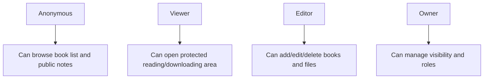
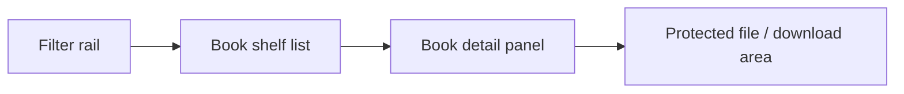

# Favorite Books Design

## Design Intent

The books page should feel like entering a personal reading room.

Not a generic file manager.

It must combine:

- reading memory
- library organization
- protected file access

## Visual Direction

Keywords:

- quiet
- warm
- archival
- orderly
- intimate

Material references:

- paper label
- linen binding
- dark walnut shelf
- reading desk light

## Visual Language

### Palette

- background: pale paper or warm gray
- card surface: off-white
- text: deep charcoal
- accent: walnut brown / bronze
- protected action color: deep bottle green

### Typography

- book titles can be more literary
- metadata stays compact and technical
- notes area should feel like margin annotations

## Access Logic

This page should have layered experience by role.



## Page Structure



## Desktop Prototype

```text
+--------------------------------------------------------------------------------+
| Header: Favorite Books | Search | Add Book | Upload File                       |
+--------------------+-----------------------------------------------------------+
| Left filter rail   | Main shelf                                                |
| - status           | --------------------------------------------------------- |
| - tag              | Book cards / rows                                         |
| - rating           | - cover                                                   |
| - format           | - title                                                   |
| - year             | - author                                                  |
|                    | - status / tags                                           |
|                    | - short note                                              |
+--------------------+-----------------------------+-----------------------------+
| Detail panel                                    | Protected file zone         |
| - large cover                                   | - download original file    |
| - title + author                                | - download                  |
| - personal note                                 | - locked state if no login  |
| - reading history                               |                             |
+-------------------------------------------------+-----------------------------+
```

## Mobile Prototype

```text
+--------------------------------------+
| Header + search                      |
+--------------------------------------+
| Filter chips                         |
+--------------------------------------+
| Book list cards                      |
+--------------------------------------+
| Tap card -> full-screen detail       |
| - metadata                           |
| - note                               |
| - protected file actions             |
+--------------------------------------+
```

## Core Blocks

### 1. Header

Contains:

- page title
- search
- add book
- upload file

Logged-out users:

- only see search and page title

### 2. Filter Rail

Filters:

- status
- tag
- rating
- file format

This block should be visually light and stable.

### 3. Book Shelf

This is the main memory layer.

Each item should show:

- cover
- title
- author
- current reading state
- one-line note

Recommended states:

- planned
- reading
- paused
- finished
- revisiting

### 4. Detail Panel

This is where the page becomes personal.

Suggested content:

- title and author
- long note
- tags
- read dates
- emotional note: why this book matters

### 5. Protected File Zone

This is a clear boundary block.

Anonymous state:

- shows locked message
- shows that the file exists
- asks for login to continue

Logged-in viewer state:

- online reading
- download
- file format info

Editor state:

- replace file
- change visibility
- delete file

## File Archive Experience

The file area should feel like a protected archive drawer, not like a mini reader app.

Recommended priorities:

- download the original file directly
- show file metadata clearly
- preserve permission boundaries without making the UI hostile

## CRUD Experience

Because you want page-level editing instead of only using a backend admin, the preferred pattern is a side drawer:

- add book via side drawer
- edit book in the same side drawer pattern
- upload file as a secondary protected action

This keeps the page elegant.

## Aesthetic Guardrails

Do:

- prioritize cover, title, note
- make protection states elegant, not scary
- keep actions quiet until needed
- let the page feel like a library, not an admin table

Do not:

- make it look like cloud storage
- expose too many buttons at once
- let auth warnings dominate the design

## What Makes It Feel Mature

- public visitors still feel welcomed
- logged-in users feel the page deepens, not merely unlocks
- the protected file area feels intentional and dignified
