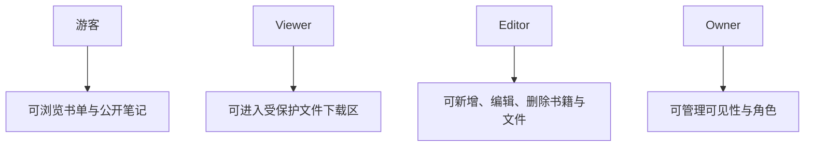

# 收藏书籍设计概览

## 设计定位

收藏书籍页不应该像文件管理器。

它更应该像：

- 藏书室
- 长期藏书页
- 书与笔记共同存在的档案空间

这个页面同时要承载三层意义：

- 书单管理
- 阅读记忆
- 受保护文件归档与下载

## 设计气质

关键词：

- 安静
- 温暖
- 有秩序
- 有私密感
- 有档案感

材质参考：

- 纸质标签
- 亚麻书脊
- 深色木书架
- 阅读灯下的桌面

## 权限结构



## 页面结构


## 桌面原型

```text
+--------------------------------------------------------------------------------+
| 收藏书籍 | 搜索 | 新增书籍 | 上传文件                                          |
+--------------------+-----------------------------------------------------------+
| 左侧筛选栏          | 中间书架列表                                              |
| 状态 / 标签 / 评分  | 封面 / 书名 / 作者 / 状态 / 字数 / 标签 / 一句短评        |
| 格式 / 年份         |                                                           |
+--------------------+-----------------------------+-----------------------------+
| 书籍详情面板                                  | 受保护文件区                |
| 封面、作者、长笔记、阅读时间线、为什么重要     | 下载 / 登录提示 / 文件信息   |
+-------------------------------------------------+-----------------------------+
```

## 手机原型

```text
+--------------------------------------+
| 顶部：标题 + 搜索                    |
+--------------------------------------+
| 筛选 Chips                           |
+--------------------------------------+
| 书籍列表卡片                         |
+--------------------------------------+
| 点击后进入全屏详情                   |
| - 元数据                             |
| - 长笔记                             |
| - 受保护文件操作                     |
+--------------------------------------+
```

## 核心区块说明

### 1. 页面头部

显示：

- 页面标题
- 搜索
- 新增书籍
- 上传文件

未登录时：

- 只显示标题和搜索

### 2. 筛选栏

建议筛选：

- 阅读状态
- 标签
- 评分
- 文件格式

它应该非常轻，不喧宾夺主。

### 3. 书架列表

列表项建议固定展示：

- 封面
- 书名
- 作者
- 当前状态
- 字数
- 一句短评

推荐状态：

- 想读
- 在读
- 读完
- 重读

### 4. 详情面板

这是页面最贴近个人记录的部分。

建议内容：

- 标题与作者
- 字数与评分
- 标签
- 长笔记
- 阅读时间
- 为什么这本书重要

### 5. 受保护文件区

这里必须是明确边界，但不能粗暴。

游客看到：

- 文件存在
- 需要登录后继续

已登录用户看到：

- 下载
- 文件格式说明

编辑者看到：

- 替换文件
- 修改可见性
- 删除文件

## 编辑方式

当前已确认：

**新增和编辑都优先采用抽屉式交互。**

原因：

- 不打断页面阅读感
- 比弹窗更从容
- 比跳后台更统一

## 成熟感来源

- 游客也会觉得这是认真经营的书页，而不是权限页面
- 登录之后页面是“加深”，不是“变后台”
- 文件保护是体面的边界，不是刺眼的阻断
