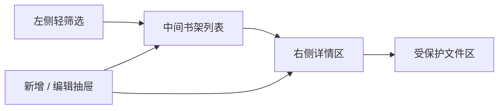
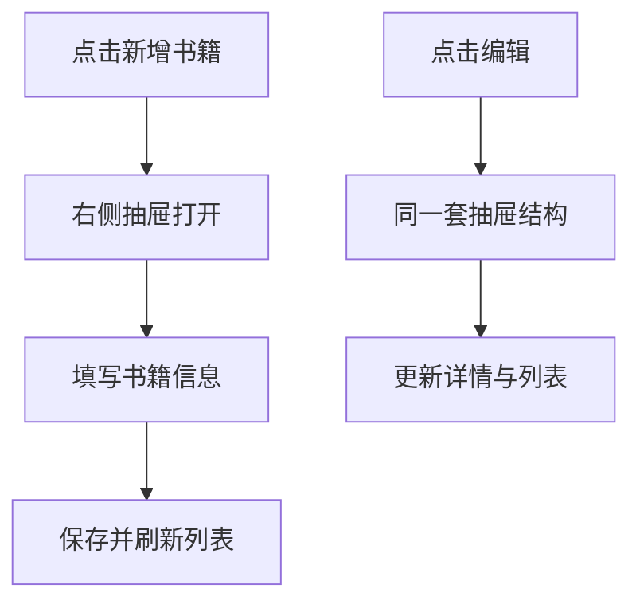

# 收藏书籍高保真说明

## 总体基调

这个页面的理想感受是：

**像进入一个有秩序、有温度、并且有人长期在里面阅读和记录的藏书阅读室。**

它不是：

- 网盘
- 后台管理页
- 冷冰冰的表格

## 视觉主张

### 色彩

- 背景：暖灰纸色 `#EFE8DE`
- 卡片：偏白纸面 `#F8F4EE`
- 主文字：深炭黑 `#221F1B`
- 次文字：烟灰色 `#6F685F`
- 主点缀：胡桃木棕 `#6B4F3A`
- 权限动作色：深瓶绿 `#2F4B3C`
- 分割线：旧纸灰 `#D9D0C4`

原则：

- 保持温暖，不要发黄
- 保持安静，不要彩色化
- 文件权限区可略深，但不能突兀

### 字体

- 书名：有文学气质的中文衬线
- 元数据：清爽无衬线
- 注释：接近纸页边注感

## 版式结构



桌面端节奏：

- 左侧窄
- 中间主
- 右侧深

手机端节奏：

- 先列表
- 再全屏详情
- 抽屉改为底部拉起式或全屏编辑页

## 高保真文字原型

```text
+--------------------------------------------------------------------------------+
| 收藏书籍                                                搜索    新增书籍        |
+------------------+--------------------------------------+----------------------+
| 状态             | [封面] 书名                          | 封面放大              |
| 标签             | 作者 / 状态 / 标签                   | 书名                  |
| 评分             | 一句短评                             | 作者                  |
| 格式             | ----------------------------------   | 长笔记                |
| 年份             | [封面] 书名                          | 阅读时间线            |
|                  | 作者 / 状态 / 标签                   | 为什么重要            |
|                  | 一句短评                             | -------------------- |
|                  | ...                                  | 文件信息 / 下载       |
+------------------+--------------------------------------+----------------------+
```

## 列表项规范

每本书卡片要尽量克制，不要堆满信息。

建议只显示：

- 封面缩略图
- 书名
- 作者
- 当前状态
- 一句短评

辅助元素：

- 标签不超过 3 个
- 评分如存在，尽量弱化显示
- 时间信息放到次级层

## 详情区规范

详情区要像打开一本书后的前几页。

建议顺序：

1. 封面与书名
2. 作者与基础信息
3. 为什么重要
4. 长笔记
5. 阅读时间线
6. 受保护文件区

“为什么重要”建议固定保留，这是这个页面区别于普通书单页的关键。

## 受保护文件区

这个区域的设计原则是：

**明确边界，但不要有惩罚感。**

游客态：

- 看到文件存在
- 看到格式
- 看到“登录后可下载”

Viewer 态：

- 下载按钮
- 文件信息

Editor 态：

- 替换文件
- 修改可见性
- 删除文件

Owner 态：

- 附加角色管理入口

## 抽屉交互规范

本页已确定采用抽屉作为新增与编辑主交互。



抽屉里建议分两段：

- 基础信息：书名、作者、状态、标签、评分
- 深度内容：短评、长笔记、为什么重要、文件上传

抽屉特性：

- 宽度不要太窄
- 标题固定在顶部
- 保存按钮固定在底部
- 滚动时不要丢失操作区

## 手机端策略

手机端不要硬塞三栏布局。

建议：

1. 顶部保留标题和搜索
2. 筛选改成横向 Chips
3. 列表单列展示
4. 点击书籍后进入全屏详情
5. 编辑时使用底部上拉抽屉或全屏编辑页

手机端重点：

- 封面比例清晰
- 文本行数控制
- 受保护文件区必须一屏内看懂

## 后续实现边界

- 不要做成云盘
- 不要做成数据库后台
- 不要做成表格式书单工具

它应该像：

**一本持续被阅读、被标注、被珍藏的长期书册目录。**
