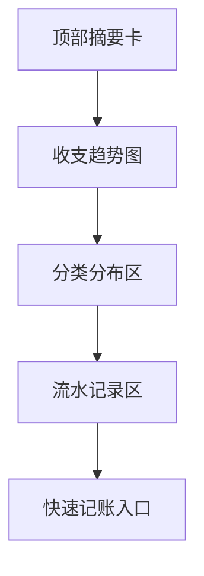

# 收支平衡最终视觉稿说明

## 目标

这份文档定义“收支平衡”页面的最终视觉规格。

这个页面不是财务软件后台，而是：

- 每日收支的长期记录页
- 节制与消费习惯的观察页
- 清晰但不焦躁的个人账本页

它必须克制、清楚、有秩序，不能有证券交易界面的压迫感。

## 页面路由

- 页面主页：`/finance`
- 记录详情高亮：`/finance/:id`
- 新增 / 编辑：保留在 `/finance`，通过抽屉打开

## 视觉基调

关键词：

- 准确
- 克制
- 账本感
- 轻量
- 不是商业后台

## 视觉 Token

```css
:root {
  --rm-finance-bg: #F1ECE5;
  --rm-finance-surface: #FAF6F0;
  --rm-finance-surface-2: #EFE7DC;
  --rm-finance-text-strong: #25211E;
  --rm-finance-text-body: #403933;
  --rm-finance-text-muted: #786F67;
  --rm-finance-line: #DDD3C7;
  --rm-finance-accent-ink: #4B5A59;
  --rm-finance-accent-bronze: #876B53;
  --rm-finance-accent-soft: rgba(75, 90, 89, 0.10);
  --rm-finance-income: #4C6658;
  --rm-finance-expense: #8A6A56;
  --rm-finance-shadow-soft: 0 12px 30px rgba(37, 33, 30, 0.04);
  --rm-finance-shadow-hover: 0 16px 34px rgba(37, 33, 30, 0.07);
}
```

## 字体与字级

| 用途 | 字体 | 字号 | 行高 | 字重 |
| --- | --- | --- | --- | --- |
| 页面标题 | serif | `28px` | `1.3` | `600` |
| 主金额数值 | serif | `36px` | `1.15` | `600` |
| 摘要卡标题 | serif | `18px` | `1.35` | `600` |
| 正文说明 | sans | `15px` | `1.8` | `400` |
| 表格 / 列表文字 | sans | `14px` | `1.7` | `400` |
| 元数据 | sans | `12px` | `1.5` | `500` |
| 按钮 | sans | `14px` | `1` | `500` |

## 页面布局

### 桌面端

- 页面主容器：`1240px`
- 顶部摘要卡：`4` 张
- 中部趋势图区：`1fr`
- 下部流水记录表 / 卡片区
- 区块间距：`24px`

### 手机端

- 左右留白：`16px`
- 摘要卡改 `2 x 2`
- 趋势图区纵向展示
- 流水记录改单列卡片

## 页面结构



## 顶部摘要卡

### 建议 4 张卡

1. 本周支出
2. 本周收入
3. 本月净额
4. 最近一笔记录

### 样式

- 最小高度：`124px`
- 背景：`var(--rm-finance-surface)`
- 边框：`1px solid var(--rm-finance-line)`
- 圆角：`16px`
- 内边距：`20px`
- 阴影：`var(--rm-finance-shadow-soft)`

### 金额颜色

- 收入：`var(--rm-finance-income)`
- 支出：`var(--rm-finance-expense)`
- 净额默认：`var(--rm-finance-text-strong)`

不要直接用鲜红鲜绿。

## 收支趋势图区

### 样式

- 最小高度：`320px`
- 背景：`rgba(250,246,240,0.92)`
- 边框：`1px solid var(--rm-finance-line)`
- 圆角：`18px`
- 内边距：`24px`

### 图表规则

- 第一版采用双线或柱线结合
- 时间范围：`7天 / 30天 / 月度`
- 收入线：`var(--rm-finance-income)`
- 支出线：`var(--rm-finance-expense)`
- 辅助网格线：`rgba(120,111,103,0.14)`

### 顶部工具区

- 左：`收支趋势`
- 右：时间范围切换

时间范围按钮：

- 高度：`32px`
- 圆角：`999px`
- 选中态背景：`var(--rm-finance-accent-soft)`

## 分类分布区

### 作用

用来快速看“钱花在哪里”。

### 第一版形式

- 横向分类条形图或占比卡片

### 样式

- 最小高度：`180px`
- 背景：`var(--rm-finance-surface)`
- 边框：`1px solid var(--rm-finance-line)`
- 圆角：`16px`
- 内边距：`20px`

## 流水记录区

### 桌面端

第一版建议采用“轻表格 + 行卡片感”的形式。

列建议：

- 日期
- 类型
- 分类
- 金额
- 说明
- 操作提示

### 样式

- 行高：`64px`
- 表头字号：`12px`
- 表头字重：`600`
- 表头颜色：`var(--rm-finance-text-muted)`
- 行分隔线：`1px solid rgba(221,211,199,0.7)`

### hover

- 整行背景变为 `rgba(239,231,220,0.45)`
- 鼠标悬停显示轻编辑提示

### 手机端

改成单列记录卡：

- 上：日期 + 类型
- 中：分类 + 说明
- 下：金额 + 进入箭头

## 快速记账入口

### 按钮文案

- `记一笔`

### 样式

- 高度：`44px`
- 背景：`var(--rm-finance-accent-ink)`
- 文字：`#FAF6F0`
- 圆角：`12px`

### 位置

- 桌面端：右上工具区或右下固定按钮
- 手机端：底部固定主按钮

## 编辑抽屉

### 分区

1. 基础信息
2. 金额与类型
3. 分类与说明
4. 可见性与备注

### 字段

- 日期
- 金额
- 类型：收入 / 支出
- 分类
- 说明
- 备注

### 样式

- 宽度：`480px`
- 顶部固定标题栏：`68px`
- 底部固定保存区：`76px`
- 输入框高度：`42px`

## 手机端规则

### 摘要区

- 改为 `2 x 2`
- 金额字号降至 `28px`

### 趋势图

- 高度：`260px`
- 仍保留时间范围切换

### 记录卡

- 单列
- 金额放右侧或底部强调显示

## 前端实现验收标准

- 页面第一眼像个人账本，不像财务系统后台
- 金额信息清楚，但不造成视觉焦虑
- 趋势图轻量，不出现密集看板感
- 手机端能快速完成“看概况 + 记一笔”

## 本版结论

这一版已经把收支平衡页推进到最终视觉稿层级：

- 颜色
- 字重
- 摘要卡
- 趋势图
- 分类分布
- 流水记录
- 快速记账
- 手机端结构
