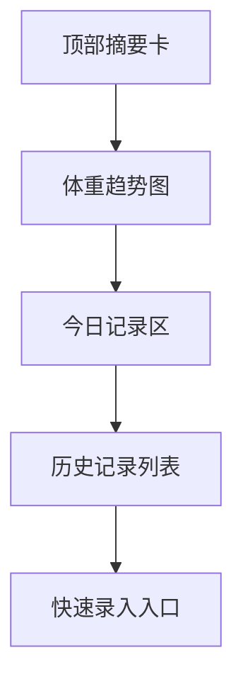

# 健身养体最终视觉稿说明

## 目标

这份文档定义“健身养体”页面的最终视觉规格。

这个页面不是专业训练面板，而是：

- 身体状态的长期记录页
- 体重变化与生活节奏的观察页
- 饮食、运动、感受三者并行的自我整理页

它必须看起来克制、可信、稳定，不要像燃脂广告页。

## 页面路由

- 页面主页：`/fitness`
- 日期详情高亮：`/fitness/:date`
- 新增 / 编辑记录：保留在 `/fitness`，通过抽屉或弹层打开

## 视觉基调

关键词：

- 干净
- 稳定
- 纸感数据页
- 不紧张
- 有自律感，但不过度压迫

## 视觉 Token

```css
:root {
  --rm-fitness-bg: #EEF0EA;
  --rm-fitness-surface: #F7F8F3;
  --rm-fitness-surface-2: #E8ECE3;
  --rm-fitness-text-strong: #232520;
  --rm-fitness-text-body: #3D4038;
  --rm-fitness-text-muted: #757A6F;
  --rm-fitness-line: #D5DACF;
  --rm-fitness-accent-green: #53624F;
  --rm-fitness-accent-earth: #8A745E;
  --rm-fitness-accent-soft: rgba(83, 98, 79, 0.12);
  --rm-fitness-positive: #4D6655;
  --rm-fitness-warning: #8B7257;
  --rm-fitness-shadow-soft: 0 12px 30px rgba(35, 37, 32, 0.04);
  --rm-fitness-shadow-hover: 0 16px 34px rgba(35, 37, 32, 0.07);
}
```

## 字体与字级

| 用途 | 字体 | 字号 | 行高 | 字重 |
| --- | --- | --- | --- | --- |
| 页面标题 | serif | `28px` | `1.3` | `600` |
| 体重主数值 | serif | `40px` | `1.1` | `600` |
| 摘要卡标题 | serif | `18px` | `1.35` | `600` |
| 正文说明 | sans | `15px` | `1.8` | `400` |
| 图表标签 | sans | `12px` | `1.5` | `500` |
| 元数据 | sans | `13px` | `1.6` | `500` |
| 按钮 | sans | `14px` | `1` | `500` |

## 页面布局

### 桌面端

- 页面主容器：`1240px`
- 顶部摘要区：`4` 张横向卡片
- 中部趋势图区：`1fr`
- 下部记录区：左侧三餐与运动，右侧每日感受
- 区块间距：`24px`

### 手机端

- 左右留白：`16px`
- 顶部摘要卡改为 `2 x 2`
- 趋势图纵向排在摘要卡之后
- 每日记录改成单列卡片流

## 页面结构



## 顶部摘要卡

### 结构

建议 4 张卡：

1. 当前体重
2. 本周平均体重
3. 今日卡路里
4. 今日运动状态

### 样式

- 最小高度：`124px`
- 背景：`var(--rm-fitness-surface)`
- 边框：`1px solid var(--rm-fitness-line)`
- 圆角：`16px`
- 内边距：`20px`
- 阴影：`var(--rm-fitness-shadow-soft)`

### 数值表现

- 主数值字号：`40px`
- 单位字号：`14px`
- 趋势说明字号：`12px`

### 色彩规则

- 正常趋势：`var(--rm-fitness-positive)`
- 需要注意：`var(--rm-fitness-warning)`

不要用夸张红绿。

## 体重趋势图区

### 区块样式

- 最小高度：`340px`
- 背景：`rgba(247,248,243,0.9)`
- 边框：`1px solid var(--rm-fitness-line)`
- 圆角：`18px`
- 内边距：`24px`

### 图表规则

- 第一版以折线图为主
- 时间范围切换：`7天 / 30天 / 90天`
- X 轴标注稀疏，不要太密
- Y 轴刻度轻量显示
- 曲线颜色：`var(--rm-fitness-accent-green)`
- 辅助网格线颜色：`rgba(117,122,111,0.15)`

### 图表顶部工具区

- 左：标题 `体重趋势`
- 右：时间范围切换按钮

时间范围按钮样式：

- 高度：`32px`
- 圆角：`999px`
- 选中背景：`var(--rm-fitness-accent-soft)`

## 今日记录区

### 结构

桌面端建议左右两栏：

- 左：三餐 + 卡路里 + 运动
- 右：身体感觉 + 当日备注

### 卡片样式

- 最小高度：`220px`
- 背景：`var(--rm-fitness-surface)`
- 边框：`1px solid var(--rm-fitness-line)`
- 圆角：`16px`
- 内边距：`20px`

### 内容顺序

1. 日期
2. 三餐记录
3. 卡路里
4. 运动
5. 身体感觉
6. 备注

## 历史记录列表

### 结构

每条记录建议采用横向卡片：

- 左：日期
- 中：体重 / 卡路里 / 运动摘要
- 右：状态标签 / 进入箭头

### 样式

- 每项最小高度：`88px`
- 项间距：`12px`
- 背景：`var(--rm-fitness-surface)`
- 边框：`1px solid var(--rm-fitness-line)`
- 圆角：`14px`
- 内边距：`16px`

### hover

- 整卡可点
- 上移 `2px`
- 阴影：`var(--rm-fitness-shadow-hover)`

## 快速录入入口

### 位置

- 桌面端固定在右下角或页面底部右侧
- 手机端固定底部主按钮

### 文案

- `记录今天`

### 按钮样式

- 高度：`44px`
- 背景：`var(--rm-fitness-accent-green)`
- 文字：`#F7F8F3`
- 圆角：`12px`

## 编辑抽屉

### 分区

1. 日期与体重
2. 三餐记录
3. 卡路里与运动
4. 身体感觉与备注

### 字段

- 日期
- 体重
- 早餐
- 午餐
- 晚餐
- 卡路里
- 运动
- 身体感觉
- 备注

### 样式

- 抽屉宽度：`520px`
- 顶部固定标题栏：`68px`
- 底部固定保存区：`76px`
- 多行输入最小高度：`96px`

## 手机端规则

### 摘要区

- 改为 `2 x 2`
- 主数值字号降至 `28px`

### 趋势图

- 高度降为 `260px`
- 时间切换按钮允许横向滑动

### 记录卡

- 改为纵向信息卡
- 把“记录今天”按钮固定到底部

## 前端实现验收标准

- 页面第一眼是“稳定的身体记录页”，不是健身商业页面
- 图表必须轻，不要做数据后台重视觉
- 快速录入路径必须清晰
- 手机端一只手能完成“看趋势 + 记今天”

## 本版结论

这一版已经把健身养体页推进到最终视觉稿层级：

- 颜色
- 字重
- 摘要卡
- 趋势图
- 记录卡
- 快速录入
- 手机端结构
