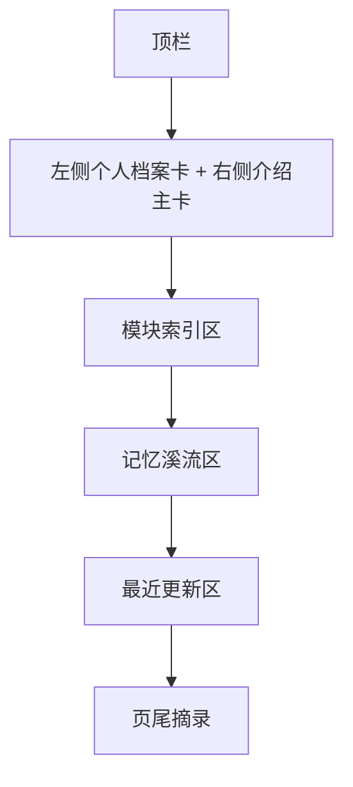

# 首页最终视觉稿说明

## 当前版本定位

首页不是展示型官网，也不是内容信息流。

当前定稿的定位是：

- 左侧个人档案卡
- 右侧多彩介绍主卡
- 下方更紧凑的模块入口
- 四条缓慢流动的记忆溪流
- 最近更新继续保留，但不再占据过大空间

它更像一本被认真装帧过的个人档案册封面页。

先让内容的气味出现，再把人带回对应房间。

## 首页路由与锚点

- 首页：`/`
- 记忆溪流：`/#memory-streams`
- 模块索引：`/#module-index`
- 最近更新：`/#recent-updates`

## 首页点击跳转规则

| 区域 | 点击行为 |
| --- | --- |
| 站点名 `RememberMyself` | 返回首页 `/` |
| 顶栏 `模块` | 打开模块面板 |
| Hero 主按钮 | 进入 `/books` |
| Hero 次按钮 | 滚动到 `/#memory-streams` |
| 每条流带右上角入口 | 跳到对应模块页 |
| 书影流中的单本书封面 | 跳到该书详情页 |
| 模块索引卡片 | 跳到对应模块页 |
| 最近更新卡片 | 跳到对应模块页或具体记录 |

## 页面结构



## 首页完整线框稿

```text
+--------------------------------------------------------------------------------------------------+
| RememberMyself                                                    模块    归档    登录            |
+--------------------------------------------------------------------------------------------------+
| 左：头像 / 个人信息 / 时间线 / 联系方式                                                        |
| 右：孙伯符 / Noah Brooks + 介绍文案 + Motto + 3 个动作按钮 + 统计卡                               |
+--------------------------------------------------------------------------------------------------+
| 模块索引：彩色但克制的卡片入口，布局更紧凑                                                     |
+--------------------------------------------------------------------------------------------------+
| 记忆溪流                                                                                       |
| 书影流      真实书籍封面横向漂流      [进入藏书室]                                               |
| 声纹流      真实或占位音乐封面缓慢漂流  [进入音乐页]                                             |
| 食味流      美食图片缓慢漂流          [进入美食页]                                               |
| 风景流      景色图片缓慢漂流          [进入景色页]                                               |
+--------------------------------------------------------------------------------------------------+
| 最近更新：保留 4 张摘要卡，证明站点仍在继续生长                                                 |
+--------------------------------------------------------------------------------------------------+
| “流过首页的，只是入口。真正的停留，发生在每一个板块里面。”                                       |
+--------------------------------------------------------------------------------------------------+
```

## 视觉 Token

首页当前已经进一步从“瓷白墨骨”推进到更活的 `流彩索引` 结构。

核心关系是：

- 整体页面：冷白蓝灰底
- 首屏主卡：深色多彩锚点
- 左侧资料卡：浅玻璃表面
- 模块卡：低饱和彩色点缀
- 流带容器：浅表面
- 流带卡片：深色矿石感

```css
:root {
  --rm-home-bg: #EDF3FB;
  --rm-home-surface: rgba(255, 255, 255, 0.82);
  --rm-home-surface-strong: rgba(255, 255, 255, 0.96);
  --rm-home-text-strong: #111A2C;
  --rm-home-text-body: #22324A;
  --rm-home-text-muted: #6B7A92;
  --rm-home-line: rgba(15, 23, 42, 0.10);
  --rm-home-hero:
    linear-gradient(135deg, rgba(9,18,36,0.96), rgba(11,27,46,0.96) 52%, rgba(10,30,43,0.94));
  --rm-home-book: #5C87FF;
  --rm-home-music: #8B5CF6;
  --rm-home-food: #FF8F3E;
  --rm-home-scenery: #17A874;
}
```

## 区块详细说明

## 1. 首屏结构

首页首屏不再是单块大 Hero，而是“双栏介绍台”。

要求：

- 左侧是个人资料卡
- 右侧是自我介绍主卡
- 第一屏必须把“这个网站是谁的”讲清楚
- 同时保留模块入口和继续浏览的动作

规则：

- 左侧头像卡需要容纳：头像、姓名、身份、标签、时间线、联系方式
- 右侧主卡需要容纳：名字、介绍、Motto、动作按钮、统计
- 按钮保持 3 个以内
- 第一屏不允许再出现大面积空白

按钮逻辑：

- 主按钮：进入 `收藏书籍`
- 次按钮：快速跳到“记忆溪流”
- 第三个按钮：查看 GitHub 源码

## 2. 记忆溪流区

这是首页的核心结构。

规则如下：

- 四条流带纵向堆叠
- 每条流带内部内容横向自动缓慢流动
- hover 时整条流带暂停
- 左右边缘有渐隐遮罩，避免硬切
- 流带容器保持浅表面
- 流带卡片统一使用更深的“矿石感”底，形成节奏

### 各流带文案

| 流带名 | 副标题 | 说明文案 |
| --- | --- | --- |
| 书影流 | 私人藏书 | 读过的、在读的、准备靠近的，都先以封面留下。 |
| 声纹流 | 喜欢的音乐 | 一首歌有时比一句话更像记忆本身。 |
| 食味流 | 喜欢的美食 | 我记住的不只是味道，还有它靠近生活的方式。 |
| 风景流 | 喜欢的景色 | 有些地方并不属于我，却长期停在我的视线里。 |

### 卡片尺寸

| 流带 | Desktop | Mobile | 比例 |
| --- | --- | --- | --- |
| 书影流 | `112px` | `84px` | `3:4` |
| 声纹流 | `136px` | `106px` | `1:1` |
| 食味流 | `178px` | `144px` | `4:3` |
| 风景流 | `208px` | `164px` | `16:10` |

### 卡片样式

- 圆角：`18px`，手机端 `15px`
- 容器圆角：`24px`
- 容器边框：`1px solid rgba(18, 24, 32, 0.10)`
- 卡片边框：`1px solid rgba(18, 24, 32, 0.12)`
- 卡片背景：深色渐变矿石底
- 真实卡片底部带深色渐隐文字遮罩
- 占位卡片改为虚线边框，并保留轻微扫光

### 动效

- 默认自动滑动
- 书影流与食味流默认向左
- 声纹流与风景流默认向右
- 一条流带中允许存在 `1 - 2` 行平行流道
- 单条动画时长保持在 `52s - 92s`
- 不使用弹跳，不使用突兀加速

## 3. 模块索引区

模块索引继续保留，因为它是最稳定的总入口。

职责：

- 承担全站结构化导航
- 不让首页只剩气质，没有秩序

视觉要求：

- 使用规整网格
- 整卡可点击
- 比流带更安静、更克制
- 颜色回到瓷白表面，避免和 Hero 抢重心

## 4. 最近更新区

最近更新不再承担首页主视觉，只承担“网站仍在变化”的证明作用。

要求：

- 保留 4 张摘要卡
- 文案简短
- 可直接跳转
- 视觉比模块索引更轻

## 5. 页尾摘录

页尾仍然只保留一句收束文案，不加按钮，不加额外功能。

## 手机端规则

- Hero 内边距压缩，但仍要保留呼吸感
- 记忆流带区块之间间距压缩
- 每条流带头部改为上下结构
- 流带 viewport 左右全宽展开，减少浪费留白
- 卡片尺寸缩小，但保持各自比例
- 模块索引和最近更新退回单列

## 当前版本结论

首页已经不再是卡片墙，也不再是整站深色的展示页。

当前视觉方向正式确定为：

- 瓷白页面底
- 一个深色 Hero 作为锚点
- 四条缓慢流动的记忆带
- 流带卡片深，容器浅
- 真实书籍先上首页，其余模块逐步接入
