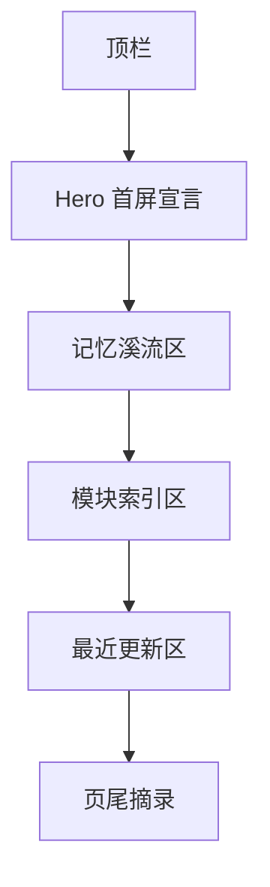

# 首页最终视觉稿说明

## 当前版本定位

首页不再采用“当前关注四卡片”的旧结构。

当前定稿已经切换为：

- 一个安静的首屏宣言
- 四条横向缓慢流动的记忆流带
- 下方保留模块索引与最近更新

它不是展示型官网，也不是资讯流首页。

它更像一本个人档案册的封面页，先让内容的气味出现，再把人带进具体板块。

## 首页路由与锚点

- 首页：`/`
- 记忆溪流：`/#memory-streams`
- 模块索引：`/#module-index`
- 最近更新：`/#recent-updates`

## 首页点击跳转规则

| 区域 | 点击行为 |
| --- | --- |
| 站点名 `RememberMyself` | 返回首页 `/` |
| 顶栏 `模块` | 打开模块面板 |
| Hero 主按钮 | 进入 `/books` |
| Hero 次按钮 | 滚动到 `/#memory-streams` |
| 每条流带右上角入口 | 跳到对应模块页 |
| 书影流中的单本书封面 | 跳到该书详情页 |
| 模块索引卡片 | 跳到对应模块页 |
| 最近更新卡片 | 跳到对应模块页或具体记录 |

## 页面结构



## 首页完整线框稿

```text
+--------------------------------------------------------------------------------------------------+
| RememberMyself                                                    模块    归档    登录            |
+--------------------------------------------------------------------------------------------------+
| 2026.03.16 / 安静的总索引                                                                  |
| 我把真正留下来的东西，放在这里，让它们缓慢流过。                                                |
| 这里不是展示型官网，而是一份仍在生长的个人档案册入口。                                          |
| [进入私人藏书室]   [看记忆溪流]                                                                |
+--------------------------------------------------------------------------------------------------+
| 记忆溪流                                                                                       |
| 书影流      真实书籍封面横向漂流      [进入藏书室]                                               |
| 声纹流      音乐占位封面缓慢漂流      [进入音乐页]                                               |
| 食味流      美食占位图片缓慢漂流      [进入美食页]                                               |
| 风景流      景色占位图片缓慢漂流      [进入景色页]                                               |
+--------------------------------------------------------------------------------------------------+
| 模块索引：用整卡入口回到各个板块                                                               |
+--------------------------------------------------------------------------------------------------+
| 最近更新：保留 4 张摘要卡，说明站点还在继续生长                                                  |
+--------------------------------------------------------------------------------------------------+
| “流过首页的，只是入口。真正的停留，发生在每一个板块里面。”                                       |
+--------------------------------------------------------------------------------------------------+
```

## 视觉 Token

当前前端实现使用深海蓝夜色体系。

```css
:root {
  --bg: #09111c;
  --surface: rgba(10, 18, 31, 0.94);
  --surface-strong: rgba(14, 24, 40, 0.98);
  --text-strong: #edf2ff;
  --text-body: #d6e0f0;
  --text-muted: #a7b4c7;
  --line: rgba(167, 180, 199, 0.16);
  --brand: #74a7ff;
  --brand-soft: #5ed7ff;
  --accent: #f2b766;
  --shadow-soft: 0 22px 56px rgba(3, 8, 18, 0.42);
}
```

四条流带各自拥有轻微偏色：

| 流带 | 主色倾向 | 气质 |
| --- | --- | --- |
| 书影流 | 偏冷蓝 | 稳定、理性、像书页边缘的冷光 |
| 声纹流 | 偏浅青 | 更轻、更飘，像空气中的声音残响 |
| 食味流 | 偏暖金 | 生活感更强，像灯下的食物温度 |
| 风景流 | 偏灰绿 | 更远、更平，像被压低饱和度的远景 |

## 区块详细说明

## 1. Hero

- 不是大而满的营销 Banner
- 仍然保留卡片边界，但气氛要轻
- 主标题限制在两行以内
- 两个动作按钮必须同时保留

按钮逻辑：

- 主按钮：进入已成熟的 `收藏书籍`
- 次按钮：快速跳到“记忆溪流”

## 2. 记忆溪流区

这是首页的核心新结构。

规则如下：

- 四条流带纵向堆叠
- 每条流带内部内容横向自动缓慢流动
- hover 时整条流带暂停
- 左右边缘有渐隐遮罩，避免“硬切”
- 书影流使用真实书籍数据
- 声纹流、食味流、风景流在对应模块未建成前先使用占位流带，不伪造用户真实内容

### 各流带文案

| 流带名 | 副标题 | 说明文案 |
| --- | --- | --- |
| 书影流 | 私人藏书 | 读过的、在读的、准备靠近的，都先以封面留下。 |
| 声纹流 | 喜欢的音乐 | 一首歌有时比一句话更像记忆本身。 |
| 食味流 | 喜欢的美食 | 我记住的不只是味道，还有它靠近生活的方式。 |
| 风景流 | 喜欢的景色 | 有些地方并不属于我，却长期停在我的视线里。 |

### 卡片尺寸

| 流带 | Desktop | Mobile | 比例 |
| --- | --- | --- | --- |
| 书影流 | `112px` | `84px` | `3:4` |
| 声纹流 | `136px` | `106px` | `1:1` |
| 食味流 | `178px` | `144px` | `4:3` |
| 风景流 | `208px` | `164px` | `16:10` |

### 卡片样式

- 圆角：`18px`，手机端 `15px`
- 边框：`1px solid rgba(167, 180, 199, 0.16)`
- 背景：深色渐变底
- 阴影：轻，不做悬浮感过强的厚阴影
- 真实卡片底部带一层渐隐文字遮罩
- 占位卡片改为虚线边框，并带轻微扫光

### 动效

- 默认自动滑动
- 书影流与食味流默认向左
- 声纹流与风景流默认向右
- 一条流带中允许存在 1 到 2 行平行流道
- 单条动画时长保持在 `52s - 92s`
- 不使用弹跳、不使用突兀加速

## 3. 模块索引区

模块索引仍然保留，因为它是最稳定的总入口。

职责是：

- 承担全站结构化导航
- 不让首页只剩气质，没有秩序

视觉要求：

- 使用规整网格
- 整卡可点击
- 比流带更安静、更克制

## 4. 最近更新区

最近更新不再承担首页主视觉，只承担“网站仍在变化”的证明作用。

要求：

- 保留 4 张摘要卡
- 文案简短
- 可直接跳转

## 5. 页尾摘录

页尾仍然只保留一句收束文案，不加按钮，不加额外功能。

## 手机端规则

- 记忆流带区块之间间距压缩
- 每条流带的头部改为上下结构
- 流带 viewport 左右全宽展开，减少手机端浪费留白
- 卡片尺寸统一缩小，但保持各自比例
- 模块索引和最近更新退回单列

## 当前版本结论

首页已经不再是“卡片墙”。

当前视觉方向正式确定为：

- 安静的总索引
- 深色夜海底板
- 四条缓慢流动的记忆带
- 真实书籍先上首页，其余模块先搭骨架，后续直接接入
