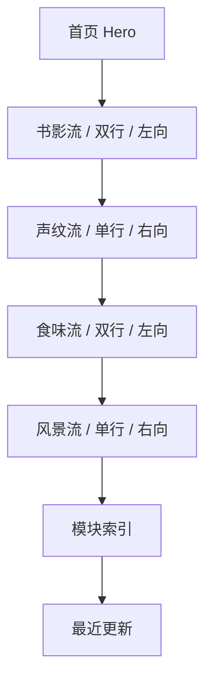

# 首页四条流带设计稿

## 目标

这份文档只服务于首页的“四条流带”。

它回答四件事：

- 四条流带怎么排
- 每条流带长什么样
- 首页整体里它们放在哪里
- 前端施工时哪些部分先接真实数据，哪些先保留占位

## 四条流带清单

| 流带 | 数据来源 | 当前状态 |
| --- | --- | --- |
| 书影流 | `books` 真实数据 | 已接真实书籍封面 |
| 声纹流 | `music` 模块 | 先占位，等待模块落地 |
| 食味流 | `food` 模块 | 先占位，等待模块落地 |
| 风景流 | `scenery` 模块 | 先占位，等待模块落地 |

## 四条流带布局图



## 每条流带的结构

```text
+----------------------------------------------------------------------------------------------+
| Section Label | 副标题 | 一句说明                                    数量 / 待录入  进入链接 |
+----------------------------------------------------------------------------------------------+
|  左渐隐  [卡片][卡片][卡片][卡片][卡片][卡片] 持续横向移动                           右渐隐  |
|  说明文字：在模块未录入完成前，这里先保留占位流带，后续直接替换为真实内容。                     |
+----------------------------------------------------------------------------------------------+
```

## 流带尺寸与节奏

| 项目 | Desktop | Mobile |
| --- | --- | --- |
| 单条流带外层圆角 | `28px` | `22px` |
| 单条流带内边距 | `26px` | `18px` |
| viewport 高度 | `190px` 左右 | `150px` 左右 |
| 行间距 | `14px` | `14px` |
| 左右渐隐宽度 | `72px` | `42px` |

## 各流带卡片规格

### 书影流

- 数据：真实书籍封面
- 行数：2 行
- 方向：向左
- 封面比例：`3:4`
- 底部显示：书名 + 阅读状态

### 声纹流

- 数据：占位
- 行数：1 行
- 方向：向右
- 封面比例：`1:1`
- 后续真实化后替换为：专辑封面 + 歌曲/专辑标题

### 食味流

- 数据：占位
- 行数：2 行
- 方向：向左
- 图片比例：`4:3`
- 后续真实化后替换为：食物照片 + 美食名称

### 风景流

- 数据：占位
- 行数：1 行
- 方向：向右
- 图片比例：`16:10`
- 后续真实化后替换为：景色照片 + 地点名

## 首页完整嵌入关系

```text
首页
├─ Hero
├─ 记忆溪流总区
│  ├─ 书影流
│  ├─ 声纹流
│  ├─ 食味流
│  └─ 风景流
├─ 模块索引
├─ 最近更新
└─ 页尾摘录
```

## 设计原则

- 流带不是功能宫格，它更像缓慢漂流的内容河道
- 首页不伪造数据，所以只有书影流现在接真实内容
- 其余三条流带先用“会动的占位骨架”，等模块上线后直接换数据
- 模块索引仍保留在流带下面，负责秩序，不被流带替代

## 实现建议

- 真实内容与占位内容共用同一套流带外壳
- 卡片动画通过重复数据形成无缝循环
- hover 暂停整条流带，便于查看和点击
- 手机端将 viewport 改成左右贴边，减少浪费空间
