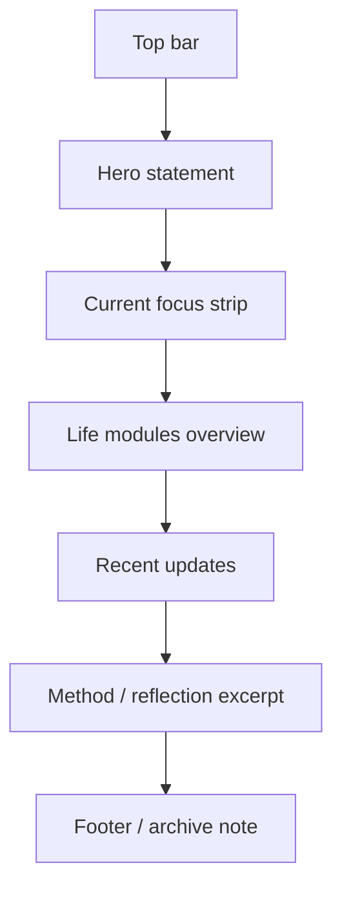

# Home Design

## Design Intent

The home page should not feel like a startup landing page.

It should feel like:

- a calm personal index
- a crafted object
- a long-term archive entrance

The emotion is quiet confidence with a restrained poetic undertone, not loud self-promotion.

## Visual Direction

Keywords:

- minimal
- restrained
- tactile
- precise
- calm

Material references:

- matte paper
- graphite ink
- brushed metal detail
- museum label precision

## Visual Language

### Palette

- background: warm ivory
- primary text: graphite black
- secondary text: muted stone gray
- accent: dark bronze / deep moss, used sparingly
- line color: soft ash

The home page should not rely on heavy gradients.

It should look expensive because of spacing, typography, and restraint.

### Typography

Recommended direction:

- Chinese headline: serif or humanist serif style
- body copy: clean sans
- meta data: narrow monospace or technical sans

Suggested pairings:

- `Source Han Serif SC` + `IBM Plex Sans`
- `Noto Serif SC` + `Inter Tight`

### Motion

- slow fade-in sections
- gentle reading-progress motion
- subtle card elevation on hover
- no playful bouncing or flashy hero animation

## Page Structure



## Desktop Prototype

```text
+--------------------------------------------------------------------------------+
| Top bar: RememberMyself | Modules | Login                                      |
+--------------------------------------------------------------------------------+
|                                                                        date    |
| "Remembering myself is a long-term act."                                      |
| Short paragraph about life system, memory, discipline, and affection.         |
| [Enter Books] [View Current State]                                            |
+--------------------------------------+-----------------------------------------+
| Current Focus                         | Quiet Status                           |
| 3 short lines: reading / body / money | today / this week / latest note        |
+--------------------------------------+-----------------------------------------+
| Module Index                                                                  |
| Books | Food | Music | Scenery | Fitness | Finance | Schedule | Methods       |
+--------------------------------------------------------------------------------+
| Recent from Life System                                                      |
| 4 summary cards, each one highly restrained                                  |
| - latest book                                                                 |
| - current weight trend                                                        |
| - latest expense note                                                         |
| - latest method note                                                          |
+--------------------------------------------------------------------------------+
| Closing block: "This site is a slow archive, not a feed."                     |
+--------------------------------------------------------------------------------+
```

## Mobile Prototype

```text
+--------------------------------------+
| Top bar                              |
+--------------------------------------+
| Hero statement                       |
| Short text                           |
| Primary actions                      |
+--------------------------------------+
| Current focus                        |
+--------------------------------------+
| Module cards, single-column          |
+--------------------------------------+
| Recent updates                       |
+--------------------------------------+
```

## Core Blocks

### 1. Top Bar

Contains:

- site name
- module entry
- login button

Style:

- thin
- very clean
- almost editorial

### 2. Hero Statement

Purpose:

- define the soul of the site
- explain that this is a personal memory system

Content style:

- one strong line
- one calm supporting paragraph

### 3. Current Focus Strip

Shows the living present, not only archive.

Suggested fields:

- current reading
- current body target
- current budget discipline

### 4. Module Index

This should feel like a cabinet index, not an app dashboard.

Each module card should be:

- thin border
- precise label
- one-line summary

### 5. Recent Updates

This block proves the site is alive.

It should contain:

- latest book status
- latest fitness record
- latest finance record
- latest insight

## Interaction Rules

- anonymous users can view all public summary blocks
- no editing UI is visible unless logged in
- logged-in users see subtle management actions, not admin-heavy clutter

## Aesthetic Guardrails

Do:

- large breathing room
- strong hierarchy
- few colors
- exact alignment
- meaningful negative space

Do not:

- overdecorate
- use oversized gradients
- make it look like a SaaS dashboard
- overload the home page with charts

## What Makes It Feel Mature

- the home page does not try to show everything
- it acts as a refined index
- the strongest feeling comes from typography and composition, not effects
