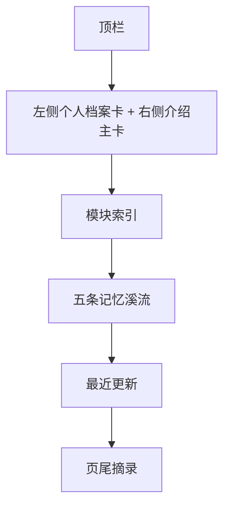

# 首页设计概览

## 首页定位

首页不是展示型官网，也不是博客信息流。

它现在的准确定位是：

**一张安静的个人总索引封面。**

作用不是把所有东西一次性讲完，而是先让访问者感受到：

- 这个网站是谁的
- 这个人正在整理什么
- 各个模块应该从哪里进入

## 当前结构



## 当前首页核心特征

### 1. 第一屏必须先讲清“你是谁”

首页首屏现在不再是大留白 Hero。

而是：

- 左侧：个人档案卡
- 右侧：自我介绍主卡

这样手机和桌面端一打开，都能先看到“人”，而不是只看到一个空氛围页。

### 2. 首页不是卡片墙，而是“总索引 + 溪流”

首页承担两种职责：

- `模块索引`：负责秩序、入口、结构感
- `记忆溪流`：负责气质、内容感、持续生长感

两者不能互相替代。

### 3. 五条流带是首页的灵魂区

当前五条流带分别是：

- 书影流
- 字句流
- 声纹流
- 食味流
- 风景流

它们像五条缓慢流动的内容河道，把首页从“导航页”变成“有记忆感的入口页”。

## 当前桌面端原型

```text
+--------------------------------------------------------------------------------------------------+
| RememberMyself                                                    模块    归档    登录            |
+--------------------------------------------------------------------------------------------------+
| 左：头像 / 姓名 / 标签 / 时间线 / 联系方式                                                     |
| 右：孙伯符 / Noah Brooks + 文案 + Motto + 按钮 + 统计卡                                          |
+--------------------------------------------------------------------------------------------------+
| 模块索引：10 个板块入口，承担结构化导航                                                        |
+--------------------------------------------------------------------------------------------------+
| 书影流：真实书封缓慢流动                                                                        |
| 字句流：真实文章卡缓慢流动                                                                      |
| 声纹流：音乐封面流位                                                                            |
| 食味流：美食照片流位                                                                            |
| 风景流：景色照片流位                                                                            |
+--------------------------------------------------------------------------------------------------+
| 最近更新                                                                                        |
+--------------------------------------------------------------------------------------------------+
| “流过首页的，只是入口。真正的停留，发生在每一个板块里面。”                                       |
+--------------------------------------------------------------------------------------------------+
```

## 当前手机端原则

- 不能出现大面积无效留白
- 第一屏就要看到人物信息和动作按钮
- 模块入口改为单列或紧凑双列
- 流带仍然保留，但视窗高度缩小
- 每条流带的说明文字要更短

## 当前视觉气质

首页气质已经从早期“纸张档案感”升级为：

- 冷静的诗意
- 现代玻璃感
- 深色矿石感
- 彩光点到为止

也就是说：

不是科技站，不是博客站，也不是阅读器站。

## 当前跳转规则

| 位置 | 行为 |
| --- | --- |
| 站点名 | 返回首页 |
| 顶栏模块按钮 | 打开模块面板 |
| Hero 主按钮 | 进入收藏书籍页 |
| Hero 次按钮 | 跳到记忆溪流 |
| 模块索引卡片 | 进入对应模块 |
| 流带右上角入口 | 进入对应模块 |
| 书影流卡片 | 打开对应书籍详情 |

## 当前已废弃的旧方案

以下口径已经不再作为首页当前版本参考：

- 大面积米黄纸张底
- 以“当前关注区”为核心的旧首页
- 超大留白 Hero
- 单层静态模块卡片式首页

以后首页设计与实现，一律以这套结构为准。
