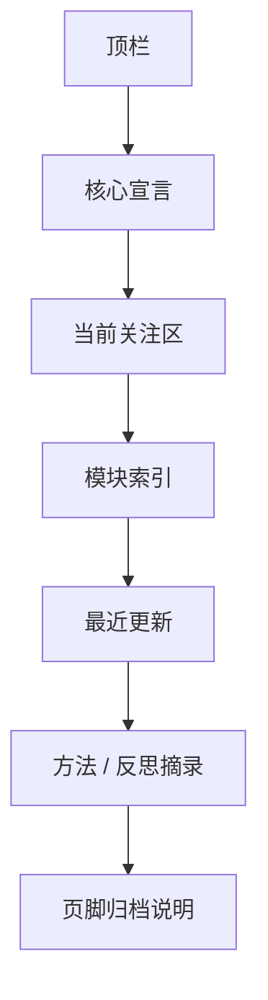

# 首页设计概览

## 设计定位

首页不是展示型官网。

它应该像一个安静、克制、被认真装帧过的总索引页。

更准确地说：

- 它是人生系统的入口
- 它是长期记录的封面
- 它是秩序感与时间感的起点

首页的情绪不是“我要展示自己”，而是：

**我在认真地整理自己，并允许别人安静地看见。**

## 设计气质

当前已确认的关键词：

- 简约
- 工艺美感
- 冷静的诗意
- 克制
- 精确
- 留白

材质参考：

- 温暖的纸张
- 石墨色墨迹
- 拉丝金属边角
- 档案标签式排版

## 页面结构



## 桌面原型

```text
+--------------------------------------------------------------------------------+
| RememberMyself                                  模块 | 归档 | 登录              |
+--------------------------------------------------------------------------------+
|                                                                     2026.03.16 |
| 记住自己，是一场缓慢而长期的整理。                                              |
| 这里存放我的阅读、身体、时间、收支和方法，也存放我如何慢慢成为我自己。            |
| [进入书籍]   [查看此刻]                                                         |
+--------------------------------------+-----------------------------------------+
| 当前关注                              | 安静状态                                |
| 阅读 / 身体 / 收支 / 方法              | 今日 / 本周 / 最近一次记录              |
+--------------------------------------+-----------------------------------------+
| 模块索引：书籍 | 美食 | 音乐 | 景色 | 健身 | 收支 | 时间 | 方法                |
+--------------------------------------------------------------------------------+
| 最近更新：4 张克制的摘要卡片                                                 |
+--------------------------------------------------------------------------------+
| “这里不是信息流，而是缓慢生长的个人归档。”                                     |
+--------------------------------------------------------------------------------+
```

## 手机原型

```text
+--------------------------------------+
| 顶栏：站点名 / 登录                  |
+--------------------------------------+
| 核心宣言                            |
| 一句主文案 + 一段辅助说明            |
| 主按钮 / 次按钮                      |
+--------------------------------------+
| 当前关注                            |
+--------------------------------------+
| 模块索引卡片（单列）                 |
+--------------------------------------+
| 最近更新                            |
+--------------------------------------+
```

## 核心区块说明

### 1. 顶栏

只保留最必要的信息：

- 站点名
- 模块入口
- 登录入口

它应该极薄、干净，像页眉，而不是导航条。

### 2. 核心宣言

这里决定首页有没有“灵魂”。

内容结构建议：

- 一句有力量的主文案
- 一段安静的补充说明
- 两个动作按钮

### 3. 当前关注区

这个区块的意义是告诉访问者：

这个网站不是死档案，而是仍在生长。

建议先呈现：

- 当前阅读
- 当前身体目标
- 当前收支纪律
- 当前方法实践

### 4. 模块索引

它不应该做成应用宫格。

更适合做成：

- 档案卡片
- 柜签式入口
- 每张卡只给一句摘要

### 5. 最近更新

这里用来证明页面“活着”。

建议首批摘要来源：

- 最新一本书
- 最近一次体重变化
- 最近一次支出记录
- 最近一条方法心得

## 交互原则

- 游客可以看所有公开摘要
- 未登录时不出现编辑控件
- 登录后，管理入口要轻量、低调，不要突然变成后台系统

## 成熟感来源

- 不试图在首页展示所有东西
- 不靠特效来制造高级感
- 用留白、排版、比例和节奏来制造“贵”的感觉
