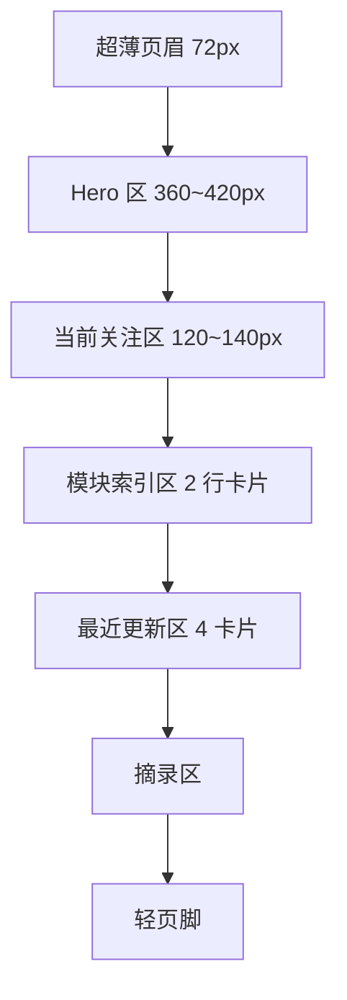

# 首页版式深化说明

## 目标

这一版不是再讨论“首页应该是什么”，而是把首页推进到更接近正式 UI 的层级。

目标是让后续真正进入开发时，首页已经有明确的：

- 信息层级
- 栅格关系
- 组件密度
- 文案语气
- 手机端收缩方式

一句话总结：

**首页要像一本精心装帧的人生档案封面，而不是一个互联网产品首页。**

## 桌面端版式骨架

建议采用：

- 内容最大宽度：`1240px`
- 中央主容器：`1120px`
- 12 栏栅格
- 页面左右留白大于普通内容站

推荐分区高度感：

- 页眉：轻、薄、低存在感
- Hero：全页最有呼吸感的区域
- 当前关注：收紧信息密度
- 模块索引：最规整、最秩序化
- 最近更新：最有生活感
- 结尾摘录：最安静



## 桌面端结构原型

```text
+--------------------------------------------------------------------------------------------------+
| RememberMyself                                                    模块    归档    登录            |
+--------------------------------------------------------------------------------------------------+
| 2026.03.16                                                                         Shanghai       |
|                                                                                                  |
| 记住自己，是一场缓慢而长期的整理。                                                                |
|                                                                                                  |
| 我把阅读、身体、收支、时间和方法放进同一个系统里，                                                 |
| 让自己在漫长的日子里，不至于被忙碌和遗忘冲散。                                                     |
|                                                                                                  |
| [进入收藏书籍]      [查看此刻状态]                                                                 |
|                                                                                                  |
+--------------------------------------------------------------------------------------------------+
| 当前阅读：书名                     身体目标：轻一点、稳一点                                        |
| 本周收支：保持克制                 最近方法：让事情变简单                                         |
+--------------------------------------------------------------------------------------------------+
| 书籍         一句摘要              | 美食         一句摘要                                        |
| 音乐         一句摘要              | 景色         一句摘要                                        |
| 健身         一句摘要              | 收支         一句摘要                                        |
| 时间         一句摘要              | 方法         一句摘要                                        |
+--------------------------------------------------------------------------------------------------+
| 最近更新                                                                                          |
| [书籍短评卡] [体重变化卡] [支出反思卡] [方法句子卡]                                                |
+--------------------------------------------------------------------------------------------------+
| “这里不是信息流，而是缓慢生长的个人归档。”                                                         |
+--------------------------------------------------------------------------------------------------+
```

## 手机端结构原型

```text
+--------------------------------------+
| RememberMyself          登录         |
+--------------------------------------+
| 2026.03.16 / Shanghai                |
|                                      |
| 记住自己，是一场缓慢而长期的整理。    |
|                                      |
| 一段辅助文案                         |
| [进入收藏书籍] [查看此刻]            |
+--------------------------------------+
| 当前关注                             |
| 当前阅读 / 身体 / 收支 / 方法         |
+--------------------------------------+
| 模块索引卡片                         |
| 书籍                                 |
| 美食                                 |
| 音乐                                 |
| 景色                                 |
| 健身                                 |
| 收支                                 |
| 时间                                 |
| 方法                                 |
+--------------------------------------+
| 最近更新                             |
+--------------------------------------+
```

## 栅格和比例建议

### 1. 页眉

- 高度建议：`64px ~ 72px`
- 左侧：站点名
- 中间：可选模块入口
- 右侧：归档 / 登录

不建议：

- 把页眉做得很重
- 放太多导航
- 放头像、简介、搜索同时出现

### 2. Hero

建议占首页视觉重心的 `35%` 左右。

内容布局：

- 上方：日期 / 城市 / 元信息
- 中间：一句主文案
- 下方：一段辅助文案
- 最下：两个动作按钮

推荐最大文字宽度：

- 主文案：`12~16` 个中文字符最佳
- 辅助文案：每行不超过 `22~28` 个中文字符

### 3. 当前关注区

建议为四等分横排。

每块结构：

- 小标签
- 当前状态
- 更新时间

视觉上更像“档案标签”而不是功能卡片。

### 4. 模块索引区

建议：

- 桌面端两列或四列均可
- 当前更推荐 `2 列 x 4 行`

理由：

- 更像目录页
- 更稳重
- 比 4 列更有阅读感

### 5. 最近更新区

建议维持 4 张卡片。

每张卡片结构：

- 模块名
- 一句近期摘要
- 时间
- 轻微进入提示

## 组件风格细化

### 按钮

首页按钮不做强产品化。

建议：

- 主按钮：描边或深苔绿细色块
- 次按钮：纯描边
- 圆角：偏小
- 高度：`40px ~ 44px`

感觉要像标签、印章、书签，而不是电商按钮。

### 卡片

卡片不要厚重阴影。

建议：

- 1px 细线边框
- 很浅的底色差
- 轻微 hover 抬升
- 阴影接近无或极弱

### 文字层级

建议至少分成四层：

- L1：主文案
- L2：模块标题 / 区块标题
- L3：正文摘要
- L4：时间、元数据、标签

## 文案语气建议

首页文案必须统一口吻。

推荐语气：

- 不鸡汤
- 不夸张
- 不成功学
- 不过分自我表演

推荐主文案方向：

1. 记住自己，是一场缓慢而长期的整理。
2. 我把喜欢、秩序与日常，慢慢归档成自己。
3. 人生不是展示，而是长期校准与保存。

辅助文案方向：

- 描述“为什么要做这个网站”
- 语言要安静
- 不要过于功能介绍式

## 手机端收缩原则

手机端不能只是桌面端缩小。

必须主动做三件事：

- 减少同屏信息量
- 压缩无效留白
- 强化主路径

### 手机端优先顺序

1. 主文案
2. 两个按钮
3. 当前关注
4. 模块索引
5. 最近更新

### 手机端删减项

- 页眉中间导航可隐藏
- Hero 辅助文案可缩短为两行
- 模块摘要要缩成一句
- 最近更新卡片可改纵向单列

## 首页后续实现检查清单

如果未来真的开始开发，首页完成后要检查：

- 第一屏是否已经传达“人生系统”而不是“博客”
- 第一屏是否没有堆过多信息
- 模块索引是否显得像目录，而不是应用宫格
- 卡片是否足够克制
- 手机端是否一屏内看懂主路径

## 这一版确认结论

- 首页保持“安静的总索引”定位
- 气质明确为“冷静的诗意”
- 版式重点落在留白、比例、纸感和秩序感
- 手机端必须做主动收缩，而不是机械缩放
