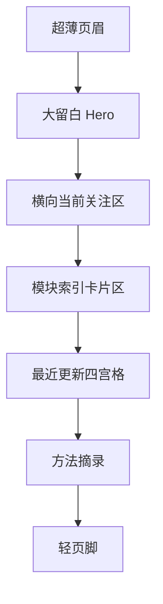

# 首页高保真说明

## 总体基调

首页的目标不是“让人惊艳”，而是“让人安静下来”。

它的气质应当是：

- 冷静
- 有节制
- 带一点诗意
- 像长期保存的纸质档案，而不是互联网热点页面

一句话定义：

**这是一本正在继续书写的人生档案的封面页。**

## 视觉主张

### 色彩

- 主背景：温暖象牙白 `#F4EFE6`
- 主文字：石墨黑 `#1F1D1A`
- 次文字：石灰灰 `#6E6A63`
- 细线：灰烬色 `#D8D0C4`
- 点缀色：深苔绿 `#465246`
- 金属点缀：暗铜 `#7A6248`

原则：

- 不用大面积浓色块
- 不用重渐变
- 点缀色极少出现

### 字体

- 中文标题：思源宋体 / Noto Serif SC 一类
- 正文：思源黑体 / IBM Plex Sans 一类
- 时间、元信息：窄体无衬线或轻量等宽字体

排版关系：

- 标题要有书页气
- 正文要干净
- 元信息要像档案标签

## 版式节奏



节奏要求：

- Hero 留白最大
- 模块索引最规整
- 最近更新最生活化
- 页脚最轻，不抢视线

## 高保真文字原型

```text
+--------------------------------------------------------------------------------+
| RememberMyself                                              模块  归档  登录   |
+--------------------------------------------------------------------------------+
| 2026.03.16                                                             Shanghai |
|                                                                                |
| 记住自己，是一场缓慢而长期的整理。                                              |
|                                                                                |
| 我把阅读、身体、收支、时间和方法放在同一个系统里，                               |
| 不是为了展示，而是为了在漫长的日子里，不把自己弄丢。                            |
|                                                                                |
| [进入收藏书籍]    [查看当前状态]                                                |
|                                                                                |
+--------------------------------------------------------------------------------+
| 当前阅读：xxx      身体目标：xxx      本周支出：xxx      最近方法：xxx            |
+--------------------------------------------------------------------------------+
| 书籍       一句摘要                                                             |
| 美食       一句摘要                                                             |
| 音乐       一句摘要                                                             |
| 景色       一句摘要                                                             |
| 健身       一句摘要                                                             |
| 收支       一句摘要                                                             |
| 时间       一句摘要                                                             |
| 方法       一句摘要                                                             |
+--------------------------------------------------------------------------------+
| 最近更新                                                                     |
| [卡片1] [卡片2] [卡片3] [卡片4]                                               |
+--------------------------------------------------------------------------------+
| 这里不是信息流，而是缓慢生长的个人归档。                                       |
+--------------------------------------------------------------------------------+
```

## 组件细节

### Hero 区

要求：

- 文案必须短
- 主标题最好控制在 16 到 24 个中文字符以内
- 按钮不要超过两个
- 按钮风格要像印章或标签，不要像产品按钮

### 当前关注区

更适合做成四段横排信息，而不是彩色卡片。

每段信息结构：

- 小标签
- 一句当前状态
- 一行更新时间

### 模块索引

建议每个模块卡片都保持统一高度。

卡片内只保留：

- 模块名
- 一句摘要
- 极轻的进入提示

不要在这里放编辑按钮。

### 最近更新区

这里的卡片可以有轻微的生活感，但依旧要克制。

例如：

- 一本书的短评
- 一天的体重变化
- 一笔花销的反思
- 一条方法句子

## 动效建议

- 页面初次加载时，各区块按顺序轻微淡入
- 鼠标悬停时，卡片只做极轻的抬升和阴影变化
- 不做弹跳、滑入过多、花哨视差

## 手机端策略

手机端必须保证一屏内看到核心内容，不要出现一打开就是大面积无效留白。

手机版顺序：

1. 顶栏
2. 核心宣言
3. 当前关注
4. 模块索引
5. 最近更新

手机端原则：

- 按钮并排时不超过两个
- 模块卡片改成单列
- 最近更新改为纵向滚动
- 时间、元信息缩小但保持精致

## 首页后续实现时的关键边界

- 不要做成博客首页
- 不要做成管理后台
- 不要做成个人简介页

它应当像：

**一个还在继续书写、但已经很有秩序的人生总索引。**
