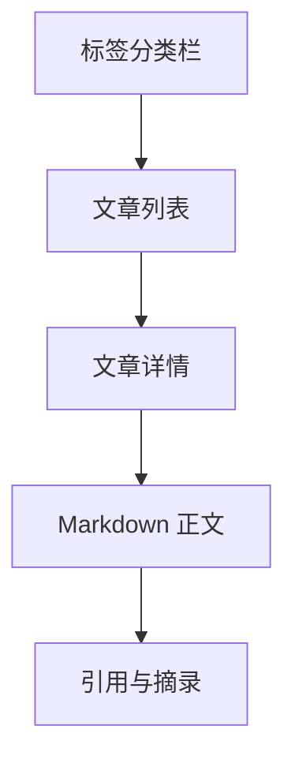

# 方法心得最终视觉稿说明

## 目标

这份文档定义“方法心得”页面的最终视觉规格。

这个页面不是普通博客文章流，而是：

- 个人方法论档案
- 一些长期有效原则的保存页
- 适合反复回看的思考集合

它必须像纸质阅读空间，而不是媒体站信息流。

## 页面路由

- 页面主页：`/methods`
- 文章详情高亮：`/methods/:slug`
- 新增 / 编辑：保留在 `/methods`，通过抽屉或独立编辑页打开

## 视觉基调

关键词：

- 安静
- 有思想密度
- 接近纸质阅读
- 克制
- 可长期停留

## 视觉 Token

```css
:root {
  --rm-methods-bg: #F1EEE8;
  --rm-methods-surface: #FBF8F3;
  --rm-methods-surface-2: #EEE9E1;
  --rm-methods-text-strong: #23211F;
  --rm-methods-text-body: #403A35;
  --rm-methods-text-muted: #7A726A;
  --rm-methods-line: #DED5C9;
  --rm-methods-accent-ink: #4E5A58;
  --rm-methods-accent-bronze: #826D58;
  --rm-methods-accent-soft: rgba(78, 90, 88, 0.10);
  --rm-methods-shadow-soft: 0 12px 30px rgba(35, 33, 31, 0.04);
  --rm-methods-shadow-hover: 0 16px 34px rgba(35, 33, 31, 0.07);
}
```

## 字体与字级

| 用途 | 字体 | 字号 | 行高 | 字重 |
| --- | --- | --- | --- | --- |
| 页面标题 | serif | `28px` | `1.3` | `600` |
| 文章标题 | serif | `34px` | `1.25` | `600` |
| 列表标题 | serif | `18px` | `1.4` | `600` |
| 正文 | sans | `16px` | `1.95` | `400` |
| 引文 / 重点句 | serif | `20px` | `1.8` | `500` |
| 标签 / 元数据 | sans | `12px` | `1.5` | `500` |

## 页面布局

### 桌面端

- 左：标签与分类 `220px`
- 中：文章列表 `1fr`
- 右：文章详情 `420px`
- 栏间距：`24px`

### 手机端

- 顶部搜索与标签
- 中部文章列表
- 点击后进入全屏详情阅读

## 页面结构



## 左侧标签与分类栏

### 内容

- 标签
- 分类
- 时间筛选

### 样式

- 背景：`var(--rm-methods-surface)`
- 边框：`1px solid var(--rm-methods-line)`
- 圆角：`16px`
- 内边距：`18px`

### 标签项

- 高度：`32px`
- 圆角：`999px`
- 选中态背景：`var(--rm-methods-accent-soft)`

## 中间文章列表

### 排布

- 第一版采用纵向文章卡
- 项间距：`14px`
- 每项最小高度：`112px`

### 单篇卡片结构

1. 标题
2. 一句摘要
3. 标签
4. 更新时间

### 样式

- 背景：`var(--rm-methods-surface)`
- 边框：`1px solid var(--rm-methods-line)`
- 圆角：`16px`
- 内边距：`18px`
- hover：上移 `2px`

## 右侧文章详情区

### 内容顺序

1. 标题
2. 元信息
3. 摘要句
4. 正文
5. 相关文章 / 相似标签

### 正文排版

第一版必须支持 Markdown 渲染。

建议排版规则：

- 正文字号：`16px`
- 行高：`1.95`
- 段落间距：`18px`
- 标题层级清楚
- 列表缩进克制
- 引文区块有轻背景

### 引文样式

- 左边 `2px` 竖线
- 字体略偏 serif
- 字号：`20px`
- 背景：`rgba(251,248,243,0.7)`

## 搜索与筛选

### 搜索框

- 高度：`42px`
- 背景：`rgba(251,248,243,0.92)`
- 边框：`1px solid var(--rm-methods-line)`
- 圆角：`12px`

### 搜索逻辑

- 标题
- 标签
- 摘要
- 正文全文

## 编辑入口

### 文案

- `写一条方法`

### 样式

- 高度：`42px`
- 背景：`var(--rm-methods-accent-ink)`
- 文字：`#FBF8F3`
- 圆角：`10px`

## 编辑抽屉 / 编辑页

### 分区

1. 标题与摘要
2. 标签与分类
3. Markdown 正文
4. 可见性与引用

### 字段

- 标题
- 一句摘要
- 标签
- 分类
- Markdown 正文
- 可见性

### 样式

- 如用抽屉，宽度：`560px`
- 如用独立编辑页，保持阅读页同字体体系

## 手机端规则

- 搜索与标签放顶部
- 列表单列
- 点击进入全屏阅读页
- 阅读页底部保留编辑入口

## 前端实现验收标准

- 页面第一眼像私人思想档案，不像内容平台
- Markdown 正文必须有良好阅读感
- 列表和详情联动清楚
- 搜索和标签筛选都必须轻，不要做复杂管理后台

## 本版结论

这一版已经把方法心得页推进到最终视觉稿层级：

- 颜色
- 字级
- 标签栏
- 文章列表
- 详情阅读区
- Markdown 排版
- 搜索与编辑入口
- 手机端结构
