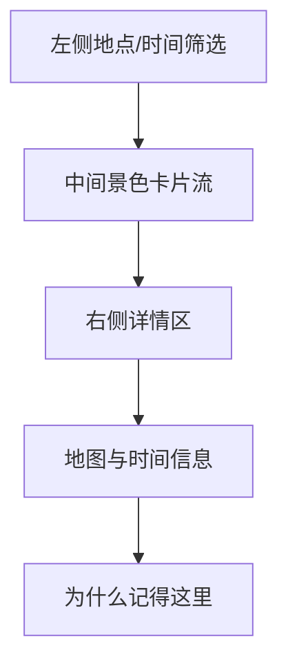

# 喜欢的景色最终视觉稿说明

## 目标

这份文档定义“喜欢的景色”页面的最终视觉规格。

这个页面不是旅游攻略页，也不是纯图片画廊。

它更像：

- 风景档案
- 带地点、时间、文字和照片的记忆页
- 一些安静场所的长期保存

它的重点不只是“好看”，而是“为什么我记得这里”。

## 页面路由

- 页面主页：`/scenery`
- 景色详情高亮：`/scenery/:id`
- 新增 / 编辑：保留在 `/scenery`，通过抽屉打开

## 第一版产品范围

当前第一版已经明确纳入：

- 手机端多图上传
- 自动读取照片里的拍摄时间
- 自动读取 GPS 并尝试反查地点
- 图片上传后进入景色列表与首页风景流

这一版先保证“上传顺手、识别可用、展示成立”，不先做重型地图与预览确认流。

## 视觉基调

关键词：

- 呼吸感
- 安静
- 图像优先
- 轻
- 有空间感

## 视觉 Token

```css
:root {
  --rm-scenery-bg: #ECEAE4;
  --rm-scenery-surface: #F8F6F1;
  --rm-scenery-surface-2: #E8E5DE;
  --rm-scenery-text-strong: #21201D;
  --rm-scenery-text-body: #3E3B36;
  --rm-scenery-text-muted: #757069;
  --rm-scenery-line: #D8D2C8;
  --rm-scenery-accent-stone: #5F6A67;
  --rm-scenery-accent-earth: #87735E;
  --rm-scenery-accent-soft: rgba(95, 106, 103, 0.10);
  --rm-scenery-shadow-soft: 0 14px 32px rgba(33, 32, 29, 0.04);
  --rm-scenery-shadow-hover: 0 18px 36px rgba(33, 32, 29, 0.07);
}
```

## 字体与字级

| 用途 | 字体 | 字号 | 行高 | 字重 |
| --- | --- | --- | --- | --- |
| 页面标题 | serif | `28px` | `1.3` | `600` |
| 景色标题 | serif | `30px` | `1.25` | `600` |
| 卡片标题 | serif | `18px` | `1.35` | `600` |
| 正文说明 | sans | `15px` | `1.85` | `400` |
| 地点 / 时间信息 | sans | `13px` | `1.6` | `500` |
| 标签 | sans | `12px` | `1.5` | `500` |

## 页面布局

### 桌面端

- 页面主容器：`1240px`
- 左侧筛选：`220px`
- 中间景色列表：`1fr`
- 右侧详情：`400px`
- 栏间距：`24px`

### 手机端

- 左右留白：`16px`
- 景色卡片单列
- 点击后进入全屏详情
- 编辑使用全屏页或底部抽屉

## 页面结构



## 左侧筛选栏

### 建议筛选

- 城市 / 地区
- 时间
- 场景类型：山 / 海 / 街道 / 建筑 / 夜景 / 天空
- 是否有文字说明

### 样式

- 筛选 chip 高度：`32px`
- 圆角：`999px`
- 选中态背景：`var(--rm-scenery-accent-soft)`

## 中间景色列表

### 排布

- 第一版采用双列图像卡片
- 卡片间距：`18px`
- 卡片最小高度：`280px`

### 卡片结构

1. 主图
2. 标题
3. 地点 / 时间
4. 一句说明

### 卡片样式

- 背景：`var(--rm-scenery-surface)`
- 边框：`1px solid var(--rm-scenery-line)`
- 圆角：`18px`
- 内边距：`16px`
- 阴影：`var(--rm-scenery-shadow-soft)`

### 图片规则

- 比例：`4:3`
- 圆角：`14px`
- `object-fit: cover`

### hover

- 整卡可点
- 上移 `2px`
- 阴影：`var(--rm-scenery-shadow-hover)`

## 右侧详情区

### 内容顺序

1. 大图轮播 / 首图
2. 标题
3. 地点 / 时间 / 坐标
4. 为什么记得这里
5. 说明文字
6. 地图区

### 大图区

- 主图高度：`220px`
- 圆角：`16px`
- 如有多图，底部显示缩略图条

### `为什么记得这里`

这是景色页的灵魂区块。

样式建议：

- 左侧 `2px` 竖线
- 字号：`16px`
- 行高：`1.9`
- 字重：`500`

### 地图区

- 第一版可以是静态地图卡或坐标信息卡
- 最小高度：`140px`
- 背景：`rgba(248,246,241,0.72)`
- 边框：`1px solid var(--rm-scenery-line)`
- 圆角：`14px`

## 编辑抽屉

### 分区

1. 基础信息
2. 图片上传
3. 地点与时间
4. 记忆说明

### 字段

- 标题
- 图片组
- 地点
- 地址
- 坐标
- 时间
- 一句说明
- 为什么记得这里
- 长说明

### 样式

- 抽屉宽度：`520px`
- 输入框高度：`42px`
- 多行输入：`120px`

## 手机端规则

- 景色列表改单列
- 首图保持大图优先
- 详情页先看图，再看文字，再看地点
- 地图区缩成简洁卡片

## 前端实现验收标准

- 第一眼像风景记忆页，不像旅游网站
- 图片必须是主角，但文字不能被削弱到只剩标题
- “为什么记得这里”必须明显成为页面重点
- 手机端浏览图片和地点信息要顺手

## 本版结论

这一版已经把景色页推进到最终视觉稿层级：

- 颜色
- 字级
- 图像卡片
- 详情区
- 地图区
- 记忆说明区
- 手机端结构
