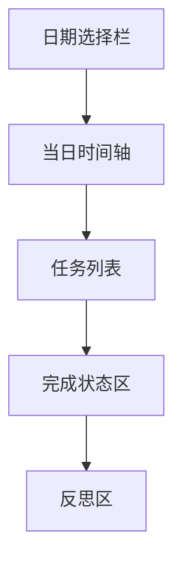

# 时间安排最终视觉稿说明

## 目标

这份文档定义“时间安排”页面的最终视觉规格。

这个页面不是复杂项目管理工具，而是：

- 个人节奏安排页
- 每日任务与完成状态页
- 时间刻度感与反思并存的页面

它必须清楚、有秩序，但不要让人紧张。

## 页面路由

- 页面主页：`/schedule`
- 日期详情高亮：`/schedule/:date`
- 新增 / 编辑：保留在 `/schedule`，通过抽屉打开

## 视觉基调

关键词：

- 准确
- 轻量
- 时间刻度感
- 秩序
- 不压迫

## 视觉 Token

```css
:root {
  --rm-schedule-bg: #EFECE7;
  --rm-schedule-surface: #FAF7F2;
  --rm-schedule-surface-2: #ECE8E1;
  --rm-schedule-text-strong: #25221F;
  --rm-schedule-text-body: #3F3A35;
  --rm-schedule-text-muted: #787168;
  --rm-schedule-line: #DDD4C8;
  --rm-schedule-accent-ink: #56605C;
  --rm-schedule-accent-bronze: #866E58;
  --rm-schedule-accent-soft: rgba(86, 96, 92, 0.10);
  --rm-schedule-done: #526559;
  --rm-schedule-pending: #8A755F;
  --rm-schedule-shadow-soft: 0 12px 30px rgba(37, 34, 31, 0.04);
  --rm-schedule-shadow-hover: 0 16px 34px rgba(37, 34, 31, 0.07);
}
```

## 字体与字级

| 用途 | 字体 | 字号 | 行高 | 字重 |
| --- | --- | --- | --- | --- |
| 页面标题 | serif | `28px` | `1.3` | `600` |
| 日期主标题 | serif | `26px` | `1.3` | `600` |
| 任务标题 | serif | `17px` | `1.4` | `600` |
| 正文说明 | sans | `15px` | `1.8` | `400` |
| 时间刻度 | mono | `12px` | `1.5` | `500` |
| 标签 / 状态 | sans | `12px` | `1.5` | `500` |

## 页面布局

### 桌面端

- 左：日期选择栏 `220px`
- 中：当日时间安排 `1fr`
- 右：完成情况与反思 `360px`
- 栏间距：`24px`

### 手机端

- 顶部日期切换
- 中部任务列表
- 下方完成状态与反思
- 新增任务按钮固定底部

## 页面结构



## 左侧日期选择栏

### 内容

- 本周日期列表
- 今日高亮
- 可切换上一周 / 下一周

### 样式

- 背景：`var(--rm-schedule-surface)`
- 边框：`1px solid var(--rm-schedule-line)`
- 圆角：`16px`
- 内边距：`18px`

### 日期项

- 高度：`44px`
- 圆角：`10px`
- 今日选中态背景：`var(--rm-schedule-accent-soft)`

## 当日时间安排区

### 第一版形式

- 纵向时间轴 + 任务卡

### 时间轴样式

- 左侧时间刻度宽度：`64px`
- 时间刻度字体：等宽 `12px`
- 中间 1px 时间线

### 任务卡样式

- 最小高度：`88px`
- 背景：`var(--rm-schedule-surface)`
- 边框：`1px solid var(--rm-schedule-line)`
- 圆角：`14px`
- 内边距：`16px`

### 单任务结构

1. 时间段
2. 任务名
3. 分类标签
4. 完成状态
5. 一句备注

### 状态色

- 已完成：`var(--rm-schedule-done)`
- 未完成 / 待办：`var(--rm-schedule-pending)`

## 完成情况区

### 内容

- 今日完成率
- 已完成数量
- 未完成数量

### 样式

- 最小高度：`160px`
- 背景：`var(--rm-schedule-surface)`
- 边框：`1px solid var(--rm-schedule-line)`
- 圆角：`16px`
- 内边距：`20px`

## 反思区

### 作用

这是时间安排页区别于普通待办页的关键。

页面不只记录“做了什么”，还记录：

**这一天的节奏是否合理。**

### 样式

- 最小高度：`180px`
- 背景：`rgba(250,247,242,0.86)`
- 边框：`1px solid var(--rm-schedule-line)`
- 圆角：`16px`
- 内边距：`20px`

## 新增任务入口

### 文案

- `安排今天`

### 样式

- 高度：`44px`
- 背景：`var(--rm-schedule-accent-ink)`
- 文字：`#FAF7F2`
- 圆角：`12px`

## 编辑抽屉

### 分区

1. 基础信息
2. 时间段
3. 分类与状态
4. 备注与反思

### 字段

- 日期
- 开始时间
- 结束时间
- 任务
- 分类
- 完成状态
- 备注
- 当日反思

### 样式

- 抽屉宽度：`500px`
- 顶部固定标题栏：`68px`
- 底部固定保存区：`76px`

## 手机端规则

- 日期切换用横向可滑动条
- 时间轴简化为任务卡列表
- 任务卡里保留时间、标题、状态三层信息
- 底部固定新增按钮

## 前端实现验收标准

- 页面第一眼像个人时间规划页，不像项目管理后台
- 时间信息必须清楚，但不能太密
- 完成状态要明确，但不制造焦虑感
- 反思区必须保留，不能只剩待办功能

## 本版结论

这一版已经把时间安排页推进到最终视觉稿层级：

- 颜色
- 字级
- 日期选择栏
- 时间轴
- 任务卡
- 完成情况区
- 反思区
- 手机端结构
