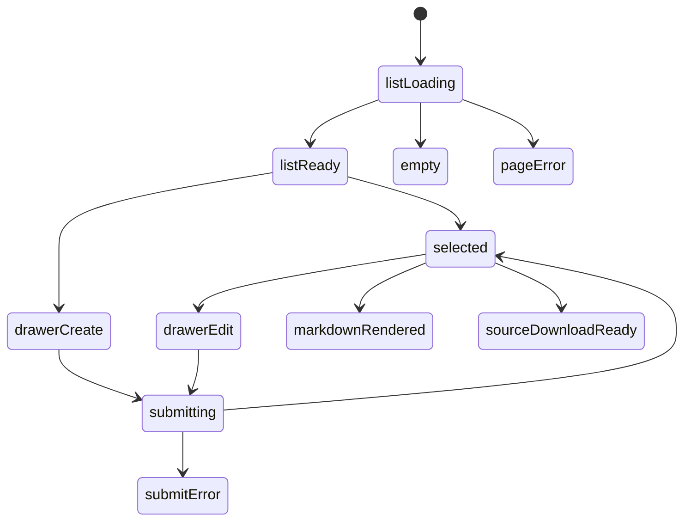

# 文章模块实现说明

## 当前实现目标

文章模块第一版已经收敛为一个独立的 Markdown 文档档案页。

实现范围：

- 文章列表
- 文章详情
- 上传 `.md`
- 下载 `.md`
- 编辑正文并覆盖源文件
- Markdown 渲染展示
- 首页字句流接入

## 路由

- `/articles`
- `/articles/:id`
- `/articles/create`
- `/articles/:id/edit`
- `/articles/:id/delete`
- `/articles/:id/download`

## 组件树

```text
ArticlesPage
├─ ArticlesHeader
├─ ArticlesFilterRail
├─ ArticlesListSection
│  └─ ArticleListItem
├─ ArticleDetailPanel
│  ├─ ArticleMetaPanel
│  ├─ ArticleSourcePanel
│  └─ ArticleMarkdownPanel
└─ ArticleEditorDrawer
```

## 组件职责

| 组件 | 责任 | 关键输入 |
| --- | --- | --- |
| `ArticlesPage` | 编排页面与筛选状态 | `session`, `query` |
| `ArticlesHeader` | 搜索与新增入口 | `query`, `canEdit` |
| `ArticlesFilterRail` | 可见性筛选与模块说明 | `filters`, `canEdit` |
| `ArticlesListSection` | 文章列表与空态 | `articles`, `selectedId` |
| `ArticleListItem` | 单篇文章摘要卡 | `article` |
| `ArticleDetailPanel` | 文件信息、下载和正文展示 | `article` |
| `ArticleEditorDrawer` | 新增与编辑抽屉 | `mode`, `form` |

## 数据模型

### `ArticleEntry`

- `title`
- `summary`
- `markdown_content`
- `source_file`
- `source_filename`
- `visibility`
- `created_at`
- `updated_at`

## 服务端渲染上下文

```json
{
  "articles": [],
  "selected_article": null,
  "active_filters": {
    "q": "",
    "visibility": ""
  },
  "visibility_filters": [],
  "editor_mode": null,
  "form": null,
  "can_edit": false
}
```

## 交互规则

- 游客只看公开文章
- 登录用户可看 `login_required`
- 编辑者可新增、编辑、上传、删除
- 上传新 `.md` 时，文件内容优先覆盖正文
- 直接改正文保存时，正文会回写到当前源文件
- 如果历史数据没有源文件，下载时自动补建

## 页面状态细图



## 接口草案

第一版仍然使用服务端渲染，但后续可拆 API：

| 方法 | 路径 | 用途 |
| --- | --- | --- |
| `GET` | `/api/articles` | 获取文章列表 |
| `GET` | `/api/articles/:id` | 获取文章详情 |
| `POST` | `/api/articles` | 新增文章 |
| `PATCH` | `/api/articles/:id` | 更新文章 |
| `DELETE` | `/api/articles/:id` | 删除文章 |
| `GET` | `/api/articles/:id/download` | 下载最新 `.md` |

## 与首页的关系

首页中的 `字句流` 直接消费文章模块真实数据。

字段需求：

- `id`
- `title`
- `summary`
- `path`
- `fallback`

映射为首页流带卡片：

```json
{
  "id": "article-8",
  "kind": "article",
  "title": "我与长期记录",
  "meta": "把较长的思路整理成可回看的文稿。",
  "path": "/articles/8/",
  "image_url": "",
  "fallback": "我"
}
```

## 第一版测试要求

- 游客只能看到公开文章
- 登录用户可以看到登录可见文章
- 编辑者能创建文章并上传 `.md`
- 编辑保存会覆盖原源文件
- 详情页能正确渲染 Markdown
- 首页出现真实 `字句流`
