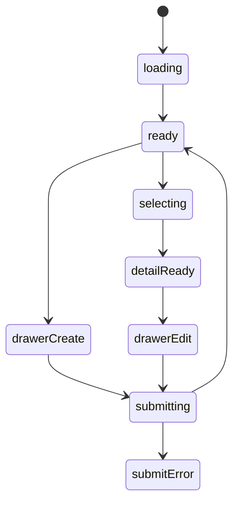

# 收藏书籍模块实现说明

## 路由

- `/books`
- `/books/:id`

## 组件树

```text
BooksPage
├─ BooksHeader
├─ BooksFilterRail
├─ BooksListSection
│  └─ BookCard
├─ BookDetailPanel
├─ ProtectedAssetPanel
├─ BookEditorDrawer
└─ ReaderOverlay
```

## 组件职责

| 组件 | 责任 | 关键输入 |
| --- | --- | --- |
| `BooksPage` | 组织筛选、列表、详情、抽屉 | `route`, `session` |
| `BooksHeader` | 搜索和新增入口 | `query`, `canEdit` |
| `BooksFilterRail` | 状态、标签、格式筛选 | `filters`, `onChange` |
| `BooksListSection` | 书籍列表与空态 | `items`, `selectedId` |
| `BookCard` | 单本书摘要 | `book` |
| `BookDetailPanel` | 详情信息与笔记 | `book` |
| `ProtectedAssetPanel` | 阅读/下载权限门 | `assets`, `session` |
| `BookEditorDrawer` | 新增/编辑书籍 | `mode`, `initialValue` |
| `ReaderOverlay` | 在线阅读 | `readerUrl`, `open` |

## 接口草案

| 方法 | 路径 | 用途 |
| --- | --- | --- |
| `GET` | `/api/books` | 获取书籍列表 |
| `GET` | `/api/books/:id` | 获取单本详情 |
| `POST` | `/api/books` | 新增书籍 |
| `PATCH` | `/api/books/:id` | 更新书籍 |
| `DELETE` | `/api/books/:id` | 删除书籍 |
| `POST` | `/api/books/:id/assets` | 上传资源文件 |
| `GET` | `/api/books/:id/assets` | 获取资源列表 |
| `POST` | `/api/books/:id/reader-session` | 获取阅读会话 URL |

## 状态机



## 实现注意点

- 列表、详情、抽屉三层同时存在
- `ProtectedAssetPanel` 必须支持 `locked / ready / error`
- 手机端详情改全屏，不保留三栏
