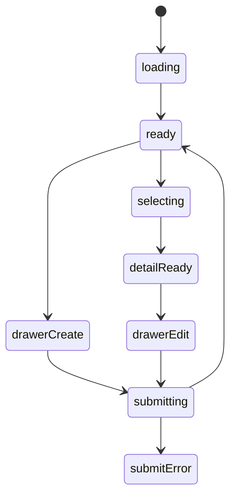
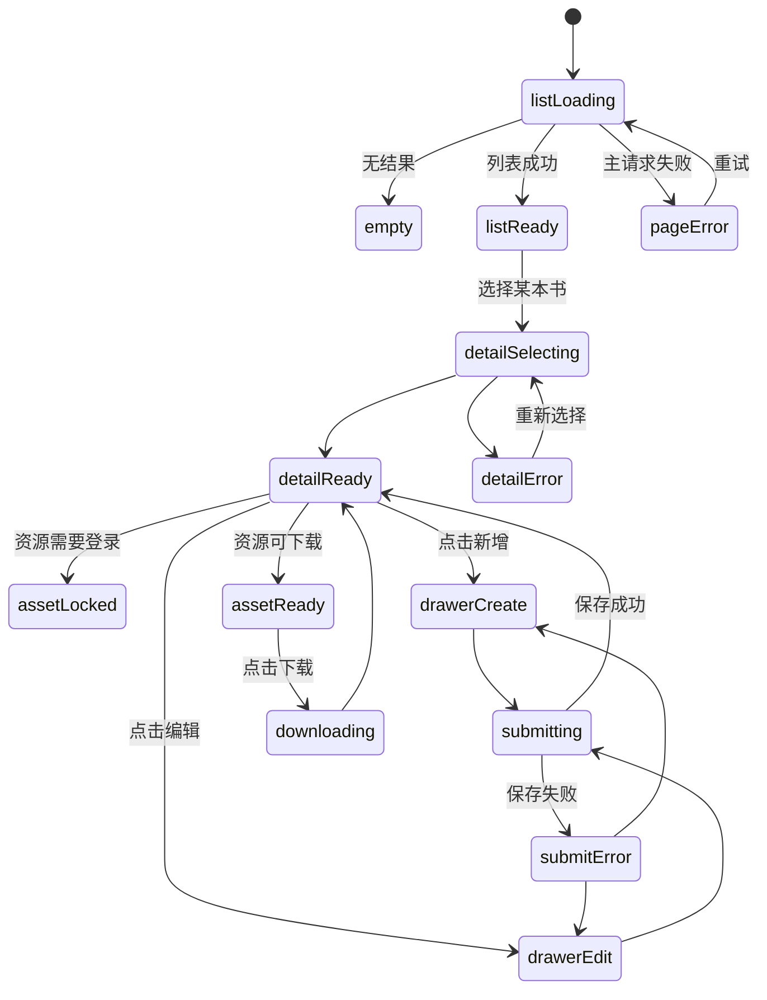

# 收藏书籍模块实现说明

## 路由

- `/books`
- `/books/:id`

## 组件树

```text
BooksPage
├─ BooksHeader
├─ BooksFilterRail
├─ BooksListSection
│  └─ BookCard
├─ BookDetailPanel
├─ ProtectedAssetPanel
└─ BookEditorDrawer
```

## 组件职责

| 组件 | 责任 | 关键输入 |
| --- | --- | --- |
| `BooksPage` | 组织筛选、列表、详情、抽屉 | `route`, `session` |
| `BooksHeader` | 搜索和新增入口 | `query`, `canEdit` |
| `BooksFilterRail` | 状态、标签、格式筛选 | `filters`, `onChange` |
| `BooksListSection` | 书籍列表与空态 | `items`, `selectedId` |
| `BookCard` | 单本书摘要 | `book` |
| `BookDetailPanel` | 详情信息与笔记 | `book` |
| `ProtectedAssetPanel` | 文件归档与下载权限门 | `assets`, `session` |
| `BookEditorDrawer` | 新增/编辑书籍 | `mode`, `initialValue` |

## 接口草案

| 方法 | 路径 | 用途 |
| --- | --- | --- |
| `GET` | `/api/books` | 获取书籍列表 |
| `GET` | `/api/books/:id` | 获取单本详情 |
| `POST` | `/api/books` | 新增书籍 |
| `PATCH` | `/api/books/:id` | 更新书籍 |
| `DELETE` | `/api/books/:id` | 删除书籍 |
| `POST` | `/api/books/:id/assets` | 上传资源文件 |
| `GET` | `/api/books/:id/assets` | 获取资源列表 |

## 状态机



## 实现注意点

- 列表、详情、抽屉三层同时存在
- `ProtectedAssetPanel` 必须支持 `locked / ready / error`
- 手机端详情改全屏，不保留三栏

## 接口字段级示例

### `GET /api/books?q=&status=&tag=`

```json
{
  "success": true,
  "data": [
    {
      "id": 12,
      "title": "沉思录",
      "subtitle": "写给自己的十二卷札记",
      "author": "马可·奥勒留",
      "status": "reading",
      "rating": 92,
      "wordCount": 8.5,
      "tags": ["哲学", "自我管理", "反思"],
      "shortReview": "适合反复拿起来的书。",
      "coverImageUrl": "https://example.com/book-cover.jpg",
      "updatedAt": "2026-03-16T09:12:00+08:00",
      "detailPath": "/books/12"
    }
  ],
  "meta": {
    "page": 1,
    "pageSize": 20,
    "total": 1
  }
}
```

| 字段 | 类型 | 示例 | 说明 |
| --- | --- | --- | --- |
| `id` | `number` | `12` | 书籍主键 |
| `status` | `string` | `reading` | 阅读状态，前端映射状态色 |
| `rating` | `number \| null` | `92` | 100 分制评分，没有评分时返回 `null` |
| `wordCount` | `number \| null` | `8.5` | 字数，单位万，支持小数；列表卡可直接显示为 `8.5 万字` |
| `tags` | `string[]` | `["哲学","自我管理"]` | 标签数组，来自共享标签库，列表页通常只展示前 2 到 3 个 |
| `shortReview` | `string` | `适合反复拿起来的书。` | 列表卡短评 |
| `detailPath` | `string` | `/books/12` | 前端可直接跳转的详情路径 |
| `meta.total` | `number` | `1` | 当前筛选条件下的总数 |

### `GET /api/books/:id`

```json
{
  "success": true,
  "data": {
    "id": 12,
    "title": "沉思录",
    "subtitle": "写给自己的十二卷札记",
    "author": "马可·奥勒留",
    "translator": "何怀宏",
    "publisher": "中央编译出版社",
    "publishYear": 2016,
    "status": "reading",
    "rating": 92,
    "wordCount": 8.5,
    "tags": ["哲学", "自我管理", "反思"],
    "whyItMatters": "它帮人把情绪从外部拉回内部。",
    "longNote": "这里放较长的阅读笔记、摘录和回想。",
    "readingStartedAt": "2026-03-01",
    "readingFinishedAt": null,
    "visibility": "public",
    "assets": [
      {
        "id": 3,
        "fileName": "meditations.epub",
        "assetType": "ebook",
        "fileSizeLabel": "1.4 MB",
        "downloadEnabled": true,
        "visibility": "login_required"
      }
    ]
  }
}
```

| 字段 | 类型 | 示例 | 说明 |
| --- | --- | --- | --- |
| `whyItMatters` | `string` | `它帮人把情绪从外部拉回内部。` | 详情页最需要突出显示的段落 |
| `longNote` | `string` | `这里放较长的阅读笔记...` | 长笔记正文，前端按段落渲染 |
| `wordCount` | `number \| null` | `8.5` | 详情区元数据字段，显示时带单位 `万字` |
| `visibility` | `string` | `public` | 决定书籍整体可见范围 |
| `assets[].assetType` | `string` | `ebook` | 文件类型，控制图标和归档呈现 |
| `assets[].downloadEnabled` | `boolean` | `true` | 是否允许直接下载 |
| `assets[].visibility` | `string` | `login_required` | 资源自身的权限级别 |

### `POST /api/books`

```json
{
  "title": "金刚经说什么",
  "author": "南怀瑾",
  "status": "planned",
  "rating": 86,
  "wordCount": 6.8,
  "tagIds": [4],
  "newTags": ["佛学", "注解"],
  "tags": ["佛学", "注解"],
  "shortReview": "先放进待读书架。",
  "whyItMatters": "后面想对照不同版本看。",
  "visibility": "public"
}
```

说明：

- 文件上传建议走 `multipart/form-data`，文本字段与文件字段同一次提交即可。
- 现有标签建议通过 `tagIds` 多选传入。
- 新标签建议通过 `newTags` 数组传入，服务端自动创建后再与书籍关联。
- 返回层仍保留 `tags` 字符串数组，方便前端直接渲染。
- 标签颜色前端按标签名做稳定映射，不要求接口额外返回颜色字段。
- `paused` 状态已废弃；旧数据如存在，应在迁移中回写到 `planned`。

## 页面状态细图



状态说明：

- `listLoading`：列表区主请求阶段，桌面端详情区可以保持骨架屏。
- `detailSelecting`：用户切换书籍时的详情加载态，应避免整页重刷。
- `assetLocked`：文件存在，但当前账号无权访问。
- `drawerCreate / drawerEdit`：同一套抽屉表单，通过模式切换文案和提交地址。
- `submitError`：提交失败后必须保留用户已编辑内容，不可清空表单。
