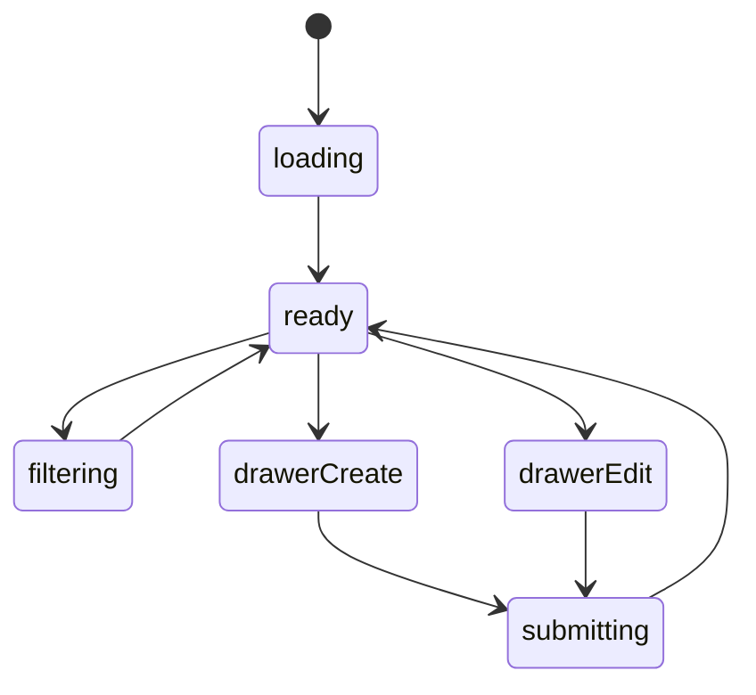

# 收支平衡模块实现说明

## 路由

- `/finance`
- `/finance/:id`

## 组件树

```text
FinancePage
├─ FinanceHeader
├─ FinanceMetricCards
├─ FinanceTrendSection
├─ FinanceCategorySection
├─ FinanceRecordsTable
├─ FinanceRecordCardList
├─ FinanceEntryDrawer
└─ FloatingRecordButton
```

## 组件职责

| 组件 | 责任 | 关键输入 |
| --- | --- | --- |
| `FinancePage` | 页面级数据编排 | `route`, `session` |
| `FinanceHeader` | 标题、筛选、范围切换 | `range`, `filters` |
| `FinanceMetricCards` | 顶部概况卡 | `metrics` |
| `FinanceTrendSection` | 收支趋势图 | `series` |
| `FinanceCategorySection` | 分类分布图 | `categories` |
| `FinanceRecordsTable` | 桌面端流水表 | `records` |
| `FinanceRecordCardList` | 手机端流水卡 | `records` |
| `FinanceEntryDrawer` | 新增/编辑一笔记录 | `mode`, `record` |
| `FloatingRecordButton` | 快速记账入口 | `onClick` |

## 接口草案

| 方法 | 路径 | 用途 |
| --- | --- | --- |
| `GET` | `/api/finance/summary` | 获取顶部概况 |
| `GET` | `/api/finance/trend` | 获取趋势图数据 |
| `GET` | `/api/finance/categories` | 获取分类分布 |
| `GET` | `/api/finance/records` | 获取流水列表 |
| `GET` | `/api/finance/records/:id` | 获取记录详情 |
| `POST` | `/api/finance/records` | 新增记录 |
| `PATCH` | `/api/finance/records/:id` | 更新记录 |
| `DELETE` | `/api/finance/records/:id` | 删除记录 |

## 状态机



## 实现注意点

- 摘要、趋势、分类可以分别缓存
- 桌面端主视图用表格式，手机端必须改卡片
- 记账入口要始终明显，但不抢主视觉
