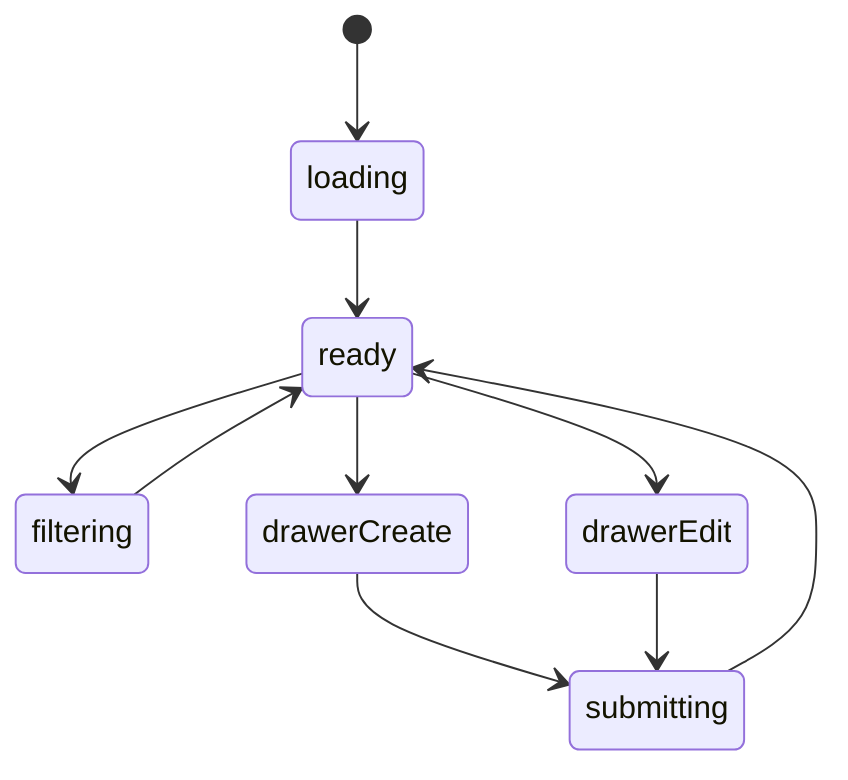
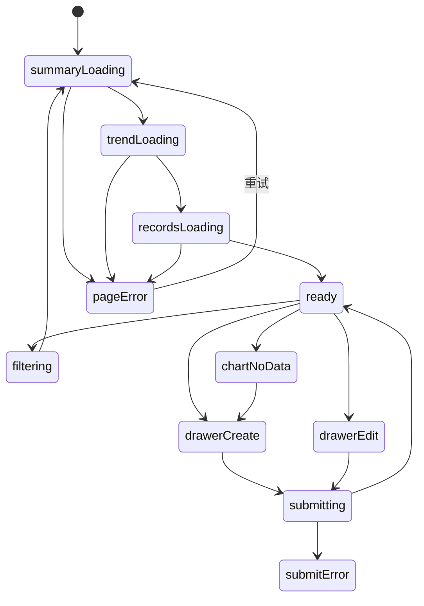

# 收支平衡模块实现说明

## 路由

- `/finance`
- `/finance/:id`

## 组件树

```text
FinancePage
├─ FinanceHeader
├─ FinanceMetricCards
├─ FinanceTrendSection
├─ FinanceCategorySection
├─ FinanceRecordsTable
├─ FinanceRecordCardList
├─ FinanceEntryDrawer
└─ FloatingRecordButton
```

## 组件职责

| 组件 | 责任 | 关键输入 |
| --- | --- | --- |
| `FinancePage` | 页面级数据编排 | `route`, `session` |
| `FinanceHeader` | 标题、筛选、范围切换 | `range`, `filters` |
| `FinanceMetricCards` | 顶部概况卡 | `metrics` |
| `FinanceTrendSection` | 收支趋势图 | `series` |
| `FinanceCategorySection` | 分类分布图 | `categories` |
| `FinanceRecordsTable` | 桌面端流水表 | `records` |
| `FinanceRecordCardList` | 手机端流水卡 | `records` |
| `FinanceEntryDrawer` | 新增/编辑一笔记录 | `mode`, `record` |
| `FloatingRecordButton` | 快速记账入口 | `onClick` |

## 接口草案

| 方法 | 路径 | 用途 |
| --- | --- | --- |
| `GET` | `/api/finance/summary` | 获取顶部概况 |
| `GET` | `/api/finance/trend` | 获取趋势图数据 |
| `GET` | `/api/finance/categories` | 获取分类分布 |
| `GET` | `/api/finance/records` | 获取流水列表 |
| `GET` | `/api/finance/records/:id` | 获取记录详情 |
| `POST` | `/api/finance/records` | 新增记录 |
| `PATCH` | `/api/finance/records/:id` | 更新记录 |
| `DELETE` | `/api/finance/records/:id` | 删除记录 |

## 状态机



## 实现注意点

- 摘要、趋势、分类可以分别缓存
- 桌面端主视图用表格式，手机端必须改卡片
- 记账入口要始终明显，但不抢主视觉

## 接口字段级示例

### `GET /api/finance/summary?range=month`

```json
{
  "success": true,
  "data": {
    "totalExpense": 4280.5,
    "totalIncome": 8600.0,
    "balance": 4319.5,
    "topCategory": "餐饮",
    "range": "month"
  }
}
```

| 字段 | 类型 | 示例 | 说明 |
| --- | --- | --- | --- |
| `totalExpense` | `number` | `4280.5` | 周期内总支出 |
| `totalIncome` | `number` | `8600.0` | 周期内总收入 |
| `balance` | `number` | `4319.5` | `收入 - 支出` |
| `topCategory` | `string \| null` | `餐饮` | 金额最高的分类 |
| `range` | `string` | `month` | 统计周期 |

### `GET /api/finance/records?date_from=2026-03-01&date_to=2026-03-31`

```json
{
  "success": true,
  "data": [
    {
      "id": 91,
      "date": "2026-03-16",
      "type": "expense",
      "category": "餐饮",
      "amount": 36.5,
      "paymentMethod": "微信",
      "note": "晚饭牛肉面"
    }
  ]
}
```

| 字段 | 类型 | 示例 | 说明 |
| --- | --- | --- | --- |
| `type` | `string` | `expense` | `expense / income` |
| `category` | `string` | `餐饮` | 分类名称 |
| `amount` | `number` | `36.5` | 金额，前端统一格式化为两位小数 |
| `paymentMethod` | `string` | `微信` | 支付方式或账户 |
| `note` | `string` | `晚饭牛肉面` | 流水备注 |

### `GET /api/finance/trend?group_by=day`

```json
{
  "success": true,
  "data": {
    "groupBy": "day",
    "series": [
      {
        "date": "2026-03-15",
        "expense": 120.0,
        "income": 0.0
      },
      {
        "date": "2026-03-16",
        "expense": 36.5,
        "income": 0.0
      }
    ]
  }
}
```

说明：

- `summary` 负责顶部概况，`trend` 负责图表，`records` 负责流水明细，三者可以分别缓存。
- `groupBy` 建议只开放 `day / week / month` 三种，避免图表状态过多。

## 页面状态细图



状态说明：

- `filtering`：切换日期范围、账户或分类时触发。
- `chartNoData`：图表区为空时，流水列表仍可正常显示。
- `drawerCreate / drawerEdit`：记账抽屉统一承载新增和编辑。
- `submitError`：金额、日期或分类校验失败时保留表单原值。
