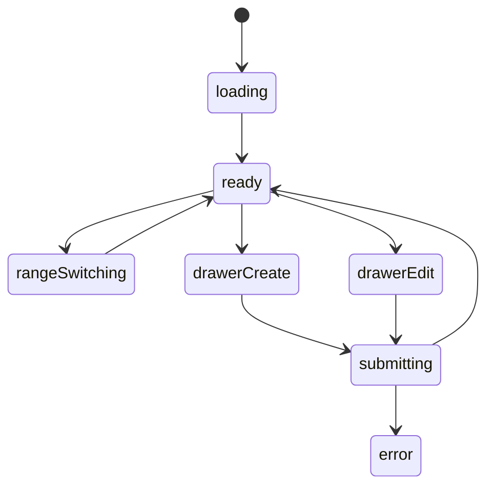

# 健身养体模块实现说明

## 路由

- `/fitness`
- `/fitness/:date`

## 组件树

```text
FitnessPage
├─ FitnessHeader
├─ FitnessMetricCards
│  └─ MetricCard
├─ FitnessTrendSection
├─ FitnessTodayRecordSection
├─ FitnessHistoryList
├─ FitnessEntryDrawer
└─ FloatingEntryButton
```

## 组件职责

| 组件 | 责任 | 关键输入 |
| --- | --- | --- |
| `FitnessPage` | 页面数据编排 | `route`, `session` |
| `FitnessHeader` | 标题和范围切换 | `range` |
| `FitnessMetricCards` | 顶部指标摘要 | `metrics` |
| `FitnessTrendSection` | 体重趋势图 | `series`, `range` |
| `FitnessTodayRecordSection` | 当日三餐、运动、感受 | `todayRecord` |
| `FitnessHistoryList` | 历史记录列表 | `records` |
| `FitnessEntryDrawer` | 新增/编辑记录 | `mode`, `record` |
| `FloatingEntryButton` | 快速录入入口 | `onClick` |

## 接口草案

| 方法 | 路径 | 用途 |
| --- | --- | --- |
| `GET` | `/api/fitness/summary` | 获取顶部摘要卡 |
| `GET` | `/api/fitness/trend` | 获取趋势图数据 |
| `GET` | `/api/fitness/records` | 获取记录列表 |
| `GET` | `/api/fitness/records/:date` | 获取某日详情 |
| `POST` | `/api/fitness/records` | 新增记录 |
| `PATCH` | `/api/fitness/records/:date` | 更新记录 |
| `DELETE` | `/api/fitness/records/:date` | 删除记录 |

## 状态机



## 实现注意点

- 图表和列表请求可以并行
- 快速录入按钮在手机端要固定
- 同一天只允许一条主记录时，日期就是天然主键
