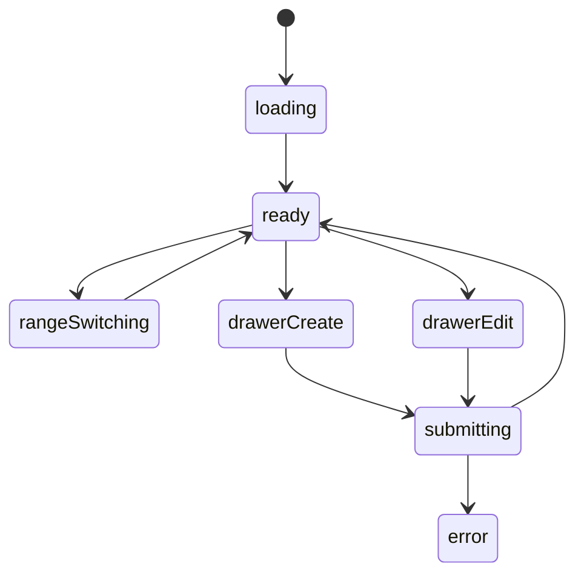
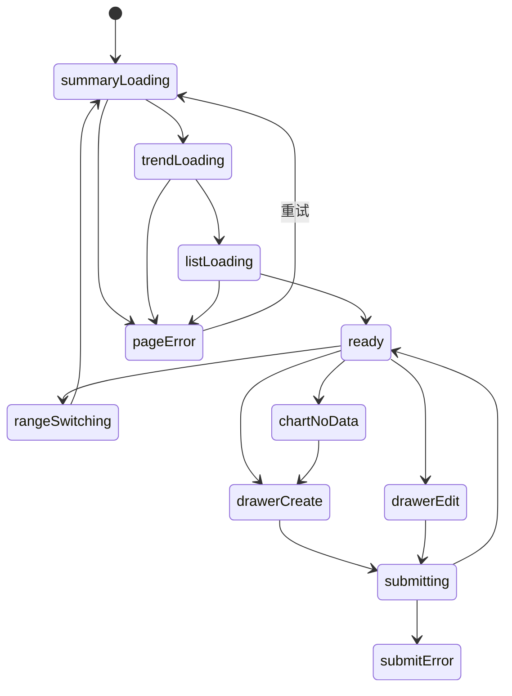

# 健身养体模块实现说明

## 路由

- `/fitness`
- `/fitness/:date`

## 组件树

```text
FitnessPage
├─ FitnessHeader
├─ FitnessMetricCards
│  └─ MetricCard
├─ FitnessTrendSection
├─ FitnessTodayRecordSection
├─ FitnessHistoryList
├─ FitnessEntryDrawer
└─ FloatingEntryButton
```

## 组件职责

| 组件 | 责任 | 关键输入 |
| --- | --- | --- |
| `FitnessPage` | 页面数据编排 | `route`, `session` |
| `FitnessHeader` | 标题和范围切换 | `range` |
| `FitnessMetricCards` | 顶部指标摘要 | `metrics` |
| `FitnessTrendSection` | 体重趋势图 | `series`, `range` |
| `FitnessTodayRecordSection` | 当日三餐、运动、感受 | `todayRecord` |
| `FitnessHistoryList` | 历史记录列表 | `records` |
| `FitnessEntryDrawer` | 新增/编辑记录 | `mode`, `record` |
| `FloatingEntryButton` | 快速录入入口 | `onClick` |

## 接口草案

| 方法 | 路径 | 用途 |
| --- | --- | --- |
| `GET` | `/api/fitness/summary` | 获取顶部摘要卡 |
| `GET` | `/api/fitness/trend` | 获取趋势图数据 |
| `GET` | `/api/fitness/records` | 获取记录列表 |
| `GET` | `/api/fitness/records/:date` | 获取某日详情 |
| `POST` | `/api/fitness/records` | 新增记录 |
| `PATCH` | `/api/fitness/records/:date` | 更新记录 |
| `DELETE` | `/api/fitness/records/:date` | 删除记录 |

## 状态机



## 实现注意点

- 图表和列表请求可以并行
- 快速录入按钮在手机端要固定
- 同一天只允许一条主记录时，日期就是天然主键

## 接口字段级示例

### `GET /api/fitness/summary?range=30d`

```json
{
  "success": true,
  "data": {
    "currentWeight": 72.4,
    "weightChange": -1.8,
    "avgCalories": 1980,
    "trainingDays": 18,
    "range": "30d"
  }
}
```

| 字段 | 类型 | 示例 | 说明 |
| --- | --- | --- | --- |
| `currentWeight` | `number \| null` | `72.4` | 当前最新体重，单位默认 `kg` |
| `weightChange` | `number \| null` | `-1.8` | 相对周期起点的变化值 |
| `avgCalories` | `number \| null` | `1980` | 周期平均摄入热量 |
| `trainingDays` | `number` | `18` | 周期内完成训练的天数 |
| `range` | `string` | `30d` | 当前统计区间 |

### `GET /api/fitness/records?date=2026-03-16`

```json
{
  "success": true,
  "data": [
    {
      "date": "2026-03-16",
      "weight": 72.4,
      "meals": [
        "早餐：鸡蛋 + 咖啡",
        "午餐：牛肉饭",
        "晚餐：酸奶 + 香蕉"
      ],
      "calories": 2010,
      "workout": "上肢力量 45 分钟",
      "note": "状态一般，但训练完成。",
      "completed": true
    }
  ]
}
```

| 字段 | 类型 | 示例 | 说明 |
| --- | --- | --- | --- |
| `date` | `string` | `2026-03-16` | 记录日期 |
| `weight` | `number \| null` | `72.4` | 当日体重 |
| `meals` | `string[]` | `["早餐：鸡蛋 + 咖啡"]` | 三餐或加餐文本 |
| `calories` | `number \| null` | `2010` | 当日总热量 |
| `workout` | `string` | `上肢力量 45 分钟` | 训练摘要 |
| `completed` | `boolean` | `true` | 当天记录是否完整 |

## 页面状态细图



状态说明：

- `summaryLoading / trendLoading / listLoading`：顶部指标、趋势图、记录列表建议分段加载。
- `rangeSwitching`：切换 `7d / 30d / 90d` 时重新请求摘要和图表。
- `chartNoData`：图表层无数据时不应阻塞手动录入。
- `submitError`：保存失败后，抽屉中的日期、体重和三餐文本都要保留。
