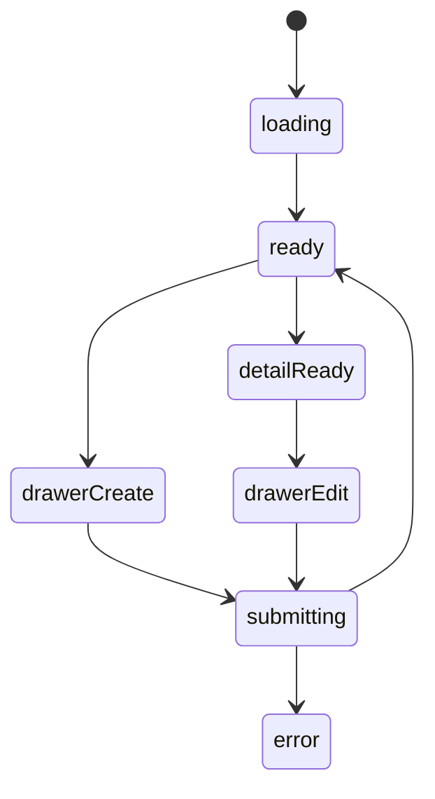
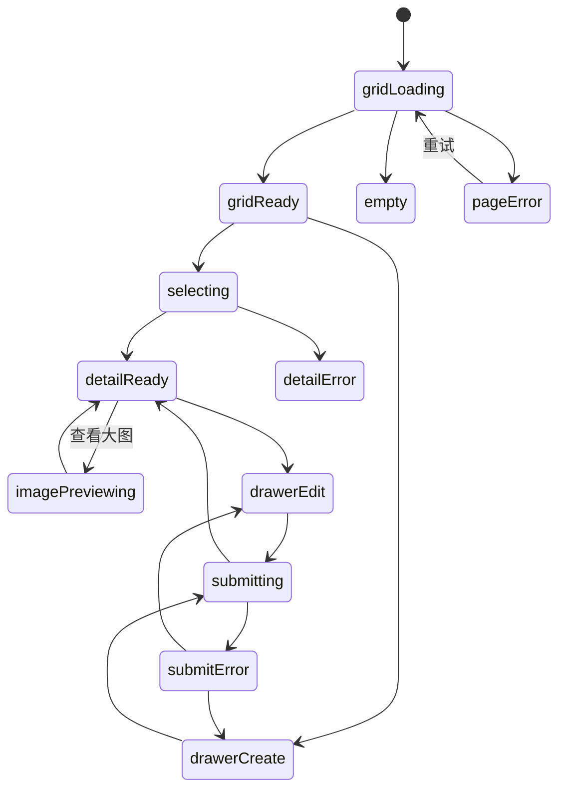

# 喜欢的美食模块实现说明

## 路由

- `/food`
- `/food/:id`

## 组件树

```text
FoodPage
├─ FoodHeader
├─ FoodFilterRail
├─ FoodListSection
│  └─ FoodCard
├─ FoodDetailPanel
└─ FoodEditorDrawer
```

## 组件职责

| 组件 | 责任 | 关键输入 |
| --- | --- | --- |
| `FoodPage` | 页面编排与主数据请求 | `session`, `route` |
| `FoodHeader` | 搜索和新增按钮 | `query`, `canEdit` |
| `FoodFilterRail` | 类型、心情等筛选 | `filters` |
| `FoodListSection` | 双列卡片流 | `items`, `selectedId` |
| `FoodCard` | 单张美食卡片 | `food` |
| `FoodDetailPanel` | 图片、做法、喜欢原因 | `food` |
| `FoodEditorDrawer` | 新增/编辑食物条目 | `mode`, `food` |

## 接口草案

| 方法 | 路径 | 用途 |
| --- | --- | --- |
| `GET` | `/api/food` | 获取美食列表 |
| `GET` | `/api/food/:id` | 获取详情 |
| `POST` | `/api/food` | 新增美食 |
| `PATCH` | `/api/food/:id` | 更新美食 |
| `DELETE` | `/api/food/:id` | 删除美食 |
| `POST` | `/api/food/:id/images` | 上传图片 |

## 状态机



## 实现注意点

- `为什么喜欢` 是详情页核心字段
- 卡片图片必须优先加载
- 抽屉表单图片组要支持排序和删除

## 接口字段级示例

### `GET /api/food`

```json
{
  "success": true,
  "data": [
    {
      "id": 21,
      "name": "酸汤肥牛",
      "category": "热菜",
      "moodTags": ["解馋", "重口"],
      "coverImageUrl": "https://example.com/food-cover.jpg",
      "summary": "酸、辣、鲜同时到位。",
      "locationLabel": "深圳 · 家常复刻",
      "detailPath": "/food/21"
    }
  ]
}
```

| 字段 | 类型 | 示例 | 说明 |
| --- | --- | --- | --- |
| `name` | `string` | `酸汤肥牛` | 美食主标题 |
| `category` | `string` | `热菜` | 分类，用于左侧筛选 |
| `moodTags` | `string[]` | `["解馋","重口"]` | 情绪或场景标签 |
| `summary` | `string` | `酸、辣、鲜同时到位。` | 列表页摘要 |
| `locationLabel` | `string` | `深圳 · 家常复刻` | 地址、来源或场景描述 |

### `GET /api/food/:id`

```json
{
  "success": true,
  "data": {
    "id": 21,
    "name": "酸汤肥牛",
    "category": "热菜",
    "images": [
      {
        "id": 301,
        "url": "https://example.com/food-1.jpg",
        "alt": "酸汤肥牛成品图",
        "order": 1
      }
    ],
    "ingredients": [
      "肥牛卷 300g",
      "金针菇 200g",
      "黄灯笼辣椒酱 2 勺"
    ],
    "steps": [
      "先煮底料，再放金针菇。",
      "肥牛最后下锅，避免口感发柴。"
    ],
    "whyILikeIt": "它能把胃口和心情一起提起来。",
    "memoryNote": "第一次自己复刻成功是在一个下雨的晚上。"
  }
}
```

| 字段 | 类型 | 示例 | 说明 |
| --- | --- | --- | --- |
| `images[].order` | `number` | `1` | 前端拖拽排序后的稳定顺序 |
| `ingredients` | `string[]` | `["肥牛卷 300g"]` | 原料清单 |
| `steps` | `string[]` | `["先煮底料，再放金针菇。"]` | 做法步骤 |
| `whyILikeIt` | `string` | `它能把胃口和心情一起提起来。` | 详情页核心文案 |
| `memoryNote` | `string` | `第一次自己复刻成功...` | 记忆或场景补充 |

## 页面状态细图



状态说明：

- `gridLoading`：美食卡片流首次加载。
- `detailReady`：右侧详情或手机端全屏详情已就绪。
- `imagePreviewing`：放大查看图片时的遮罩层状态。
- `submitError`：图片上传失败和文本校验失败都应落到这里，并保留草稿。
