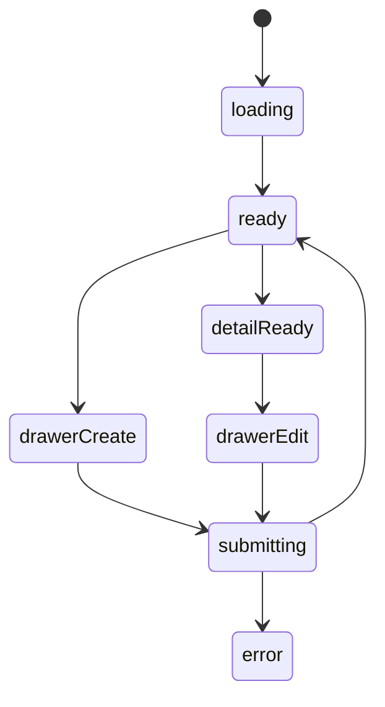

# 喜欢的美食模块实现说明

## 路由

- `/food`
- `/food/:id`

## 组件树

```text
FoodPage
├─ FoodHeader
├─ FoodFilterRail
├─ FoodListSection
│  └─ FoodCard
├─ FoodDetailPanel
└─ FoodEditorDrawer
```

## 组件职责

| 组件 | 责任 | 关键输入 |
| --- | --- | --- |
| `FoodPage` | 页面编排与主数据请求 | `session`, `route` |
| `FoodHeader` | 搜索和新增按钮 | `query`, `canEdit` |
| `FoodFilterRail` | 类型、心情等筛选 | `filters` |
| `FoodListSection` | 双列卡片流 | `items`, `selectedId` |
| `FoodCard` | 单张美食卡片 | `food` |
| `FoodDetailPanel` | 图片、做法、喜欢原因 | `food` |
| `FoodEditorDrawer` | 新增/编辑食物条目 | `mode`, `food` |

## 接口草案

| 方法 | 路径 | 用途 |
| --- | --- | --- |
| `GET` | `/api/food` | 获取美食列表 |
| `GET` | `/api/food/:id` | 获取详情 |
| `POST` | `/api/food` | 新增美食 |
| `PATCH` | `/api/food/:id` | 更新美食 |
| `DELETE` | `/api/food/:id` | 删除美食 |
| `POST` | `/api/food/:id/images` | 上传图片 |

## 状态机



## 实现注意点

- `为什么喜欢` 是详情页核心字段
- 卡片图片必须优先加载
- 抽屉表单图片组要支持排序和删除
