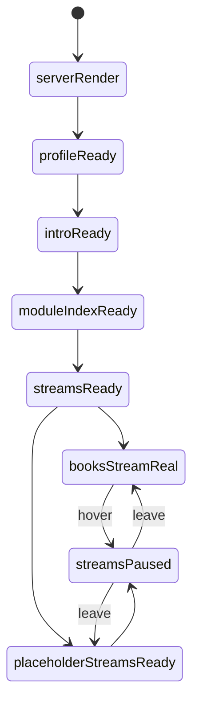

# 首页模块实现说明

## 当前实现范围

首页当前已经进入正式实现阶段，现状如下：

- 顶栏 + 模块面板
- 左侧个人档案卡
- 右侧介绍主卡
- 模块索引
- 四条记忆溪流
- 最近更新
- 页尾摘录

旧版“当前关注区”已经退出首页主结构。

## 路由与文件

- 路由：`/`
- 视图：[apps/home/views.py](/D:/09_Ai/RememberMyself/apps/home/views.py)
- 模板：[templates/home/index.html](/D:/09_Ai/RememberMyself/templates/home/index.html)
- 样式：[static/site/styles.css](/D:/09_Ai/RememberMyself/static/site/styles.css)
- 测试：[apps/home/tests.py](/D:/09_Ai/RememberMyself/apps/home/tests.py)

## 当前组件树

```text
HomePage
├─ SiteHeader
│  ├─ SiteBrand
│  ├─ ModuleToggle
│  └─ ModulePanel
├─ HomeStage
│  ├─ HomeProfileCard
│  │  ├─ ProfileIdentity
│  │  ├─ ProfileMeta
│  │  ├─ ProfileTags
│  │  ├─ ProfileTimeline
│  │  └─ ProfileContact
│  └─ HomeIntroCard
│     ├─ HeroEyebrow
│     ├─ HeroTitle
│     ├─ HeroSubtitle
│     ├─ HeroMotto
│     ├─ HeroActions
│     └─ HomeStatGrid
├─ ModuleIndexSection
├─ MemoryStreamsSection
│  ├─ MemoryStreamSection (books)
│  ├─ MemoryStreamSection (music)
│  ├─ MemoryStreamSection (food)
│  └─ MemoryStreamSection (scenery)
├─ RecentUpdatesSection
└─ ArchiveQuoteSection
```

## 服务端上下文

### `profile`

负责左侧个人档案卡。

字段包括：

- `name`
- `handle`
- `role`
- `location`
- `organization`
- `summary`
- `hero_title`
- `hero_subtitle`
- `motto`
- `avatar_asset`
- `contact_label`
- `contact_value`
- `tags`

### `profile_timeline`

用于左侧时间线。

### `hero`

用于右侧介绍主卡：

- `eyebrow`
- `title`
- `body`
- `primary_action`
- `secondary_action`

### `home_stats`

首页统计卡数组。

当前默认三张：

- 已入藏书
- 已归档音乐
- 已落地板块

### `memory_streams`

首页四条流带的数据源。

书影流当前接真实数据，其余三条保留占位结构。

## 当前数据规则

### 书影流

- 数据源：`Book.objects.visible_to_user(request.user)`
- 必须按权限过滤
- 真实书籍卡片点进书籍详情

### 声纹流 / 食味流 / 风景流

- 先保留占位卡
- 不伪造用户真实内容
- 后续各模块真实化后直接替换数据生成逻辑

## 当前状态机



## 当前交互规则

- 顶栏 `模块`：开关模块面板
- Hero 主按钮：进入书籍页
- Hero 次按钮：滚动到记忆溪流
- 模块卡：整卡点击
- 流带右上角入口：进入对应模块
- 书影流卡片：进入书籍详情
- hover 流带：暂停滚动

## 当前测试要求

- 首页返回 `200`
- 首页必须出现四条流带标题
- 有书时显示真实书名
- 无书时显示书影流空状态提示

## 当前扩展点

- 音乐、美食、景色只要有真实模型，就能复用当前流带结构
- 如果以后加“照片流”“方法卡流”，只需要新增一个流带配置项
- 首页结构本身不需要推翻
