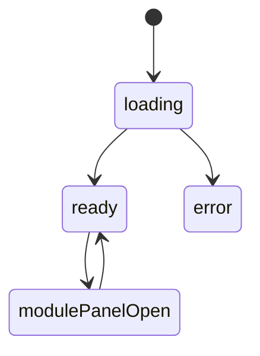

# 首页模块实现说明

## 路由

- `/`

## 组件树

```text
HomePage
├─ HomeTopNav
├─ ModulePanel
├─ HomeHeroSection
├─ CurrentFocusSection
├─ ModuleIndexSection
├─ RecentUpdatesSection
└─ HomeArchiveQuote
```

## 组件职责

| 组件 | 责任 | 关键输入 |
| --- | --- | --- |
| `HomePage` | 组织首页所有区块与主请求 | `session`, `route` |
| `HomeTopNav` | 顶栏、模块入口、登录入口 | `session`, `moduleLinks` |
| `ModulePanel` | 展开所有板块入口 | `modules`, `open` |
| `HomeHeroSection` | 主文案与首屏按钮 | `hero`, `actions` |
| `CurrentFocusSection` | 当前阅读/身体/收支/方法摘要 | `focusItems` |
| `ModuleIndexSection` | 模块卡片网格 | `modules` |
| `RecentUpdatesSection` | 最近更新卡片 | `updates` |
| `HomeArchiveQuote` | 结尾摘录 | `quote` |

## 接口草案

| 方法 | 路径 | 用途 |
| --- | --- | --- |
| `GET` | `/api/home/summary` | 获取首页 Hero、焦点摘要、结尾摘录 |
| `GET` | `/api/home/modules` | 获取模块索引卡片信息 |
| `GET` | `/api/home/recent-updates` | 获取最近更新卡片 |
| `GET` | `/api/session` | 获取登录态 |

### `/api/home/summary` 返回建议

```json
{
  "success": true,
  "data": {
    "hero": {
      "title": "记住自己，是一场缓慢而长期的整理。",
      "body": "..."
    },
    "focusItems": [],
    "quote": "这里不是信息流，而是缓慢生长的个人归档。"
  }
}
```

## 状态机



## 实现注意点

- 首页至少保留 4 层跳转入口
- `ModuleIndexSection` 必须整卡可点
- 手机端模块面板改为底部弹层
