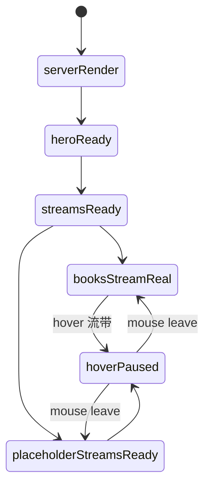
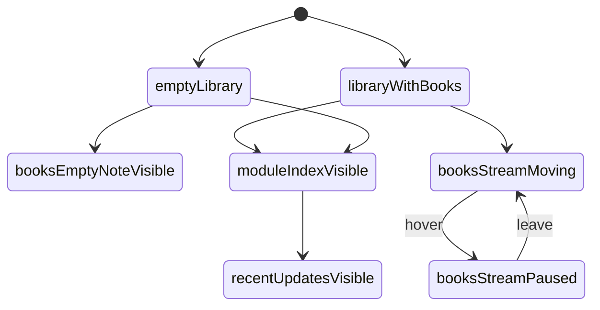

# 首页模块实现说明

## 当前实现范围

首页当前已经进入真实施工阶段。

本轮落地范围：

- 新 Hero 首屏
- 四条“记忆溪流”
- 模块索引
- 最近更新
- 页尾摘录

当前没有再使用旧版“当前关注区”。

## 路由与文件

- 路由：`/`
- 视图：[apps/home/views.py](/D:/09_Ai/RememberMyself/apps/home/views.py)
- 模板：[templates/home/index.html](/D:/09_Ai/RememberMyself/templates/home/index.html)
- 样式：[static/site/styles.css](/D:/09_Ai/RememberMyself/static/site/styles.css)
- 测试：[apps/home/tests.py](/D:/09_Ai/RememberMyself/apps/home/tests.py)

## 组件树

```text
HomePage
├─ HomeTopNav
├─ ModulePanel
├─ HomeHeroSection
├─ MemoryStreamsSection
│  ├─ MemoryStreamSection (books)
│  │  ├─ StreamHeader
│  │  ├─ StreamViewport
│  │  ├─ StreamLane x 2
│  │  └─ StreamCard x N
│  ├─ MemoryStreamSection (music)
│  ├─ MemoryStreamSection (food)
│  └─ MemoryStreamSection (scenery)
├─ ModuleIndexSection
├─ RecentUpdatesSection
└─ HomeArchiveQuote
```

## 服务端上下文契约

首页当前由服务端一次性渲染，不依赖额外首页 API。

### `hero`

```json
{
  "eyebrow": "2026年03月16日 / 安静的总索引",
  "title": "我把真正留下来的东西，放在这里，让它们缓慢流过。",
  "body": "这里不是展示型官网，而是一份仍在生长的个人档案册入口。",
  "primary_action": {
    "label": "进入私人藏书室",
    "path": "/books"
  },
  "secondary_action": {
    "label": "看记忆溪流",
    "path": "/#memory-streams"
  }
}
```

### `memory_streams`

```json
[
  {
    "key": "books",
    "tone": "books",
    "title": "书影流",
    "subtitle": "私人藏书",
    "description": "读过的、在读的、准备靠近的，都先以封面留下。",
    "count_label": "12 本",
    "enter_label": "进入藏书室",
    "path": "/books",
    "rows": [
      {
        "direction": "left",
        "duration": 78,
        "items": [
          {
            "id": "book-12",
            "kind": "book",
            "title": "沉思录",
            "meta": "在读",
            "path": "/books/12/",
            "image_url": "https://...",
            "fallback": "沉"
          }
        ]
      }
    ],
    "empty_note": null
  }
]
```

### `modules`

来自 `apps.core.site_data.get_site_modules()`，用于模块索引和顶栏模块面板。

### `recent_updates`

首页下方的 4 张最近更新卡，允许是：

- 真实书籍更新
- 首页施工进度
- 其他模块的阶段性提示

## 流带数据规则

## 1. 书影流

- 数据源：`Book.objects.visible_to_user(request.user)`
- 必须只显示当前访问者有权限看到的书
- 当前使用真实封面
- 卡片点击进入书籍详情页

## 2. 声纹流 / 食味流 / 风景流

- 当前模块尚未落地数据模型
- 首页先显示占位流带
- 占位卡片不伪造用户真实内容
- 后续模块上线时，只需要替换 `rows` 数据生成逻辑，不需要重写模板结构

## 状态机



## 交互规则

- Hero 次按钮跳到 `#memory-streams`
- 每条流带右上角入口跳到对应模块
- 书影流封面卡可直接点击
- hover 流带时暂停动画
- 首页保留模块索引，避免只有氛围没有导航

## 页面状态细图



## 测试要求

- 首页返回 `200`
- 首页必须出现四条流带标题
- 有真实书籍时，首页必须展示书名
- 有真实书籍时，不应再显示“第一本书录入后”的空状态提示
- 空书库时，应显示 `尚未入册` 和空状态提示

## 后续扩展点

- `music / food / scenery` 一旦有真实模型，可以直接复用当前流带模板
- 如果以后首页加入“照片流”或“方法卡流”，只需要新增一个 `memory_streams` 配置项
- 首页结构不需要推翻，只需要继续加新的流向
