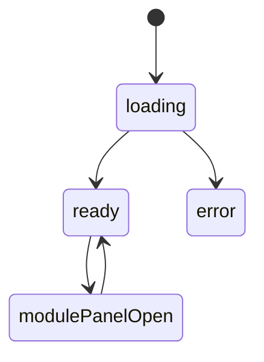
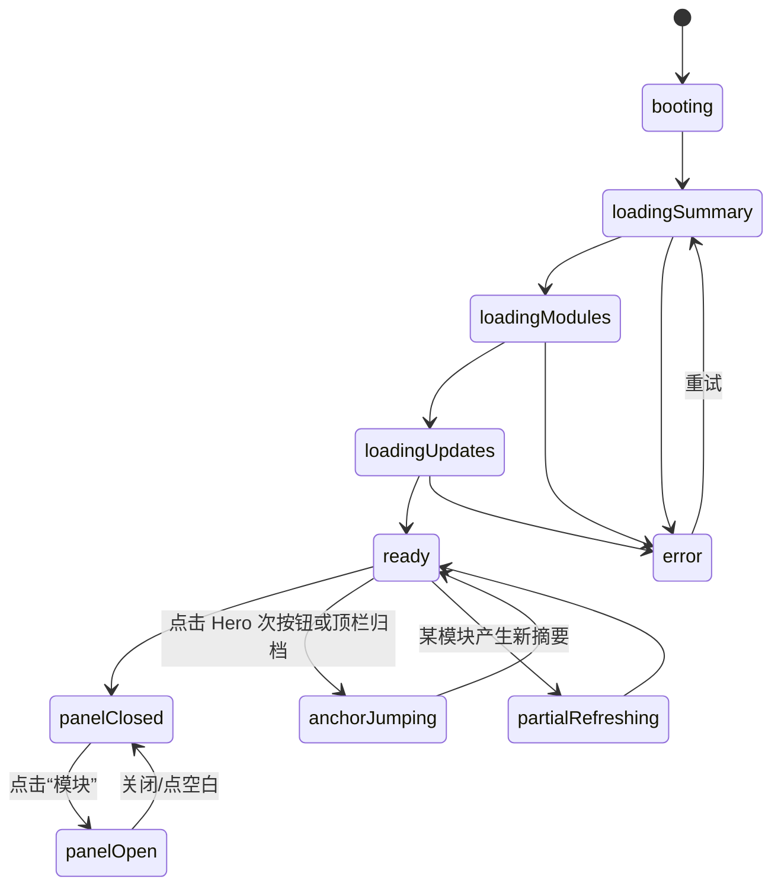

# 首页模块实现说明

## 路由

- `/`

## 组件树

```text
HomePage
├─ HomeTopNav
├─ ModulePanel
├─ HomeHeroSection
├─ CurrentFocusSection
├─ ModuleIndexSection
├─ RecentUpdatesSection
└─ HomeArchiveQuote
```

## 组件职责

| 组件 | 责任 | 关键输入 |
| --- | --- | --- |
| `HomePage` | 组织首页所有区块与主请求 | `session`, `route` |
| `HomeTopNav` | 顶栏、模块入口、登录入口 | `session`, `moduleLinks` |
| `ModulePanel` | 展开所有板块入口 | `modules`, `open` |
| `HomeHeroSection` | 主文案与首屏按钮 | `hero`, `actions` |
| `CurrentFocusSection` | 当前阅读/身体/收支/方法摘要 | `focusItems` |
| `ModuleIndexSection` | 模块卡片网格 | `modules` |
| `RecentUpdatesSection` | 最近更新卡片 | `updates` |
| `HomeArchiveQuote` | 结尾摘录 | `quote` |

## 接口草案

| 方法 | 路径 | 用途 |
| --- | --- | --- |
| `GET` | `/api/home/summary` | 获取首页 Hero、焦点摘要、结尾摘录 |
| `GET` | `/api/home/modules` | 获取模块索引卡片信息 |
| `GET` | `/api/home/recent-updates` | 获取最近更新卡片 |
| `GET` | `/api/session` | 获取登录态 |

### `/api/home/summary` 返回建议

```json
{
  "success": true,
  "data": {
    "hero": {
      "title": "记住自己，是一场缓慢而长期的整理。",
      "body": "..."
    },
    "focusItems": [],
    "quote": "这里不是信息流，而是缓慢生长的个人归档。"
  }
}
```

## 状态机



## 实现注意点

- 首页至少保留 4 层跳转入口
- `ModuleIndexSection` 必须整卡可点
- 手机端模块面板改为底部弹层

## 接口字段级示例

### `GET /api/home/summary`

```json
{
  "success": true,
  "data": {
    "hero": {
      "eyebrow": "2026年03月16日 · 安静的总索引",
      "title": "记住自己，是一场缓慢而长期的整理。",
      "body": "这里不是展示型官网，而是一份会持续扩展的个人档案册入口。",
      "primaryAction": {
        "label": "进入收藏书籍",
        "path": "/books"
      },
      "secondaryAction": {
        "label": "查看当前关注",
        "path": "/#current-focus"
      }
    },
    "focusItems": [
      {
        "key": "reading",
        "eyebrow": "当前阅读",
        "title": "沉思录",
        "meta": "马可·奥勒留",
        "path": "/books/12"
      }
    ],
    "quote": "这里不是信息流，而是慢慢长成的个人归档。"
  }
}
```

| 字段 | 类型 | 示例 | 说明 |
| --- | --- | --- | --- |
| `hero.eyebrow` | `string` | `2026年03月16日 · 安静的总索引` | Hero 顶部元信息，通常由日期和站点基调组成 |
| `hero.title` | `string` | `记住自己，是一场缓慢而长期的整理。` | 首屏主标题，只建议一到两行 |
| `hero.primaryAction` | `object` | `{"label":"进入收藏书籍","path":"/books"}` | Hero 主按钮，优先指向当前最成熟板块 |
| `focusItems[].key` | `string` | `reading` | 当前关注项的稳定标识，用于前端映射图标和排序 |
| `focusItems[].path` | `string` | `/books/12` | 点击后跳转到对应模块或具体记录 |
| `quote` | `string` | `这里不是信息流，而是慢慢长成的个人归档。` | 页尾收束文案 |

### `GET /api/home/recent-updates`

```json
{
  "success": true,
  "data": [
    {
      "id": "books-12",
      "moduleKey": "books",
      "moduleTitle": "收藏书籍",
      "summary": "最近整理到《沉思录》。",
      "timeLabel": "2026-03-16",
      "path": "/books/12"
    },
    {
      "id": "music-draft",
      "moduleKey": "music",
      "moduleTitle": "喜欢的音乐",
      "summary": "已进入接口设计阶段。",
      "timeLabel": "设计阶段",
      "path": "/music"
    }
  ]
}
```

| 字段 | 类型 | 示例 | 说明 |
| --- | --- | --- | --- |
| `id` | `string` | `books-12` | 最近更新卡片的唯一键 |
| `moduleKey` | `string` | `books` | 模块标识，用于样式和跳转 |
| `summary` | `string` | `最近整理到《沉思录》。` | 卡片摘要，建议 1 句 |
| `timeLabel` | `string` | `2026-03-16` | 时间标签，可以是日期，也可以是阶段文案 |
| `path` | `string` | `/books/12` | 卡片点击跳转目标 |

## 页面状态细图



状态说明：

- `booting`：页面初次挂载，还没发起任何数据请求。
- `loadingSummary / loadingModules / loadingUpdates`：三段首页主数据按顺序或并行加载，任意一段失败都可进入 `error`。
- `panelOpen`：模块面板展开态，桌面端为下拉面板，手机端为底部弹层。
- `anchorJumping`：点击锚点时的临时状态，不改变主数据，只改变视口位置。
- `partialRefreshing`：首页某一块摘要因其他模块更新而局部刷新，不应整页闪烁。
