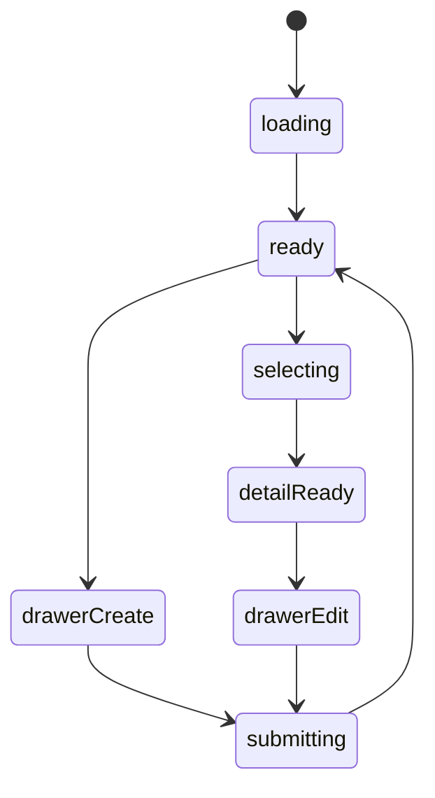

# 方法心得模块实现说明

## 路由

- `/methods`
- `/methods/:slug`

## 组件树

```text
MethodsPage
├─ MethodsHeader
├─ MethodsFilterRail
├─ MethodsListSection
│  └─ MethodArticleCard
├─ MethodDetailPanel
├─ MarkdownArticleRenderer
└─ MethodEditorDrawer
```

## 组件职责

| 组件 | 责任 | 关键输入 |
| --- | --- | --- |
| `MethodsPage` | 页面级请求与列表/详情联动 | `route`, `session` |
| `MethodsHeader` | 搜索与新增入口 | `query`, `canEdit` |
| `MethodsFilterRail` | 标签和分类筛选 | `filters` |
| `MethodsListSection` | 文章列表 | `items`, `selectedSlug` |
| `MethodArticleCard` | 单篇摘要卡 | `article` |
| `MethodDetailPanel` | 文章详情容器 | `article` |
| `MarkdownArticleRenderer` | Markdown 渲染 | `content` |
| `MethodEditorDrawer` | 新增/编辑文章 | `mode`, `article` |

## 接口草案

| 方法 | 路径 | 用途 |
| --- | --- | --- |
| `GET` | `/api/methods` | 获取文章列表 |
| `GET` | `/api/methods/:slug` | 获取文章详情 |
| `POST` | `/api/methods` | 新增文章 |
| `PATCH` | `/api/methods/:slug` | 更新文章 |
| `DELETE` | `/api/methods/:slug` | 删除文章 |
| `GET` | `/api/methods/tags` | 获取标签聚合 |

## 状态机



## 实现注意点

- Markdown 渲染和文章列表分开维护
- 标签筛选和全文搜索要能组合使用
- 手机上详情要改全屏阅读态
