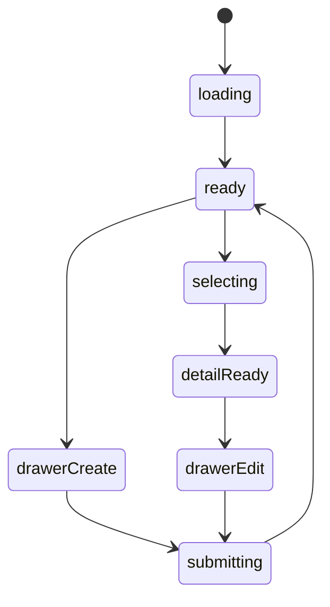
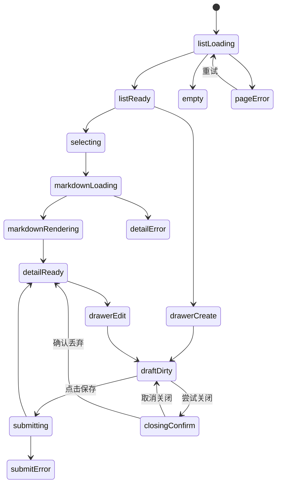

# 方法心得模块实现说明

## 路由

- `/methods`
- `/methods/:slug`

## 组件树

```text
MethodsPage
├─ MethodsHeader
├─ MethodsFilterRail
├─ MethodsListSection
│  └─ MethodArticleCard
├─ MethodDetailPanel
├─ MarkdownArticleRenderer
└─ MethodEditorDrawer
```

## 组件职责

| 组件 | 责任 | 关键输入 |
| --- | --- | --- |
| `MethodsPage` | 页面级请求与列表/详情联动 | `route`, `session` |
| `MethodsHeader` | 搜索与新增入口 | `query`, `canEdit` |
| `MethodsFilterRail` | 标签和分类筛选 | `filters` |
| `MethodsListSection` | 文章列表 | `items`, `selectedSlug` |
| `MethodArticleCard` | 单篇摘要卡 | `article` |
| `MethodDetailPanel` | 文章详情容器 | `article` |
| `MarkdownArticleRenderer` | Markdown 渲染 | `content` |
| `MethodEditorDrawer` | 新增/编辑文章 | `mode`, `article` |

## 接口草案

| 方法 | 路径 | 用途 |
| --- | --- | --- |
| `GET` | `/api/methods` | 获取文章列表 |
| `GET` | `/api/methods/:slug` | 获取文章详情 |
| `POST` | `/api/methods` | 新增文章 |
| `PATCH` | `/api/methods/:slug` | 更新文章 |
| `DELETE` | `/api/methods/:slug` | 删除文章 |
| `GET` | `/api/methods/tags` | 获取标签聚合 |

## 状态机



## 实现注意点

- Markdown 渲染和文章列表分开维护
- 标签筛选和全文搜索要能组合使用
- 手机上详情要改全屏阅读态

## 接口字段级示例

### `GET /api/methods`

```json
{
  "success": true,
  "data": [
    {
      "slug": "slow-iteration",
      "title": "慢迭代，不慢执行",
      "category": "工作方法",
      "tags": ["迭代", "执行"],
      "summary": "先让结构成立，再把每一层磨精。",
      "updatedAt": "2026-03-16T10:30:00+08:00",
      "detailPath": "/methods/slow-iteration"
    }
  ]
}
```

| 字段 | 类型 | 示例 | 说明 |
| --- | --- | --- | --- |
| `slug` | `string` | `slow-iteration` | 文章稳定标识 |
| `category` | `string` | `工作方法` | 分类筛选主键 |
| `tags` | `string[]` | `["迭代","执行"]` | 标签筛选 |
| `summary` | `string` | `先让结构成立，再把每一层磨精。` | 列表摘要 |
| `detailPath` | `string` | `/methods/slow-iteration` | 详情跳转路径 |

### `GET /api/methods/:slug`

```json
{
  "success": true,
  "data": {
    "slug": "slow-iteration",
    "title": "慢迭代，不慢执行",
    "category": "工作方法",
    "tags": ["迭代", "执行"],
    "markdown": "# 慢迭代，不慢执行\n\n先让结构成立，再把每一层磨精。",
    "toc": [
      {
        "id": "part-1",
        "text": "先让结构成立",
        "level": 2
      }
    ],
    "updatedAt": "2026-03-16T10:30:00+08:00"
  }
}
```

| 字段 | 类型 | 示例 | 说明 |
| --- | --- | --- | --- |
| `markdown` | `string` | `# 慢迭代，不慢执行...` | Markdown 原文 |
| `toc` | `object[]` | `[{\"id\":\"part-1\",\"text\":\"先让结构成立\",\"level\":2}]` | 解析后的目录结构 |
| `toc[].level` | `number` | `2` | 标题层级 |
| `updatedAt` | `string` | `2026-03-16T10:30:00+08:00` | 最近更新时间 |

### `PATCH /api/methods/:slug`

```json
{
  "title": "慢迭代，不慢执行",
  "category": "工作方法",
  "tags": ["迭代", "执行", "长期主义"],
  "markdown": "# 慢迭代，不慢执行\n\n更新后的正文。"
}
```

说明：

- 更新接口只负责文章实体本身，不把渲染后的 HTML 存回接口。
- `toc` 建议由服务端或统一渲染层生成，避免前后端不一致。

## 页面状态细图



状态说明：

- `markdownLoading`：文章原文已请求，但还没交给渲染器。
- `markdownRendering`：Markdown 转 HTML/Toc 的过程，可与语法高亮一起发生。
- `draftDirty`：抽屉中有未保存内容。
- `closingConfirm`：用户尝试关闭脏表单时的确认状态。
