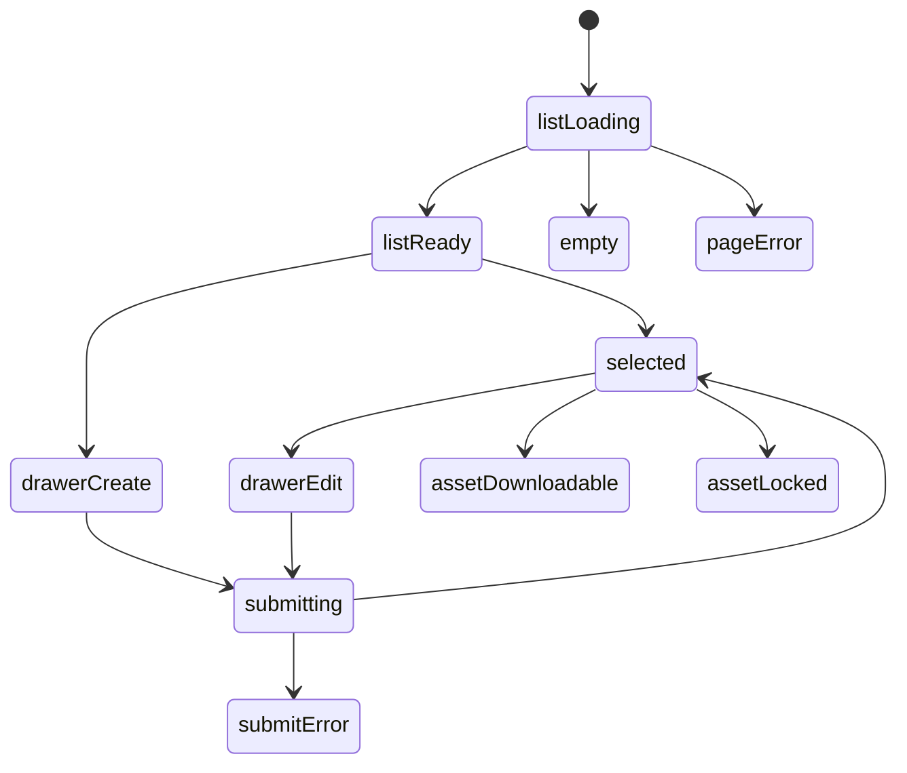

# 喜欢的音乐模块实现说明

## 当前实现目标

音乐模块第一版不做在线播放。

实现范围收敛为：

- 音乐列表
- 音乐详情
- 上传音乐文件
- 下载音乐文件
- 标签与权限
- 首页声纹流接入

## 路由

- `/music`
- `/music/:id`
- `/music/create`
- `/music/:id/edit`
- `/music/:id/delete`
- `/music/asset/:id/download`
- `/music/asset/:id/delete`

## 组件树

```text
MusicPage
├─ MusicHeader
├─ MusicFilterRail
├─ MusicListSection
│  └─ MusicListItem
├─ MusicDetailPanel
├─ ProtectedMusicAssetPanel
└─ MusicEditorDrawer
```

## 组件职责

| 组件 | 责任 | 关键输入 |
| --- | --- | --- |
| `MusicPage` | 编排页面与筛选状态 | `session`, `query` |
| `MusicHeader` | 搜索与新增入口 | `query`, `canEdit` |
| `MusicFilterRail` | 标签、可见性筛选 | `filters`, `tags` |
| `MusicListSection` | 音乐列表与空态 | `tracks`, `selectedId` |
| `MusicListItem` | 单个音乐条目 | `track` |
| `MusicDetailPanel` | 音乐详情展示 | `track`, `assets` |
| `ProtectedMusicAssetPanel` | 下载区和权限提示 | `assetRows`, `session` |
| `MusicEditorDrawer` | 新增与编辑抽屉 | `mode`, `form` |

## 数据模型建议

### `MusicTrack`

- `title`
- `artist`
- `album`
- `cover_image_url`
- `short_review`
- `why_it_matters`
- `long_note`
- `visibility`
- `created_at`
- `updated_at`

### `MusicTag`

- `name`
- `created_at`

### `MusicAsset`

- `music`
- `file`
- `file_name`
- `file_size`
- `download_enabled`
- `visibility`
- `created_at`
- `updated_at`

## 服务端渲染上下文

音乐模块第一版可以直接沿用书籍模块的服务端渲染方式，不需要先拆 API。

页面上下文建议：

```json
{
  "tracks": [],
  "selected_track": null,
  "asset_rows": [],
  "available_tags": [],
  "active_filters": {
    "q": "",
    "tag": "",
    "visibility": ""
  },
  "editor_mode": null,
  "form": null,
  "can_edit": false
}
```

## 交互规则

- 游客只看公开音乐
- 登录用户可看 `login_required`
- 编辑者可新增、编辑、上传、删除
- 文件下载必须检查：音乐可见性、文件可见性、下载开关
- 首页声纹流只取当前账号可见的音乐

## 页面状态细图



## 接口草案

虽然第一版可先服务端渲染，但后续接口建议如下：

| 方法 | 路径 | 用途 |
| --- | --- | --- |
| `GET` | `/api/music` | 获取音乐列表 |
| `GET` | `/api/music/:id` | 获取音乐详情 |
| `POST` | `/api/music` | 新增音乐 |
| `PATCH` | `/api/music/:id` | 更新音乐 |
| `DELETE` | `/api/music/:id` | 删除音乐 |
| `POST` | `/api/music/:id/assets` | 上传文件 |
| `GET` | `/api/music/assets/:id/download` | 下载文件 |

## 与首页的关系

首页中的 `声纹流` 应直接消费音乐模块真实数据。

字段需求：

- `id`
- `title`
- `artist`
- `cover_image_url`
- `detail path`

生成后映射为首页流带卡片：

```json
{
  "id": "music-12",
  "kind": "music",
  "title": "夜航星",
  "meta": "不才",
  "path": "/music/12/",
  "image_url": "https://...",
  "fallback": "夜"
}
```

## 第一版测试要求

- 游客只能看到公开音乐
- 登录用户可以看到登录可见音乐
- 编辑者能创建音乐并上传文件
- 音乐文件下载路由返回附件
- 首页出现真实 `声纹流`
- 首页声纹流能展示音乐标题或封面兜底
