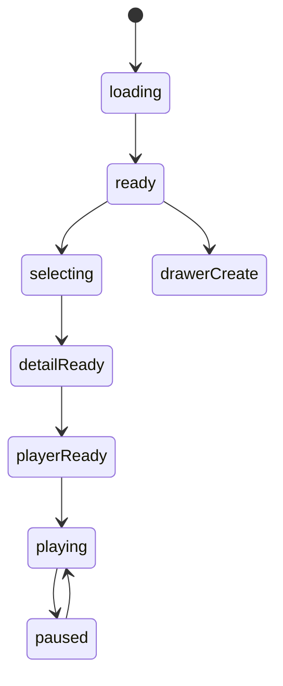
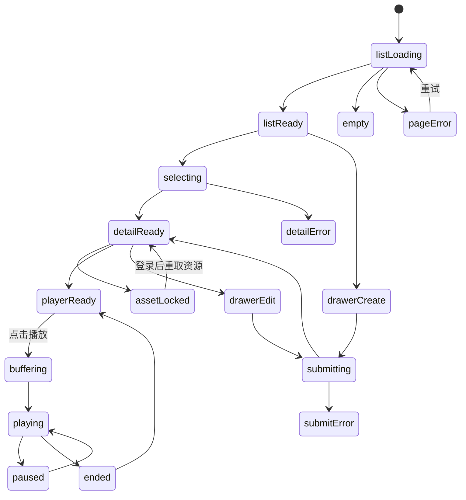

# 喜欢的音乐模块实现说明

## 路由

- `/music`
- `/music/:id`

## 组件树

```text
MusicPage
├─ MusicHeader
├─ MusicFilterRail
├─ MusicListSection
│  └─ MusicListItem
├─ MusicDetailPanel
├─ MusicPlayerPanel
├─ ProtectedAssetPanel
└─ MusicEditorDrawer
```

## 组件职责

| 组件 | 责任 | 关键输入 |
| --- | --- | --- |
| `MusicPage` | 页面编排与主请求 | `session`, `route` |
| `MusicHeader` | 搜索与新增入口 | `query`, `canEdit` |
| `MusicFilterRail` | 风格、情绪、可播放筛选 | `filters` |
| `MusicListSection` | 曲目列表和空态 | `items`, `selectedId` |
| `MusicListItem` | 单曲条目 | `track` |
| `MusicDetailPanel` | 曲目信息和喜欢原因 | `track` |
| `MusicPlayerPanel` | 播放器控制 | `src`, `status` |
| `ProtectedAssetPanel` | 资源权限区 | `asset`, `session` |
| `MusicEditorDrawer` | 新增/编辑曲目 | `mode`, `track` |

## 接口草案

| 方法 | 路径 | 用途 |
| --- | --- | --- |
| `GET` | `/api/music` | 获取曲库列表 |
| `GET` | `/api/music/:id` | 获取曲目详情 |
| `POST` | `/api/music` | 新增曲目 |
| `PATCH` | `/api/music/:id` | 更新曲目 |
| `DELETE` | `/api/music/:id` | 删除曲目 |
| `POST` | `/api/music/:id/assets` | 上传音频资源 |
| `POST` | `/api/music/:id/play-session` | 获取播放 URL |

## 状态机



## 实现注意点

- 播放器状态不要散落多个布尔值
- 游客态能看到资源存在，但不能直接播放
- 手机端播放器操作必须单手可完成

## 接口字段级示例

### `GET /api/music`

```json
{
  "success": true,
  "data": [
    {
      "id": 41,
      "title": "夜航星",
      "artist": "不才",
      "album": "夜航星",
      "genres": ["国风", "叙事"],
      "moodTags": ["安静", "夜晚"],
      "durationMs": 263000,
      "playable": true,
      "coverImageUrl": "https://example.com/music-cover.jpg",
      "detailPath": "/music/41"
    }
  ]
}
```

| 字段 | 类型 | 示例 | 说明 |
| --- | --- | --- | --- |
| `artist` | `string` | `不才` | 演唱者或创作者 |
| `genres` | `string[]` | `["国风","叙事"]` | 风格标签 |
| `moodTags` | `string[]` | `["安静","夜晚"]` | 使用场景或情绪标签 |
| `durationMs` | `number` | `263000` | 时长，前端格式化为 `04:23` |
| `playable` | `boolean` | `true` | 当前账号是否具备播放条件 |

### `GET /api/music/:id`

```json
{
  "success": true,
  "data": {
    "id": 41,
    "title": "夜航星",
    "artist": "不才",
    "album": "夜航星",
    "releaseDate": "2021-06-01",
    "genres": ["国风", "叙事"],
    "moodTags": ["安静", "夜晚"],
    "whyILikeIt": "适合深夜清理情绪时单曲循环。",
    "lyricExcerpt": "不需要整段歌词，只保留自己标记的片段。",
    "assets": [
      {
        "id": 17,
        "assetType": "audio",
        "fileName": "night-flight-star.flac",
        "visibility": "login_required",
        "streamEnabled": true,
        "downloadEnabled": false
      }
    ]
  }
}
```

| 字段 | 类型 | 示例 | 说明 |
| --- | --- | --- | --- |
| `releaseDate` | `string` | `2021-06-01` | 发行时间 |
| `whyILikeIt` | `string` | `适合深夜清理情绪时单曲循环。` | 喜欢原因，是详情主文案 |
| `lyricExcerpt` | `string` | `不需要整段歌词...` | 只保存被标记的短句 |
| `assets[].streamEnabled` | `boolean` | `true` | 是否允许在线播放 |
| `assets[].downloadEnabled` | `boolean` | `false` | 是否允许下载原文件 |

### `POST /api/music/:id/player-session`

```json
{
  "success": true,
  "data": {
    "sessionId": "ps_7Xa2",
    "streamUrl": "https://media.example.com/stream/ps_7Xa2.m3u8",
    "expiresAt": "2026-03-16T11:00:00+08:00"
  }
}
```

说明：

- 播放器不要直接暴露原始文件路径，统一走播放会话接口。
- 游客态可以先返回 `403 / ASSET_LOCKED`，前端保持可见但不可播放。

## 页面状态细图



状态说明：

- `assetLocked`：资源存在，但权限不足。
- `playerReady`：播放器已经拿到播放会话，可立即播放。
- `buffering / playing / paused / ended`：统一归播放器状态机管理，不要散落到多个局部布尔值。
- `submitError`：曲目信息和资源上传任一失败，都应把抽屉保留在当前状态。
