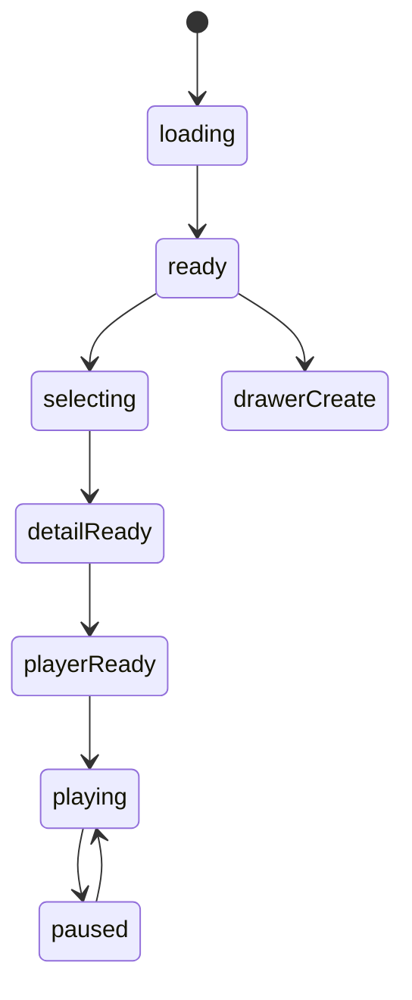

# 喜欢的音乐模块实现说明

## 路由

- `/music`
- `/music/:id`

## 组件树

```text
MusicPage
├─ MusicHeader
├─ MusicFilterRail
├─ MusicListSection
│  └─ MusicListItem
├─ MusicDetailPanel
├─ MusicPlayerPanel
├─ ProtectedAssetPanel
└─ MusicEditorDrawer
```

## 组件职责

| 组件 | 责任 | 关键输入 |
| --- | --- | --- |
| `MusicPage` | 页面编排与主请求 | `session`, `route` |
| `MusicHeader` | 搜索与新增入口 | `query`, `canEdit` |
| `MusicFilterRail` | 风格、情绪、可播放筛选 | `filters` |
| `MusicListSection` | 曲目列表和空态 | `items`, `selectedId` |
| `MusicListItem` | 单曲条目 | `track` |
| `MusicDetailPanel` | 曲目信息和喜欢原因 | `track` |
| `MusicPlayerPanel` | 播放器控制 | `src`, `status` |
| `ProtectedAssetPanel` | 资源权限区 | `asset`, `session` |
| `MusicEditorDrawer` | 新增/编辑曲目 | `mode`, `track` |

## 接口草案

| 方法 | 路径 | 用途 |
| --- | --- | --- |
| `GET` | `/api/music` | 获取曲库列表 |
| `GET` | `/api/music/:id` | 获取曲目详情 |
| `POST` | `/api/music` | 新增曲目 |
| `PATCH` | `/api/music/:id` | 更新曲目 |
| `DELETE` | `/api/music/:id` | 删除曲目 |
| `POST` | `/api/music/:id/assets` | 上传音频资源 |
| `POST` | `/api/music/:id/play-session` | 获取播放 URL |

## 状态机



## 实现注意点

- 播放器状态不要散落多个布尔值
- 游客态能看到资源存在，但不能直接播放
- 手机端播放器操作必须单手可完成
