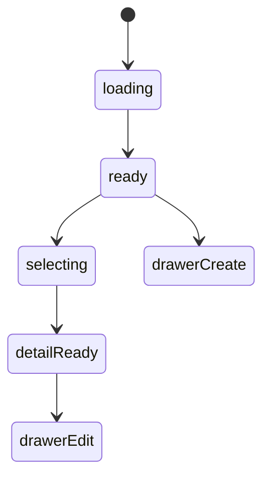

# 喜欢的景色模块实现说明

## 路由

- `/scenery`
- `/scenery/:id`

## 组件树

```text
SceneryPage
├─ SceneryHeader
├─ SceneryFilterRail
├─ SceneryGallerySection
│  └─ SceneryCard
├─ SceneryDetailPanel
├─ SceneryMapCard
└─ SceneryEditorDrawer
```

## 组件职责

| 组件 | 责任 | 关键输入 |
| --- | --- | --- |
| `SceneryPage` | 页面编排与路由驱动 | `route`, `session` |
| `SceneryHeader` | 搜索、新增入口 | `query`, `canEdit` |
| `SceneryFilterRail` | 地点、时间、类型筛选 | `filters` |
| `SceneryGallerySection` | 景色卡片流 | `items`, `selectedId` |
| `SceneryCard` | 图像摘要卡 | `scenery` |
| `SceneryDetailPanel` | 大图、文字、记忆说明 | `scenery` |
| `SceneryMapCard` | 地址与坐标信息 | `location` |
| `SceneryEditorDrawer` | 编辑景色条目 | `mode`, `initialValue` |

## 接口草案

| 方法 | 路径 | 用途 |
| --- | --- | --- |
| `GET` | `/api/scenery` | 获取景色列表 |
| `GET` | `/api/scenery/:id` | 获取景色详情 |
| `POST` | `/api/scenery` | 新增景色记录 |
| `PATCH` | `/api/scenery/:id` | 更新景色记录 |
| `DELETE` | `/api/scenery/:id` | 删除记录 |
| `POST` | `/api/scenery/:id/images` | 上传图片组 |

## 状态机



## 实现注意点

- 详情页中“大图 + 为什么记得这里”是双核心
- 地图可先用静态卡片，后面再接动态地图
- 多图上传要保留顺序
