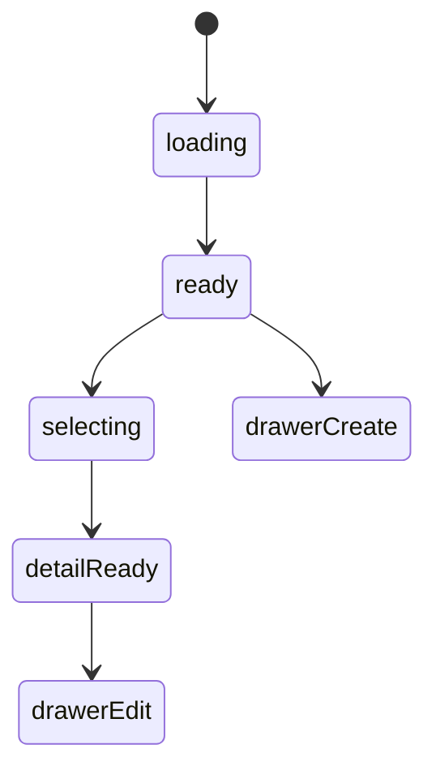
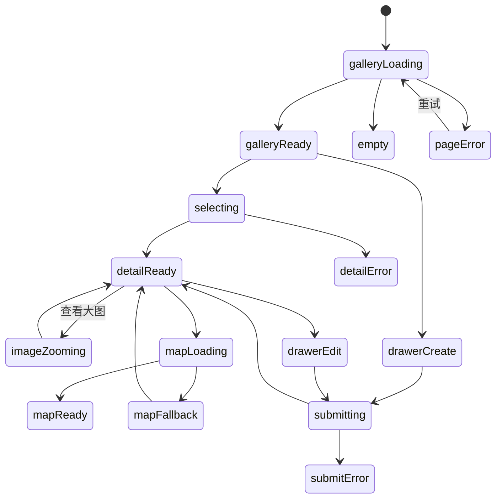

# 喜欢的景色模块实现说明

## 路由

- `/scenery`
- `/scenery/:id`

## 组件树

```text
SceneryPage
├─ SceneryHeader
├─ SceneryFilterRail
├─ SceneryGallerySection
│  └─ SceneryCard
├─ SceneryDetailPanel
├─ SceneryMapCard
└─ SceneryEditorDrawer
```

## 组件职责

| 组件 | 责任 | 关键输入 |
| --- | --- | --- |
| `SceneryPage` | 页面编排与路由驱动 | `route`, `session` |
| `SceneryHeader` | 搜索、新增入口 | `query`, `canEdit` |
| `SceneryFilterRail` | 地点、时间、类型筛选 | `filters` |
| `SceneryGallerySection` | 景色卡片流 | `items`, `selectedId` |
| `SceneryCard` | 图像摘要卡 | `scenery` |
| `SceneryDetailPanel` | 大图、文字、记忆说明 | `scenery` |
| `SceneryMapCard` | 地址与坐标信息 | `location` |
| `SceneryEditorDrawer` | 编辑景色条目 | `mode`, `initialValue` |

## 接口草案

| 方法 | 路径 | 用途 |
| --- | --- | --- |
| `GET` | `/api/scenery` | 获取景色列表 |
| `GET` | `/api/scenery/:id` | 获取景色详情 |
| `POST` | `/api/scenery` | 新增景色记录 |
| `PATCH` | `/api/scenery/:id` | 更新景色记录 |
| `DELETE` | `/api/scenery/:id` | 删除记录 |
| `POST` | `/api/scenery/:id/images` | 上传图片组 |

## 状态机



## 实现注意点

- 详情页中“大图 + 为什么记得这里”是双核心
- 地图可先用静态卡片，后面再接动态地图
- 多图上传要保留顺序

## 接口字段级示例

### `GET /api/scenery`

```json
{
  "success": true,
  "data": [
    {
      "id": 8,
      "title": "雨后的海边栈道",
      "city": "珠海",
      "category": "海边",
      "coverImageUrl": "https://example.com/scenery-cover.jpg",
      "summary": "风很大，但人会平静下来。",
      "visitedAt": "2025-11-18",
      "detailPath": "/scenery/8"
    }
  ]
}
```

| 字段 | 类型 | 示例 | 说明 |
| --- | --- | --- | --- |
| `city` | `string` | `珠海` | 地点标签，支持筛选 |
| `category` | `string` | `海边` | 景色类别 |
| `summary` | `string` | `风很大，但人会平静下来。` | 列表卡摘要 |
| `visitedAt` | `string` | `2025-11-18` | 到访时间 |

### `GET /api/scenery/:id`

```json
{
  "success": true,
  "data": {
    "id": 8,
    "title": "雨后的海边栈道",
    "city": "珠海",
    "category": "海边",
    "images": [
      {
        "id": 801,
        "url": "https://example.com/scenery-1.jpg",
        "order": 1,
        "caption": "第一张照片，云层很低。"
      }
    ],
    "address": "广东省珠海市香洲区情侣路",
    "coordinates": {
      "lat": 22.2711,
      "lng": 113.5767
    },
    "whyIRememberIt": "那天风大得像把脑子里的噪音吹空了。",
    "memoryNote": "适合一个人走，不适合赶时间。"
  }
}
```

| 字段 | 类型 | 示例 | 说明 |
| --- | --- | --- | --- |
| `images[].caption` | `string` | `第一张照片，云层很低。` | 图片对应的短说明 |
| `address` | `string` | `广东省珠海市香洲区情侣路` | 地址文案 |
| `coordinates` | `object \| null` | `{"lat":22.2711,"lng":113.5767}` | 后续接地图时直接使用 |
| `whyIRememberIt` | `string` | `那天风大得像把脑子里的噪音吹空了。` | 详情主文案 |
| `memoryNote` | `string` | `适合一个人走...` | 补充记忆或建议 |

## 页面状态细图



状态说明：

- `galleryLoading`：景色卡片流初次加载。
- `mapLoading`：开始请求坐标或地图卡片数据。
- `mapFallback`：地图失败时降级为纯文本地址卡，不阻塞详情主体。
- `imageZooming`：手机端和桌面端都需要单独处理大图浏览状态。
