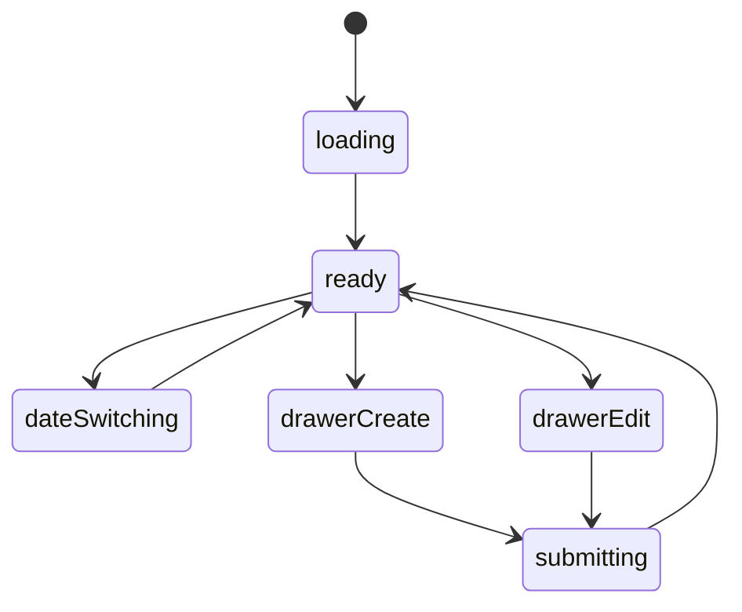
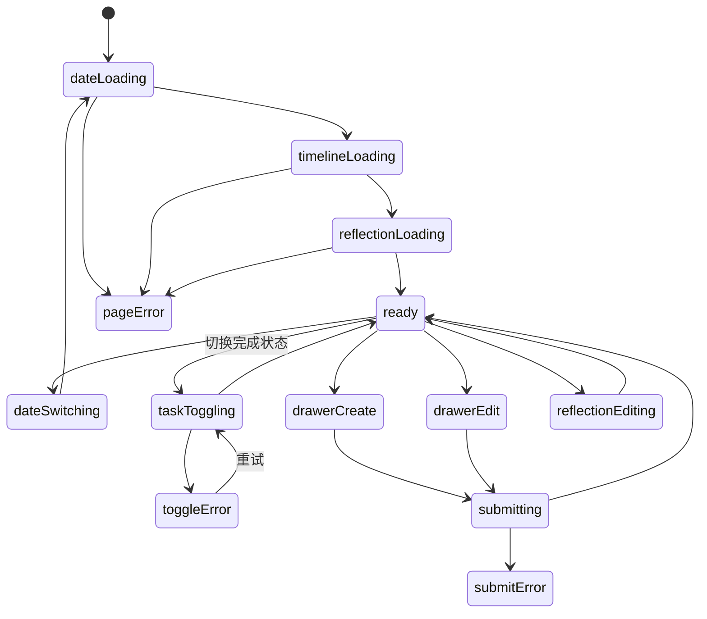

# 时间安排模块实现说明

## 路由

- `/schedule`
- `/schedule/:date`

## 组件树

```text
SchedulePage
├─ ScheduleHeader
├─ DateRail
├─ ScheduleTimelineSection
│  └─ ScheduleTaskCard
├─ ScheduleCompletionSection
├─ ScheduleReflectionSection
├─ ScheduleEditorDrawer
└─ FloatingScheduleButton
```

## 组件职责

| 组件 | 责任 | 关键输入 |
| --- | --- | --- |
| `SchedulePage` | 页面级数据编排 | `route`, `session` |
| `ScheduleHeader` | 标题、日期范围切换 | `currentDate` |
| `DateRail` | 日期列表和选择 | `dates`, `selectedDate` |
| `ScheduleTimelineSection` | 时间轴和任务卡 | `tasks` |
| `ScheduleTaskCard` | 单个任务卡 | `task` |
| `ScheduleCompletionSection` | 当日完成统计 | `summary` |
| `ScheduleReflectionSection` | 当日反思内容 | `reflection` |
| `ScheduleEditorDrawer` | 新增/编辑任务 | `mode`, `task` |
| `FloatingScheduleButton` | 快速安排入口 | `onClick` |

## 接口草案

| 方法 | 路径 | 用途 |
| --- | --- | --- |
| `GET` | `/api/schedule/summary?date=` | 获取完成情况摘要 |
| `GET` | `/api/schedule/tasks?date=` | 获取当日任务 |
| `GET` | `/api/schedule/dates?week=` | 获取日期栏 |
| `POST` | `/api/schedule/tasks` | 新增任务 |
| `PATCH` | `/api/schedule/tasks/:id` | 更新任务 |
| `DELETE` | `/api/schedule/tasks/:id` | 删除任务 |
| `PATCH` | `/api/schedule/reflection/:date` | 更新当日反思 |

## 状态机



## 实现注意点

- 日期切换和任务列表要解耦
- 完成状态可以局部更新，不必整页重刷
- 手机端时间轴要降级成任务列表

## 接口字段级示例

### `GET /api/schedule/summary?date=2026-03-16`

```json
{
  "success": true,
  "data": {
    "date": "2026-03-16",
    "plannedCount": 6,
    "completedCount": 4,
    "completionRate": 0.67,
    "focusLabel": "深度工作日"
  }
}
```

| 字段 | 类型 | 示例 | 说明 |
| --- | --- | --- | --- |
| `plannedCount` | `number` | `6` | 当日总任务数 |
| `completedCount` | `number` | `4` | 已完成任务数 |
| `completionRate` | `number` | `0.67` | 完成率，前端可转成百分比 |
| `focusLabel` | `string \| null` | `深度工作日` | 当日主题标签 |

### `GET /api/schedule/tasks?date=2026-03-16`

```json
{
  "success": true,
  "data": [
    {
      "id": 501,
      "title": "写首页与书籍页实现",
      "startAt": "2026-03-16T09:00:00+08:00",
      "endAt": "2026-03-16T11:30:00+08:00",
      "status": "completed",
      "priority": "high",
      "note": "先实现，再补文档。",
      "calendarSource": "manual"
    }
  ]
}
```

| 字段 | 类型 | 示例 | 说明 |
| --- | --- | --- | --- |
| `startAt` | `string` | `2026-03-16T09:00:00+08:00` | 任务开始时间 |
| `endAt` | `string` | `2026-03-16T11:30:00+08:00` | 任务结束时间 |
| `status` | `string` | `completed` | `planned / in_progress / completed / skipped` |
| `priority` | `string` | `high` | 优先级，用于卡片强调 |
| `calendarSource` | `string` | `manual` | 来自手动录入还是同步来源 |

### `PATCH /api/schedule/tasks/:id`

```json
{
  "status": "completed",
  "note": "已完成，晚上再复盘。"
}
```

说明：

- 任务完成状态切换建议支持局部更新，不需要重拉整日时间轴。
- 如果后续接飞书或系统日历，`calendarSource` 可扩展为 `lark / ios / manual`。

## 页面状态细图



状态说明：

- `dateLoading / timelineLoading / reflectionLoading`：日期条、时间轴、反思区可以分层加载。
- `taskToggling`：仅修改单个任务完成态时的局部保存状态。
- `reflectionEditing`：当日反思单独编辑，不和任务抽屉耦合。
- `submitError`：时间冲突、缺失开始时间等校验失败时回到抽屉错误态。
