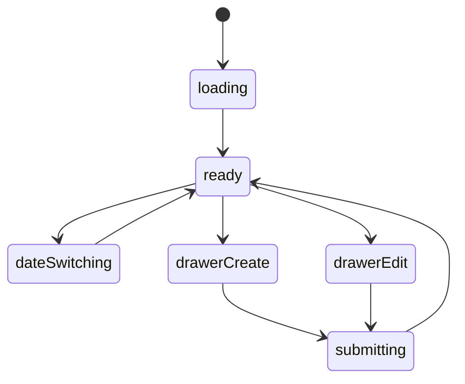

# 时间安排模块实现说明

## 路由

- `/schedule`
- `/schedule/:date`

## 组件树

```text
SchedulePage
├─ ScheduleHeader
├─ DateRail
├─ ScheduleTimelineSection
│  └─ ScheduleTaskCard
├─ ScheduleCompletionSection
├─ ScheduleReflectionSection
├─ ScheduleEditorDrawer
└─ FloatingScheduleButton
```

## 组件职责

| 组件 | 责任 | 关键输入 |
| --- | --- | --- |
| `SchedulePage` | 页面级数据编排 | `route`, `session` |
| `ScheduleHeader` | 标题、日期范围切换 | `currentDate` |
| `DateRail` | 日期列表和选择 | `dates`, `selectedDate` |
| `ScheduleTimelineSection` | 时间轴和任务卡 | `tasks` |
| `ScheduleTaskCard` | 单个任务卡 | `task` |
| `ScheduleCompletionSection` | 当日完成统计 | `summary` |
| `ScheduleReflectionSection` | 当日反思内容 | `reflection` |
| `ScheduleEditorDrawer` | 新增/编辑任务 | `mode`, `task` |
| `FloatingScheduleButton` | 快速安排入口 | `onClick` |

## 接口草案

| 方法 | 路径 | 用途 |
| --- | --- | --- |
| `GET` | `/api/schedule/summary?date=` | 获取完成情况摘要 |
| `GET` | `/api/schedule/tasks?date=` | 获取当日任务 |
| `GET` | `/api/schedule/dates?week=` | 获取日期栏 |
| `POST` | `/api/schedule/tasks` | 新增任务 |
| `PATCH` | `/api/schedule/tasks/:id` | 更新任务 |
| `DELETE` | `/api/schedule/tasks/:id` | 删除任务 |
| `PATCH` | `/api/schedule/reflection/:date` | 更新当日反思 |

## 状态机



## 实现注意点

- 日期切换和任务列表要解耦
- 完成状态可以局部更新，不必整页重刷
- 手机端时间轴要降级成任务列表
