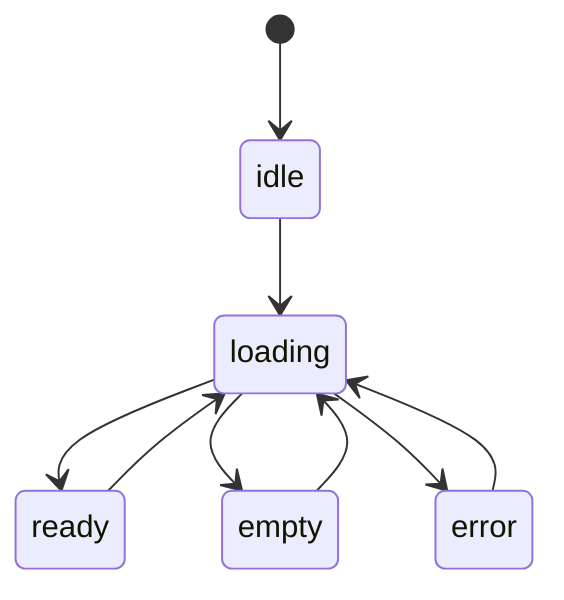
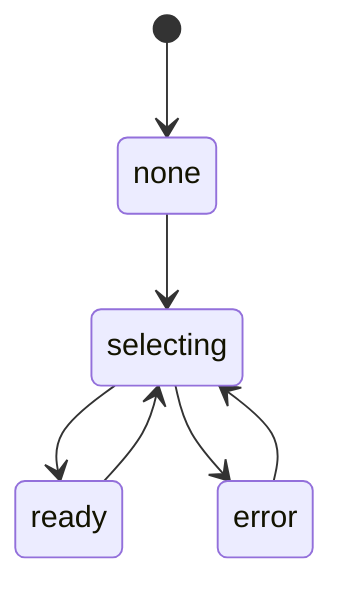
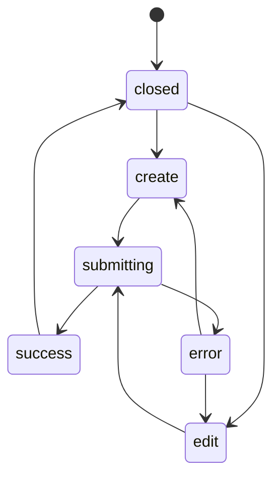
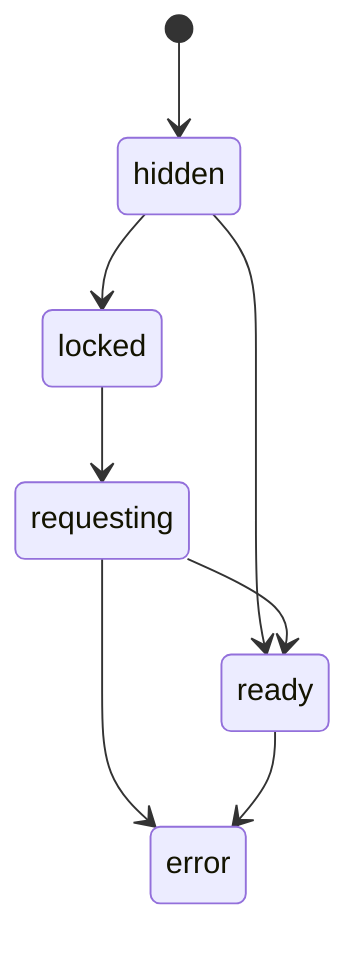

# 状态机总规范

## 目标

这份文档定义全站页面状态机的统一习惯。

目的是避免后续开发时每个页面都各写一套难维护的布尔状态。

## 页面主状态

所有页面建议统一至少有这 5 个主状态：

状态说明：

- `idle`：尚未请求
- `loading`：主数据加载中
- `ready`：页面可交互
- `empty`：无数据
- `error`：主请求失败

## 选中详情状态

适用于书籍、音乐、景色、方法等页面。

## 抽屉编辑状态

## 受保护资源状态

适用页面：

- 书籍
- 音乐

## 图表状态

适用页面：

- 健身
- 收支

建议状态：

- `loading`
- `ready`
- `no_data`
- `error`

## 搜索与筛选状态

统一建议拆成：

- `draftFilter`
- `appliedFilter`

这样可以避免每次输入都强制全量刷新。

## 脏状态

编辑表单统一保留：

- `isDirty`
- `isSubmitting`
- `submitError`

当 `isDirty = true` 且用户尝试关闭抽屉时，应触发确认流程。

## 前端实现建议

- 简单页面用 reducer 即可
- 复杂页面可抽出 `state.ts`
- 不建议一开始就全部上重型状态机库

核心原则：

- 状态名字清楚
- 转移路径可描述
- 页面层只持有页面状态
- 细节状态下沉到模块内部
