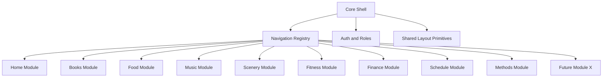
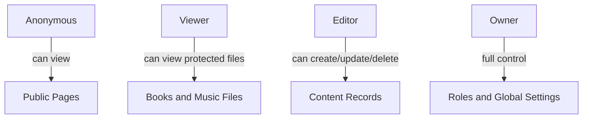

# Module Architecture

## Goal

The architecture must make future page expansion easy.

If one day a new page is added, it should feel like adding one module, not refactoring the whole site.

## High-Level Structure



## Module Contract

Each module should have:

- route entry
- model set
- service layer
- template set
- page-specific JS/CSS
- permission rules

Example:

```text
apps/books/
  models.py
  services.py
  urls.py
  views.py
  templates/books/
  static/books/
```

## Why This Helps Expansion

When adding a new page later:

1. create a new module folder
2. register it in navigation
3. connect permissions
4. add page-specific tables and templates

Existing modules do not need redesign.

## Access Architecture



## Styling Architecture

Because page style should be independent:

- keep global CSS limited to shell and utility primitives
- let each page own a theme layer
- allow each page to define its own hero, grid, card system, and mood

Recommended split:

- shared shell CSS
- module theme CSS
- module interaction JS
