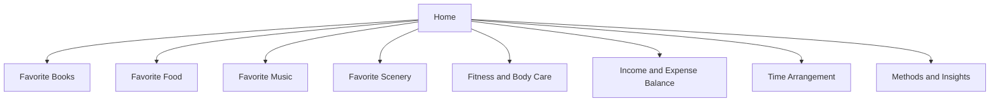

# Site Blueprint

## Site Positioning

`RememberMyself` is a personal memory system and life dashboard.

It combines:

- archive
- tracker
- media library
- personal reflection space

It should feel like a long-term, modular personal website rather than a one-time portfolio.

## Information Architecture

## Expansion Principle

The site must support future modules without structural pain.

Recommended rule:

- every new page is a new module
- every module owns its route, data model, service layer, and UI assets
- navigation is registry-based so a new page can be added by configuration, not by rewriting the whole site
- protected media modules can define extra access rules independently

## Page Modules

### 1. Home

Purpose:

- introduce the whole system
- provide quick navigation to all modules
- show selected highlights from each page

Suggested content:

- personal statement
- current priorities
- latest updates from each module
- summary cards for books, fitness, finance, and schedule

### 2. Favorite Books

Functions:

- favorite book list
- CRUD in page
- uploaded book files
- file download
- in-browser reading

Data:

- title
- author
- tags
- status
- rating
- notes
- uploaded file
- cover image

### 3. Favorite Food

Functions:

- CRUD for dishes
- upload name, photos, recipe text
- searchable food collection

Data:

- food name
- images
- ingredients
- recipe
- memory note
- tags

### 4. Favorite Music

Functions:

- upload music files
- download music files
- in-browser audio playback
- song library management

Data:

- track name
- artist
- album
- cover
- audio file
- tags
- why I like it

### 5. Favorite Scenery

Functions:

- upload images
- record location
- add text description

Data:

- title
- photo set
- address
- map coordinates
- date
- note

### 6. Fitness and Body Care

Functions:

- daily weight input
- meal logging
- calorie logging
- trend charts

Data:

- date
- weight
- breakfast/lunch/dinner
- calories
- exercise
- body feeling

### 7. Income and Expense Balance

Functions:

- daily income and expense CRUD
- category statistics
- daily trend chart

Data:

- date
- amount
- type: income/expense
- category
- note

### 8. Time Arrangement

Functions:

- daily plan
- weekly routine
- completion tracking

Data:

- date
- task
- duration
- category
- completion status
- reflection

### 9. Methods and Insights

Functions:

- store methods, principles, and reflections
- markdown article style writing
- tag-based browsing

Data:

- title
- content
- tags
- created_at
- updated_at

## Independence Rule

Each page should be independently changeable.

Recommended rule:

- each page gets its own route
- each page gets its own service layer
- each page gets its own data model group
- each page can later gain its own UI redesign without affecting the others

## Access Rule

Content visibility is split into two kinds:

- public-readable modules and summaries
- authenticated-only media/resources

This means:

- page content such as introductions, lists, notes, and public records can be public
- uploaded books and music should require login before reading, downloading, or playing

## Security Boundary

Not part of this website:

- passwords
- secret credentials
- important account data

If needed later, build a separate encrypted vault module, not inside the normal content system.
